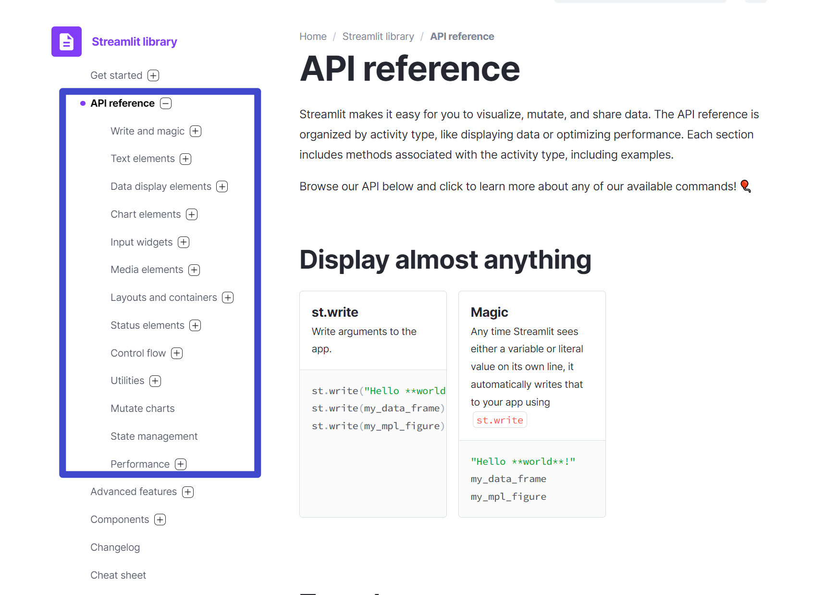
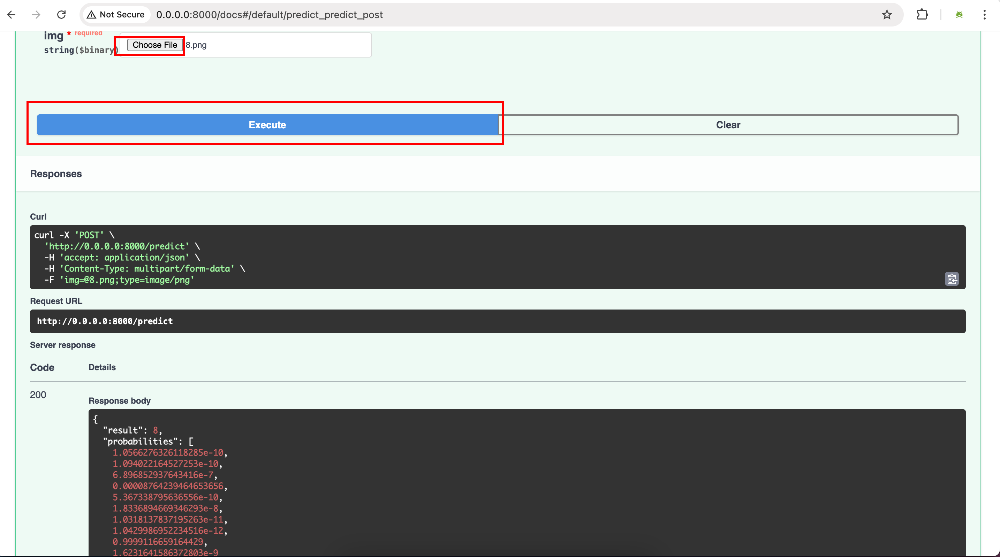
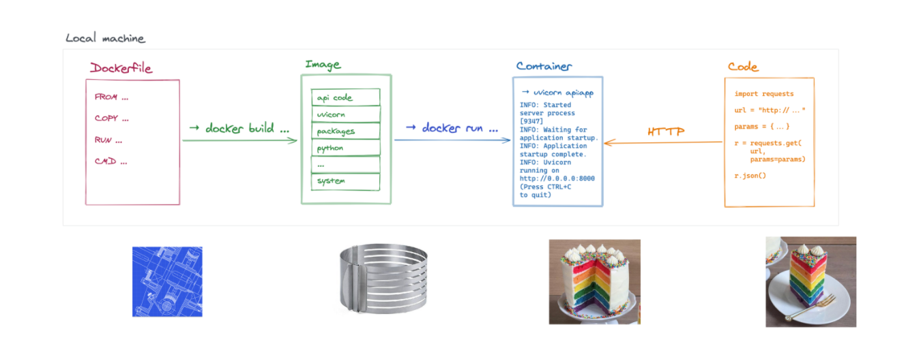

# Building a Machine Learning Web Application with PyTorch


In this tutorial, we'll build a machine learning web application for digit recognition using the MNIST dataset. You'll learn how to:
- Train a model with PyTorch
- Create a web interface with Streamlit
- Set up a backend API with FastAPI
- Deploy your application locally and to the cloud
- Use Docker for containerization


## Section 0: Videos [Optional]


If you understand Chinese, or if you want to improve your Chinese while also improving your ML skills, you can watch the video on Bilibili:


- Get Inspired! 
  - [Video 1 - Get Inspired!](https://www.bilibili.com/video/BV1244y1J7C7/)
- Streamlit 
  - [Video 2 - Training model with Jupyter notebook](https://www.bilibili.com/video/BV1Ri4y117Qh/)
  - [Video 3 - Using trained model with streamlit](https://www.bilibili.com/video/BV1Ju411R7Gy/)
- Deployment on local machine
    - [Video 4 - Local Deployment - Architecture](https://www.bilibili.com/video/BV1RS4y1r79Q/)
    - [Video 5 - Local Deployment - Backend & FastAPI & Uvicorn](https://www.bilibili.com/video/BV1aP4y1F7xs/)
    - [Video 6 - Local Deployment - Frontend & Streamlit](https://www.bilibili.com/video/BV1Lb4y1t7LK/)
    - [Video 7 - Local Deployment - Localhost Demo](https://www.bilibili.com/video/BV1vR4y1V7Gn/)
- Deployment on public cloud VM
  - [Video 8 - Cloud Deployment - Buy and connect to cloud VM](https://www.bilibili.com/video/BV1nZ4y1k7Nr/)
  - [Video 9 - Cloud Deployment - FastAPI & Backend](https://www.bilibili.com/video/BV1aS4y1F76w/)
  - [Video 10 - Cloud Deployment - Streamlit & Frontend](https://www.bilibili.com/video/BV1TR4y1j7fp/)
- Deployment with Docker
  - [Video 11 - Learning to use Docker](https://www.bilibili.com/video/BV1kL4y1g7Xd/)
  - [Video 12 - Cloud Deployment with Docker](https://www.bilibili.com/video/BV1wL411T7VB/)
  - Docker Compose (NO VIDEOS PROVIDED, It's your task to do it!)
  - Docker for Frontend/Streamlit (NO VIDEOS PROVIDED, It's your task to do it!)
  - Explore more on Docker: Volumes, Networks, Security Best Practices (NO VIDEOS PROVIDED, It's your task to do it!)
- [optional] Install MySQL and PhpMyAdmin with Docker 
  - Tutorial: https://github.com/reveurmichael/mysql-python-tutorial
  - Video 13: https://www.bilibili.com/video/BV1mB4y1Y7Yw
- [optional] Streamlit Cookie Tutorial
  - Tutorial: https://github.com/reveurmichael/streamlit-cookie-tutorial
  - Video 14: https://www.bilibili.com/video/BV1pr4y177rK


Or, YouTube videos can be helpful as well:

- Streamlit
  - https://www.youtube.com/watch?v=R2nr1uZ8ffc
  - https://www.youtube.com/watch?v=sxLNCDnqyFc
  - https://www.youtube.com/watch?v=VtrFjkSGgKM
  - https://www.youtube.com/watch?v=z8vgmvtgxCs

- FastAPI
  - https://www.youtube.com/watch?v=kCggyi_7pHg

- Uvicorn
  - https://youtu.be/-ykeT6kk4bk?t=662

- Python ```requests``` package
  - https://www.youtube.com/watch?v=qriL9Qe8pJc
  


## Section 1: Get Inspired!


Before diving into code, let's look at some inspiring machine learning applications:

- [TensorFlow.js Demos](https://www.tensorflow.org/js) - Interactive ML in the browser
- [Streamlit Gallery](https://streamlit.io/gallery) - Examples of what's possible with Streamlit
- [TensorFlow Playground](https://playground.tensorflow.org) - Interactive visualization of neural networks
- [Digit Recognition Web App](https://maneprajakta.github.io/Digit_Recognition_Web_App/) - Similar to what we'll build
- [Neural Network Visualization](https://www.cs.ryerson.ca/~aharley/vis/fc/) - Beautiful visualization of neural networks

## Section 2: Train a Model with PyTorch


Let's create a Jupyter notebook for training our MNIST digit classifier using PyTorch.

Create a new file called `LocalTrain.ipynb` and add the following code:

```python
import torch
import torch.nn as nn
import torch.optim as optim
import torchvision
import torchvision.transforms as transforms
from torch.utils.data import DataLoader

# Check if GPU is available
device = torch.device("cuda:0" if torch.cuda.is_available() else "cpu")
print(f"Using device: {device}")

# Define transformations for the training and test sets
transform = transforms.Compose([
    transforms.ToTensor(),  # Convert images to PyTorch tensors
    transforms.Normalize((0.1307,), (0.3081,))  # Normalize with mean and std of MNIST
])

# Load the MNIST dataset
train_dataset = torchvision.datasets.MNIST(root='./data_gitignore', 
                                          train=True, 
                                          transform=transform, 
                                          download=True)

test_dataset = torchvision.datasets.MNIST(root='./data_gitignore', 
                                         train=False, 
                                         transform=transform)

# Create data loaders
train_loader = DataLoader(dataset=train_dataset, 
                          batch_size=64, 
                          shuffle=True)

test_loader = DataLoader(dataset=test_dataset, 
                         batch_size=1000, 
                         shuffle=False)

# Define the neural network
class SimpleNN(nn.Module):
    def __init__(self):
        super(SimpleNN, self).__init__()
        self.flatten = nn.Flatten()
        self.fc1 = nn.Linear(28 * 28, 392)
        self.relu = nn.ReLU()
        self.fc2 = nn.Linear(392, 10)
        
    def forward(self, x):
        x = self.flatten(x)
        x = self.fc1(x)
        x = self.relu(x)
        x = self.fc2(x)
        return x

# Create the model and move it to the device
model = SimpleNN().to(device)

# Define loss function and optimizer
criterion = nn.CrossEntropyLoss()
optimizer = optim.Adam(model.parameters(), lr=0.001)

# Train the model
num_epochs = 10
for epoch in range(num_epochs):
    model.train()
    running_loss = 0.0
    for i, (images, labels) in enumerate(train_loader):
        # Move tensors to the configured device
        images = images.to(device)
        labels = labels.to(device)
        
        # Forward pass
        outputs = model(images)
        loss = criterion(outputs, labels)
        
        # Backward and optimize
        optimizer.zero_grad()
        loss.backward()
        optimizer.step()
        
        running_loss += loss.item()
        
    # Print statistics
    print(f'Epoch [{epoch+1}/{num_epochs}], Loss: {running_loss/len(train_loader):.4f}')
    
    # Validate the model
    model.eval()
    with torch.no_grad():
        correct = 0
        total = 0
        for images, labels in test_loader:
            images = images.to(device)
            labels = labels.to(device)
            outputs = model(images)
            _, predicted = torch.max(outputs.data, 1)
            total += labels.size(0)
            correct += (predicted == labels).sum().item()
        print(f'Accuracy on test set: {100 * correct / total:.2f}%')

# Save the trained model
torch.save(model.state_dict(), 'mnist_model.pth')
print("Model saved to mnist_model.pth")
```

Run the notebook to train your model. This will:
1. Download the MNIST dataset
2. Define a simple neural network with one hidden layer
3. Train the model for 10 epochs
4. Save the trained model to a file named `mnist_model.pth`

## Section 3: Build a Simple Streamlit App





Now, let's create a Streamlit app to use our trained model for digit recognition.

Create a new file called `app.py` with the following code:

```python
import streamlit as st
from streamlit_drawable_canvas import st_canvas
import torch
import torch.nn as nn
import torchvision.transforms as transforms
import cv2
import numpy as np

# Define the neural network (same as in training)
class SimpleNN(nn.Module):
    def __init__(self):
        super(SimpleNN, self).__init__()
        self.flatten = nn.Flatten()
        self.fc1 = nn.Linear(28 * 28, 392)
        self.relu = nn.ReLU()
        self.fc2 = nn.Linear(392, 10)
        
    def forward(self, x):
        x = self.flatten(x)
        x = self.fc1(x)
        x = self.relu(x)
        x = self.fc2(x)
        return x

# Load the trained model
@st.cache_resource
def load_model():
    model = SimpleNN()
    model.load_state_dict(torch.load('mnist_model.pth', map_location=torch.device('cpu')))
    model.eval()
    return model

model = load_model()

# Set up the Streamlit app
st.title("MNIST Digit Recognizer with PyTorch")

# Create a canvas for drawing
SIZE = 192
canvas_result = st_canvas(
    fill_color="#ffffff",
    stroke_width=10,
    stroke_color='#ffffff',
    background_color="#000000",
    height=150,
    width=150,
    drawing_mode='freedraw',
    key="canvas",
)

if canvas_result.image_data is not None:
    # Resize the image to 28x28
    img_color = cv2.resize(canvas_result.image_data.astype('uint8'), (28, 28))
    img_rescaling = cv2.resize(img_color, (SIZE, SIZE), interpolation=cv2.INTER_NEAREST)
    st.write('Input Image')
    st.image(img_rescaling)
    
if st.button('Predict'):
    # Convert the image to grayscale
    img_grey = cv2.cvtColor(img_color, cv2.COLOR_BGR2GRAY)
    
    # Preprocess the image
    transform = transforms.Compose([
        transforms.ToTensor(),
        transforms.Normalize((0.1307,), (0.3081,))
    ])
    img_tensor = transform(img_grey).unsqueeze(0)  # Add batch dimension
    
    # Make prediction
    with torch.no_grad():
        outputs = model(img_tensor)
        probabilities = torch.nn.functional.softmax(outputs, dim=1)[0].numpy()
        prediction = torch.argmax(outputs, 1).item()
    
    st.write(f'Result: {prediction}')
    st.bar_chart(probabilities)
```

To run the Streamlit app, you'll need to install the required packages:

```bash
pip install -i https://pypi.tuna.tsinghua.edu.cn/simple streamlit streamlit-drawable-canvas torch torchvision opencv-python
```

Then run the app with:

```bash
streamlit run app.py
```

This will open a web page where you can draw a digit and have the model predict it.

## Section 4: Backend/Frontend Separation with FastAPI


Now let's split our application into backend and frontend components.

### Backend with FastAPI


Create a file called `backend.py`:

```python
import uvicorn
from fastapi import FastAPI, UploadFile, File
import torch
import torch.nn as nn
import torchvision.transforms as transforms
import cv2
import numpy as np
from io import BytesIO

app = FastAPI()

# Define the neural network (same as before)
class SimpleNN(nn.Module):
    def __init__(self):
        super(SimpleNN, self).__init__()
        self.flatten = nn.Flatten()
        self.fc1 = nn.Linear(28 * 28, 392)
        self.relu = nn.ReLU()
        self.fc2 = nn.Linear(392, 10)
        
    def forward(self, x):
        x = self.flatten(x)
        x = self.fc1(x)
        x = self.relu(x)
        x = self.fc2(x)
        return x

# Load the trained model
model = SimpleNN()
model.load_state_dict(torch.load('mnist_model.pth', map_location=torch.device('cpu')))
model.eval()

# Define a root endpoint
@app.get("/")
def index():
    return {"status": "API is running"}

# Define prediction endpoint
@app.post("/predict")
async def predict(img: UploadFile = File(...)):
    # Read and process the uploaded image
    contents = await img.read()
    nparr = np.frombuffer(contents, np.uint8)
    img_color = cv2.imdecode(nparr, cv2.IMREAD_COLOR)
    img_grey = cv2.cvtColor(img_color, cv2.COLOR_BGR2GRAY)
    
    # Preprocess the image
    transform = transforms.Compose([
        transforms.ToTensor(),
        transforms.Normalize((0.1307,), (0.3081,))
    ])
    img_tensor = transform(img_grey).unsqueeze(0)  # Add batch dimension
    
    # Make prediction
    with torch.no_grad():
        outputs = model(img_tensor)
        probabilities = torch.nn.functional.softmax(outputs, dim=1)[0].numpy().tolist()
        prediction = torch.argmax(outputs, 1).item()
    
    return {"result": prediction, "probabilities": probabilities}

# Add a new endpoint for health check
@app.get("/health")
def health_check():
    return {"status": "healthy"}

# Add an endpoint to get model information
@app.get("/model_info")
def model_info():
    return {
        "model_type": "Simple Neural Network",
        "input_shape": "28x28 grayscale image",
        "output_classes": 10,
        "hidden_layers": 1,
        "hidden_units": 392
    }

if __name__ == "__main__":
    uvicorn.run(app, host="0.0.0.0", port=8000)
```

To run the backend:

```bash
pip install -i https://pypi.tuna.tsinghua.edu.cn/simple fastapi uvicorn python-multipart
python backend.py
```

Once the backend is running, you can access the API documentation at http://localhost:8000/docs

**Try uploading a MNIST image (such as the "8.png" file) to the Swagger UI and checking the prediction result.**




### Frontend with Streamlit

Now, let's create a frontend that communicates with our backend. Create a file called `frontend.py`:

```python
import requests
import streamlit as st
from streamlit_drawable_canvas import st_canvas
import cv2
import numpy as np

st.title("MNIST Digit Recognizer with PyTorch")

# Set up backend URL
backend_url = "http://localhost:8000"

# Create a canvas for drawing
SIZE = 192
canvas_result = st_canvas(
    fill_color="#ffffff",
    stroke_width=10,
    stroke_color='#ffffff',
    background_color="#000000",
    height=150,
    width=150,
    drawing_mode='freedraw',
    key="canvas",
)

if canvas_result.image_data is not None:
    # Resize the image to 28x28
    img_color = cv2.resize(canvas_result.image_data.astype('uint8'), (28, 28))
    img_rescaling = cv2.resize(img_color, (SIZE, SIZE), interpolation=cv2.INTER_NEAREST)
    st.write('Input Image')
    st.image(img_rescaling)
    
if st.button('Predict'):
    # Check if the backend is running
    try:
        response = requests.get(f"{backend_url}/health")
        if response.status_code == 200:
            # Encode image to PNG
            _, img_encoded = cv2.imencode('.png', img_color)
            files = {'img': ('image.png', img_encoded.tobytes(), 'image/png')}
            
            # Send request to backend
            response = requests.post(f"{backend_url}/predict", files=files)
            
            if response.status_code == 200:
                data = response.json()
                result = data['result']
                probabilities = data['probabilities']
                
                st.write(f'Result: {result}')
                st.bar_chart(probabilities)
            else:
                st.error(f"Error from backend: {response.text}")
        else:
            st.error("Backend health check failed. Is the backend running?")
    except requests.ConnectionError:
        st.error("Could not connect to the backend. Is it running at http://localhost:8000?")

# Add a section to show model information
if st.checkbox("Show Model Information"):
    try:
        response = requests.get(f"{backend_url}/model_info")
        if response.status_code == 200:
            model_info = response.json()
            st.write("## Model Information")
            for key, value in model_info.items():
                st.write(f"**{key}:** {value}")
        else:
            st.error("Could not fetch model information")
    except requests.ConnectionError:
        st.error("Could not connect to the backend")
```

To run the frontend:

```bash
streamlit run frontend.py
```

Now, you have a separated frontend and backend. The frontend communicates with the backend through HTTP requests.

## Section 5: Improving the Model with CNN


Let's improve our model by using a Convolutional Neural Network (CNN). Create a new file called `LocalTrain_CNN.ipynb`:

```python
import torch
import torch.nn as nn
import torch.optim as optim
import torchvision
import torchvision.transforms as transforms
from torch.utils.data import DataLoader

# Check if GPU is available
device = torch.device("cuda:0" if torch.cuda.is_available() else "cpu")
print(f"Using device: {device}")

# Define transformations for the training and test sets
transform = transforms.Compose([
    transforms.ToTensor(),
    transforms.Normalize((0.1307,), (0.3081,))
])

# Load the MNIST dataset
train_dataset = torchvision.datasets.MNIST(root='./data_gitignore', 
                                          train=True, 
                                          transform=transform, 
                                          download=True)

test_dataset = torchvision.datasets.MNIST(root='./data_gitignore', 
                                         train=False, 
                                         transform=transform)

# Create data loaders
train_loader = DataLoader(dataset=train_dataset, 
                          batch_size=64, 
                          shuffle=True)

test_loader = DataLoader(dataset=test_dataset, 
                         batch_size=1000, 
                         shuffle=False)

# Define the CNN model
class CNN(nn.Module):
    def __init__(self):
        super(CNN, self).__init__()
        self.conv1 = nn.Conv2d(1, 32, kernel_size=3, stride=1, padding=1)
        self.relu1 = nn.ReLU()
        self.pool1 = nn.MaxPool2d(kernel_size=2)
        self.conv2 = nn.Conv2d(32, 64, kernel_size=3, stride=1, padding=1)
        self.relu2 = nn.ReLU()
        self.pool2 = nn.MaxPool2d(kernel_size=2)
        self.fc1 = nn.Linear(64 * 7 * 7, 128)
        self.relu3 = nn.ReLU()
        self.fc2 = nn.Linear(128, 10)
        
    def forward(self, x):
        x = self.conv1(x)
        x = self.relu1(x)
        x = self.pool1(x)
        x = self.conv2(x)
        x = self.relu2(x)
        x = self.pool2(x)
        x = x.view(-1, 64 * 7 * 7)
        x = self.fc1(x)
        x = self.relu3(x)
        x = self.fc2(x)
        return x

# Create the model and move it to the device
model = CNN().to(device)

# Define loss function and optimizer
criterion = nn.CrossEntropyLoss()
optimizer = optim.Adam(model.parameters(), lr=0.001)

# Train the model
num_epochs = 10
for epoch in range(num_epochs):
    model.train()
    running_loss = 0.0
    for i, (images, labels) in enumerate(train_loader):
        # Move tensors to the configured device
        images = images.to(device)
        labels = labels.to(device)
        
        # Forward pass
        outputs = model(images)
        loss = criterion(outputs, labels)
        
        # Backward and optimize
        optimizer.zero_grad()
        loss.backward()
        optimizer.step()
        
        running_loss += loss.item()
        
    # Print statistics
    print(f'Epoch [{epoch+1}/{num_epochs}], Loss: {running_loss/len(train_loader):.4f}')
    
    # Validate the model
    model.eval()
    with torch.no_grad():
        correct = 0
        total = 0
        for images, labels in test_loader:
            images = images.to(device)
            labels = labels.to(device)
            outputs = model(images)
            _, predicted = torch.max(outputs.data, 1)
            total += labels.size(0)
            correct += (predicted == labels).sum().item()
        print(f'Accuracy on test set: {100 * correct / total:.2f}%')

# Save the trained model
torch.save(model.state_dict(), 'mnist_cnn_model.pth')
print("Model saved to mnist_cnn_model.pth")
```

Now, update your `backend.py` to use the CNN model:

```python
# In backend.py, replace the SimpleNN class with the CNN class:

class CNN(nn.Module):
    def __init__(self):
        super(CNN, self).__init__()
        self.conv1 = nn.Conv2d(1, 32, kernel_size=3, stride=1, padding=1)
        self.relu1 = nn.ReLU()
        self.pool1 = nn.MaxPool2d(kernel_size=2)
        self.conv2 = nn.Conv2d(32, 64, kernel_size=3, stride=1, padding=1)
        self.relu2 = nn.ReLU()
        self.pool2 = nn.MaxPool2d(kernel_size=2)
        self.fc1 = nn.Linear(64 * 7 * 7, 128)
        self.relu3 = nn.ReLU()
        self.fc2 = nn.Linear(128, 10)
        
    def forward(self, x):
        x = self.conv1(x)
        x = self.relu1(x)
        x = self.pool1(x)
        x = self.conv2(x)
        x = self.relu2(x)
        x = self.pool2(x)
        x = x.view(-1, 64 * 7 * 7)
        x = self.fc1(x)
        x = self.relu3(x)
        x = self.fc2(x)
        return x

# And update the model loading:
model = CNN()
model.load_state_dict(torch.load('mnist_cnn_model.pth', map_location=torch.device('cpu')))
model.eval()
```

## Section 6: Data Augmentation for Further Improvement


Data augmentation is a technique to increase the diversity of your training data by applying random transformations. This helps improve the model's ability to generalize to new data.

Let's implement data augmentation techniques in PyTorch, in `LocalTrain_DataAugmentation.ipynb`:

```python
import torch
import torch.nn as nn
import torch.optim as optim
import torchvision
import torchvision.transforms as transforms
from torch.utils.data import DataLoader
import numpy as np
import cv2
import matplotlib.pyplot as plt
import os
from torchvision.transforms import functional as F
from PIL import Image

# Create a directory to save augmented samples
os.makedirs("tmp", exist_ok=True)

# Check if GPU is available
device = torch.device("cuda:0" if torch.cuda.is_available() else "cpu")
print(f"Using device: {device}")


# Custom PyTorch transform for elastic deformation
class ElasticTransform:
    def __init__(self, alpha=1.0, sigma=0.1):
        self.alpha = alpha
        self.sigma = sigma

    def __call__(self, img):
        img_np = np.array(img)

        # Generate displacement fields
        shape = img_np.shape
        dx = np.random.rand(*shape) * 2 - 1
        dy = np.random.rand(*shape) * 2 - 1

        # Gaussian filter the displacement fields
        dx = cv2.GaussianBlur(dx, (0, 0), self.sigma) * self.alpha
        dy = cv2.GaussianBlur(dy, (0, 0), self.sigma) * self.alpha

        # Create meshgrid for mapping coordinates
        x, y = np.meshgrid(np.arange(shape[1]), np.arange(shape[0]))

        # Map coordinates
        map_x = np.float32(x + dx)
        map_y = np.float32(y + dy)

        # Apply elastic transform
        distorted = cv2.remap(
            img_np,
            map_x,
            map_y,
            interpolation=cv2.INTER_LINEAR,
            borderMode=cv2.BORDER_REFLECT_101,
        )

        return Image.fromarray(distorted)


# Custom PyTorch transform for salt and pepper noise
class SaltPepperNoise:
    def __init__(self, prob=0.05):
        self.prob = prob

    def __call__(self, img):
        img_np = np.array(img)

        # Add salt noise
        salt = np.random.random(img_np.shape) < self.prob
        img_np[salt] = 255

        # Add pepper noise
        pepper = np.random.random(img_np.shape) < self.prob
        img_np[pepper] = 0

        return Image.fromarray(img_np)


# Define advanced transformations for training
transform_train = transforms.Compose(
    [
        transforms.RandomRotation(15),  # Randomly rotate by up to 15 degrees
        transforms.RandomAffine(degrees=0, translate=(0.1, 0.1)),  # Random shifts
        ElasticTransform(alpha=15.0, sigma=3.0),  # Elastic deformation
        SaltPepperNoise(prob=0.01),  # Add salt and pepper noise
        transforms.ColorJitter(
            brightness=0.2, contrast=0.2
        ),  # Adjust brightness and contrast
        transforms.ToTensor(),  # Convert to tensor first
        transforms.Normalize((0.1307,), (0.3081,)),
        transforms.RandomErasing(
            p=0.2, scale=(0.02, 0.1), ratio=(0.3, 3.3), value=0
        ),  # Random erasing (must be after ToTensor)
    ]
)

# For test data, we only normalize (no augmentation needed)
transform_test = transforms.Compose(
    [transforms.ToTensor(), transforms.Normalize((0.1307,), (0.3081,))]
)

# Load the MNIST dataset with augmented transforms
train_dataset = torchvision.datasets.MNIST(
    root="./data_gitignore", train=True, transform=transform_train, download=True
)

test_dataset = torchvision.datasets.MNIST(
    root="./data_gitignore", train=False, transform=transform_test
)


# Function to save sample augmented images
def save_augmented_samples(num_samples=5):
    """Save augmented versions of sample images"""
    # Use a separate transform for visualization
    vis_transform = transforms.Compose(
        [
            transforms.RandomRotation(15),
            transforms.RandomAffine(degrees=0, translate=(0.1, 0.1)),
            ElasticTransform(alpha=15.0, sigma=3.0),
            SaltPepperNoise(prob=0.01),
            transforms.ColorJitter(brightness=0.2, contrast=0.2),
            transforms.ToTensor(),
        ]
    )
    
    # Create a temporary dataset with visualization transform
    vis_dataset = torchvision.datasets.MNIST(
        root="./data_gitignore", train=True, transform=vis_transform, download=False
    )
    
    # Get some samples
    samples = []
    for i in range(num_samples):
        img, _ = vis_dataset[i]
        samples.append(img)

    plt.figure(figsize=(10, 8))
    for i, img in enumerate(samples):
        plt.subplot(1, num_samples, i + 1)
        plt.imshow(img.squeeze().numpy(), cmap="gray")
        plt.title(f"Sample {i+1}")
        plt.axis("off")

    plt.tight_layout()
    plt.savefig("tmp/augmented_samples.png")
    plt.close()

    print("Saved augmented samples to tmp/augmented_samples.png")


# Create data loaders
train_loader = DataLoader(dataset=train_dataset, batch_size=64, shuffle=True)

test_loader = DataLoader(dataset=test_dataset, batch_size=1000, shuffle=False)

# Save sample augmented images
save_augmented_samples()


# Use the same CNN model as before
class CNN(nn.Module):
    def __init__(self):
        super(CNN, self).__init__()
        # First convolutional block
        self.conv1 = nn.Conv2d(1, 32, kernel_size=3, stride=1, padding=1)
        self.bn1 = nn.BatchNorm2d(32)
        self.relu1 = nn.ReLU()
        self.pool1 = nn.MaxPool2d(kernel_size=2)

        # Second convolutional block
        self.conv2 = nn.Conv2d(32, 64, kernel_size=3, stride=1, padding=1)
        self.bn2 = nn.BatchNorm2d(64)
        self.relu2 = nn.ReLU()
        self.pool2 = nn.MaxPool2d(kernel_size=2)

        # Third convolutional block
        self.conv3 = nn.Conv2d(64, 64, kernel_size=3, stride=1, padding=1)
        self.bn3 = nn.BatchNorm2d(64)
        self.relu3 = nn.ReLU()

        # Fully connected layers
        self.flatten = nn.Flatten()
        self.fc1 = nn.Linear(64 * 7 * 7, 128)
        self.drop = nn.Dropout(0.5)
        self.relu4 = nn.ReLU()
        self.fc2 = nn.Linear(128, 10)

    def forward(self, x):
        # First block
        x = self.conv1(x)
        x = self.bn1(x)
        x = self.relu1(x)
        x = self.pool1(x)

        # Second block
        x = self.conv2(x)
        x = self.bn2(x)
        x = self.relu2(x)
        x = self.pool2(x)

        # Third block
        x = self.conv3(x)
        x = self.bn3(x)
        x = self.relu3(x)

        # Fully connected
        x = self.flatten(x)
        x = self.fc1(x)
        x = self.drop(x)
        x = self.relu4(x)
        x = self.fc2(x)
        return x


# Create the model and move it to the device
model = CNN().to(device)

# Define loss function and optimizer
criterion = nn.CrossEntropyLoss()
optimizer = optim.Adam(model.parameters(), lr=0.001)

# Train the model
num_epochs = 10
for epoch in range(num_epochs):
    model.train()
    running_loss = 0.0
    for i, (images, labels) in enumerate(train_loader):
        # Move tensors to the configured device
        images = images.to(device)
        labels = labels.to(device)

        # Forward pass
        outputs = model(images)
        loss = criterion(outputs, labels)

        # Backward and optimize
        optimizer.zero_grad()
        loss.backward()
        optimizer.step()

        running_loss += loss.item()

    # Print statistics
    print(f"Epoch [{epoch+1}/{num_epochs}], Loss: {running_loss/len(train_loader):.4f}")

    # Validate the model
    model.eval()
    with torch.no_grad():
        correct = 0
        total = 0
        for images, labels in test_loader:
            images = images.to(device)
            labels = labels.to(device)
            outputs = model(images)
            _, predicted = torch.max(outputs.data, 1)
            total += labels.size(0)
            correct += (predicted == labels).sum().item()
        print(f"Accuracy on test set: {100 * correct / total:.2f}%")

# Save the trained model
torch.save(model.state_dict(), "mnist_augmented_model.pth")
print("Model saved to mnist_augmented_model.pth")
```

Data augmentation improves the model's performance by:
1. Increasing the diversity of training data
2. Reducing overfitting
3. Improving the model's ability to generalize
4. Making the model more robust to variations in input data

These advanced augmentation techniques help the model better handle real-world conditions:
- **Rotation**: Handles digits written at different angles
- **Affine Transformations**: Manages different positioning and sizing
- **Elastic Deformation**: Simulates natural handwriting variations
- **Salt & Pepper Noise**: Makes the model robust to image noise
- **Random Erasing**: Helps the model focus on all features (not just prominent ones)
- **Brightness/Contrast Adjustments**: Handles different writing tools and backgrounds

Update your `backend.py` to use the improved model:

```python
# Update the model loading in backend.py:
model = CNN()
model.load_state_dict(torch.load('mnist_augmented_model.pth', map_location=torch.device('cpu')))
model.eval()
```

## Section 7: Cloud Deployment


To deploy our application to the cloud, we'll need a virtual machine from a cloud provider. Here are the steps:

### AWS Free Tier VM

AWS offers a generous free tier that allows you to run a t2.micro EC2 instance for 12 months at no cost. Here's how to set up your application on AWS:

1. **Sign up for AWS Free Tier**:
   - Navigate to [AWS Free Tier](https://aws.amazon.com/free/)
   - Create an account with your email and payment information (credit card required, but won't be charged for free tier eligible services)

2. **Launch an EC2 Instance**:
   - Go to the EC2 Dashboard and click "Launch Instance"
   - Choose an Ubuntu Server 20.04 LTS AMI (eligible for free tier)
   - Select the t2.micro instance type (eligible for free tier)
   - Configure instance details as needed
   - Add storage (up to 30GB for free tier)
   - Add tags if desired
   - Configure security group:
     - Allow SSH (port 22) from your IP
     - Allow HTTP (port 80) from anywhere
     - Add custom TCP rules for ports 8000 and 8501

3. **Set Up SSH Access**:
   - During instance creation, create a new key pair or use an existing one
   - Download the .pem file and set appropriate permissions:
     ```bash
     chmod 400 your-key.pem
     ```

4. **Connect to Your AWS Instance**:
   ```bash
   ssh -i your-key.pem ubuntu@your-ec2-public-dns
   ```

5. **Install Required Software**:
   ```bash
   sudo apt update
   sudo apt install -y python3-pip python3-dev git
   ```

6. **Deploy Your Application**:
   ```bash
   # Clone your repository if it's on GitHub
   git clone https://github.com/yourusername/your-repo.git
   
   # Or upload files with SCP
   exit # Exit from SSH first
   scp -i your-key.pem -r your_app_directory/* ubuntu@your-ec2-public-dns:~/app
   ssh -i your-key.pem ubuntu@your-ec2-public-dns # Connect again
   ```

7. **Configure Environment and Service**:
   ```bash
   cd ~/app
   sudo pip3 install -i https://pypi.tuna.tsinghua.edu.cn/simple torch torchvision fastapi uvicorn python-multipart streamlit streamlit-drawable-canvas opencv-python requests
   ```

### Tencent Lighthouse VM

Tencent Cloud Lighthouse offers an affordable and easy-to-use virtual machine suitable for lightweight applications:

1. **Sign up for Tencent Cloud**:
   - Create an account at [Tencent Cloud](https://cloud.tencent.com/)
   - Verify your identity to access the services

2. **Purchase a Lighthouse Instance**:
   - Navigate to Lighthouse in the console
   - Choose a region close to your target users
   - Select Ubuntu 20.04 as the image
   - Choose an appropriate configuration (1 core, 2GB RAM is sufficient for our app)
   - Set a login password or use SSH key authentication

3. **Set Up SSH Access**:
   - Generate SSH keys if you don't have them: `ssh-keygen`
   - Add your public key to the cloud instance during setup:
     ```bash
     # On your local machine
     cat ~/.ssh/id_rsa.pub
     
     # Copy the output and add it to the Lighthouse instance using the web console
     # Or on the server
     echo "ssh-rsa AAAAB3NzaC1yc2EAAAADAQABAAABAQC1234567890..." >> ~/.ssh/authorized_keys
     ```

4. **Connect to Your Lighthouse Instance**:
   ```bash
   ssh lighthouse@your-instance-ip
   # Or if using a custom username
   ssh username@your-instance-ip
   ```

5. **Install Required Software**:
   ```bash
   sudo apt update
   sudo apt install -y python3-pip python3-dev git
   ```

6. **Configure Firewall**:
   - In the Tencent Cloud Console, modify the firewall rules to allow:
     - TCP port 22 (SSH)
     - TCP port 8000 (FastAPI backend)
     - TCP port 8501 (Streamlit frontend)

7. **Deploy Your Application**:
   ```bash
   mkdir -p ~/app/models
   ```

### Deploying Both Backend and Frontend on the Same VM

Once you have access to either an AWS or Tencent Cloud VM, follow these steps to deploy both components:

1. **Upload your files to the server**:
   ```bash
   # From your local machine
   scp -r backend.py frontend.py requirements.txt mnist_augmented_model.pth username@your-vm-ip:~/app/
   ```

2. **Install Python Dependencies**:
   ```bash
   # On the server
   cd ~/app
   pip3 install -i https://pypi.tuna.tsinghua.edu.cn/simple torch torchvision fastapi uvicorn python-multipart streamlit streamlit-drawable-canvas opencv-python requests
   ```

3. **Run the Backend as a Background Service**:
   ```bash
   # Create a systemd service file for the backend
   sudo nano /etc/systemd/system/mnist-backend.service
   ```
   
   Add the following content:
   ```
   [Unit]
   Description=MNIST Classifier Backend
   After=network.target
   
   [Service]
   User=ubuntu  # Change to your username
   WorkingDirectory=/home/ubuntu/app  # Change to your directory
   ExecStart=/usr/bin/python3 /home/ubuntu/app/backend.py
   Restart=always
   
   [Install]
   WantedBy=multi-user.target
   ```
   
   Start the service:
   ```bash
   sudo systemctl daemon-reload
   sudo systemctl enable mnist-backend
   sudo systemctl start mnist-backend
   ```

4. **Modify the Frontend to Use the Correct Backend URL**:
   ```bash
   # Edit the frontend.py file
   nano ~/app/frontend.py
   ```
   
   Update the backend URL to point to localhost:
   ```python
   # Set up backend URL
   backend_url = "http://localhost:8000"
   ```

5. **Run the Frontend as a Background Service**:
   ```bash
   # Create a systemd service file for the frontend
   sudo nano /etc/systemd/system/mnist-frontend.service
   ```
   
   Add the following content:
   ```
   [Unit]
   Description=MNIST Classifier Frontend
   After=mnist-backend.service
   
   [Service]
   User=ubuntu  # Change to your username
   WorkingDirectory=/home/ubuntu/app  # Change to your directory
   ExecStart=/usr/local/bin/streamlit run /home/ubuntu/app/frontend.py --server.port=8501 --server.address=0.0.0.0
   Restart=always
   
   [Install]
   WantedBy=multi-user.target
   ```
   
   Start the service:
   ```bash
   sudo systemctl daemon-reload
   sudo systemctl enable mnist-frontend
   sudo systemctl start mnist-frontend
   ```

6. **Access Your Application**:
   - Backend API documentation: `http://your-vm-ip:8000/docs`
   - Streamlit frontend: `http://your-vm-ip:8501`

7. **Set Up Monitoring and Logs**:
   ```bash
   # View backend logs
   sudo journalctl -u mnist-backend -f
   
   # View frontend logs
   sudo journalctl -u mnist-frontend -f
   ```

8. **Security Best Practices**:
   - Set up a firewall with `ufw`:
     ```bash
     sudo apt install ufw
     sudo ufw allow ssh
     sudo ufw allow 8000
     sudo ufw allow 8501
     sudo ufw enable
     ```
   - Keep your system updated:
     ```bash
     sudo apt update && sudo apt upgrade -y
     ```
   - Consider setting up HTTPS with a free SSL certificate from Let's Encrypt

9. **Optional: Set Up a Domain Name**:
   - Register a domain through AWS Route 53, Tencent Cloud Domain, or any domain registrar
   - Point your domain to your VM's IP address using an A record
   - Consider setting up a reverse proxy with Nginx to serve your application on standard web ports (80/443)

By following these steps, you'll have a fully functional machine learning web application running in the cloud, with both the backend and frontend on the same VM.

## Section 8: Docker Deployment for Backend


Docker allows you to package your application and all its dependencies into a single container.

### Creating a Dockerfile for the Backend



Create a file named `Dockerfile` in your project directory:

```dockerfile
# syntax=docker/dockerfile:1.3

FROM ubuntu:22.04
ENV DEBIAN_FRONTEND=noninteractive

# Use Netease 163 mirror for Ubuntu apt
RUN mv /etc/apt/sources.list /etc/apt/sources.list.backup
RUN echo "deb http://mirrors.163.com/ubuntu/ jammy main restricted universe multiverse\n" >> /etc/apt/sources.list
RUN echo "deb http://mirrors.163.com/ubuntu/ jammy-security main restricted universe multiverse\n" >> /etc/apt/sources.list
RUN echo "deb http://mirrors.163.com/ubuntu/ jammy-updates main restricted universe multiverse\n" >> /etc/apt/sources.list
RUN echo "deb http://mirrors.163.com/ubuntu/ jammy-proposed main restricted universe multiverse\n" >> /etc/apt/sources.list
RUN echo "deb http://mirrors.163.com/ubuntu/ jammy-backports main restricted universe multiverse\n" >> /etc/apt/sources.list
RUN echo "deb-src http://mirrors.163.com/ubuntu/ jammy main restricted universe multiverse\n" >> /etc/apt/sources.list
RUN echo "deb-src http://mirrors.163.com/ubuntu/ jammy-security main restricted universe multiverse\n" >> /etc/apt/sources.list
RUN echo "deb-src http://mirrors.163.com/ubuntu/ jammy-updates main restricted universe multiverse\n" >> /etc/apt/sources.list
RUN echo "deb-src http://mirrors.163.com/ubuntu/ jammy-proposed main restricted universe multiverse\n" >> /etc/apt/sources.list
RUN echo "deb-src http://mirrors.163.com/ubuntu/ jammy-backports main restricted universe multiverse\n" >> /etc/apt/sources.list

# Install dependencies
RUN apt -y update
RUN apt install -y --fix-missing \
    build-essential \
    cmake \
    gfortran \
    git \
    wget \
    curl \
    pkg-config \
    python3-dev \
    python3-pip \
    python3-numpy \
    python3-opencv \
    software-properties-common \
    zip \
    && apt clean && rm -rf /tmp/* /var/tmp/*

# Set working directory
WORKDIR /app

# Copy application files
COPY backend.py .
COPY requirements.txt .
COPY mnist_augmented_model.pth .

# Install Python dependencies with Tsinghua mirror
RUN --mount=type=cache,target=/root/.cache pip install -i https://pypi.tuna.tsinghua.edu.cn/simple -U pip
RUN --mount=type=cache,target=/root/.cache pip install -i https://pypi.tuna.tsinghua.edu.cn/simple -r requirements.txt

# Expose the API port
EXPOSE 8000

# Run the application
CMD uvicorn backend:app --host 0.0.0.0 --port 8000
```

Create a `requirements.txt` file:
```
torch
torchvision
fastapi
uvicorn
python-multipart
opencv-python
```

### Build and Run the Docker Container

```bash
# Build the Docker image
docker build -t mnist-backend .

# Run the Docker container
docker run -p 8000:8000 mnist-backend
```

## Section 9: Docker Deployment for Frontend


Let's create a Dockerfile for the frontend as well:

```dockerfile
# syntax=docker/dockerfile:1.3

FROM python:3.9-slim

# Use Tsinghua mirror for pip
RUN pip config set global.index-url https://pypi.tuna.tsinghua.edu.cn/simple

# Set working directory
WORKDIR /app

# Install dependencies
COPY frontend_requirements.txt .
RUN --mount=type=cache,target=/root/.cache pip install -r frontend_requirements.txt

# Copy application files
COPY frontend.py .

# Expose the Streamlit port
EXPOSE 8501

# Run the application
CMD streamlit run frontend.py --server.port=8501 --server.address=0.0.0.0
```

Create a `frontend_requirements.txt` file:
```
streamlit
streamlit-drawable-canvas
requests
opencv-python
numpy
```

### Build and Run the Frontend Container

```bash
# Build the Docker image
docker build -t mnist-frontend -f Dockerfile.frontend .

# Run the Docker container
docker run -p 8501:8501 mnist-frontend
```

### Deploying the Docker Containers to the Cloud

1. Build your Docker images locally
2. Push the images to a container registry (Docker Hub, AWS ECR, etc.)
3. Pull and run the images on your cloud VM

```bash
# On your cloud VM
docker pull yourusername/mnist-backend
docker pull yourusername/mnist-frontend
docker run -d -p 8000:8000 yourusername/mnist-backend
docker run -d -p 8501:8501 yourusername/mnist-frontend
```

## Section 10: Docker Compose Deployment

Docker Compose allows you to define and run multi-container applications with a single configuration file.

Create a file called `docker-compose.yml`:

```yaml
version: '3.8'  # Specify the version of Docker Compose

services:
  backend:  # Define the backend service
    build:
      context: .  # Build context (current directory)
      dockerfile: Dockerfile  # Specify the Dockerfile for backend
    ports:
      - "8000:8000"  # Map port 8000 of the container to port 8000 on the host
    volumes:
      - ./models:/app/models  # Mount models directory for persistence
    environment:
      - DEBIAN_FRONTEND=noninteractive  # Set environment variable

  frontend:  # Define the frontend service
    build:
      context: .  # Build context (current directory)
      dockerfile: Dockerfile.frontend  # Specify the Dockerfile for frontend
    ports:
      - "8501:8501"  # Map port 8501 of the container to port 8501 on the host
    depends_on:
      - backend  # Make sure the backend starts first
    environment:
      - BACKEND_URL=http://backend:8000  # Set the backend URL
```

To run both containers with Docker Compose:

```bash
docker-compose up
```

To run the containers in the background:

```bash
docker-compose up -d
```

To stop the containers:

```bash
docker-compose down
```

### Deploying Docker Compose to the Cloud

1. Install Docker Compose on your cloud VM
2. Copy your `docker-compose.yml` and application files to the VM
3. Run Docker Compose

```bash
# Install Docker Compose
sudo curl -L "https://github.com/docker/compose/releases/download/v2.20.3/docker-compose-$(uname -s)-$(uname -m)" -o /usr/local/bin/docker-compose
sudo chmod +x /usr/local/bin/docker-compose

# Run your application
docker-compose up -d
```

## Conclusion

Congratulations! You've built a complete machine learning web application with PyTorch, streamlit, and FastAPI. You've also learned how to deploy it locally and to the cloud using Docker and Docker Compose.

Key points you've learned:
1. Training a neural network with PyTorch
2. Creating a web interface with Streamlit
3. Building a REST API with FastAPI
4. Improving model performance with CNN and data augmentation
5. Containerizing applications with Docker
6. Orchestrating multiple containers with Docker Compose
7. Deploying applications to the cloud

This knowledge provides a solid foundation for building and deploying your own machine learning applications!
