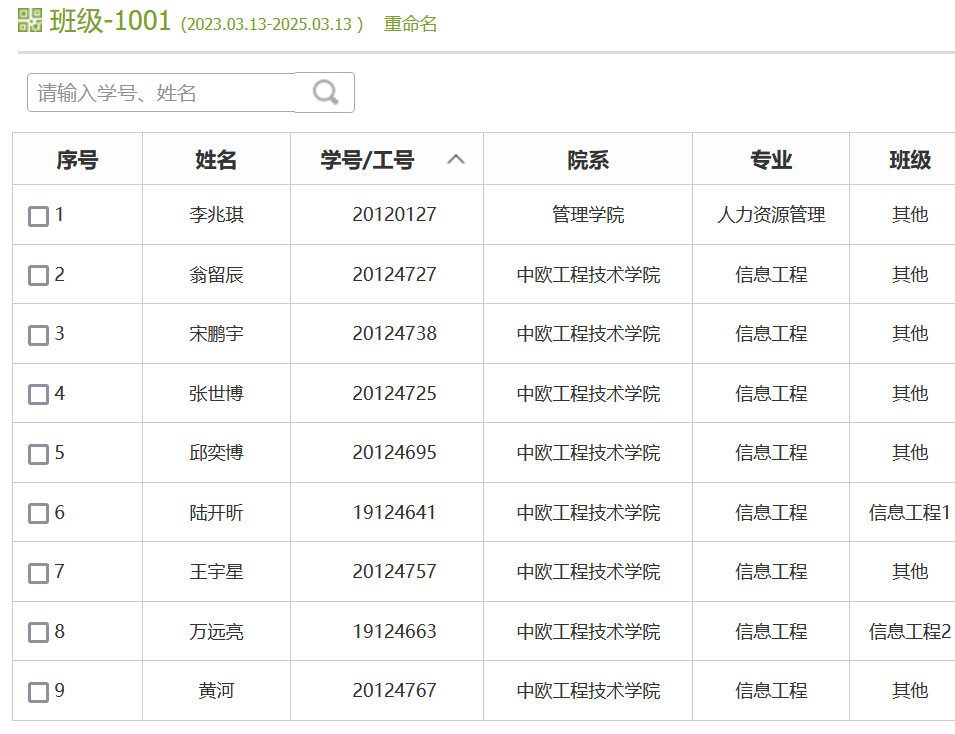
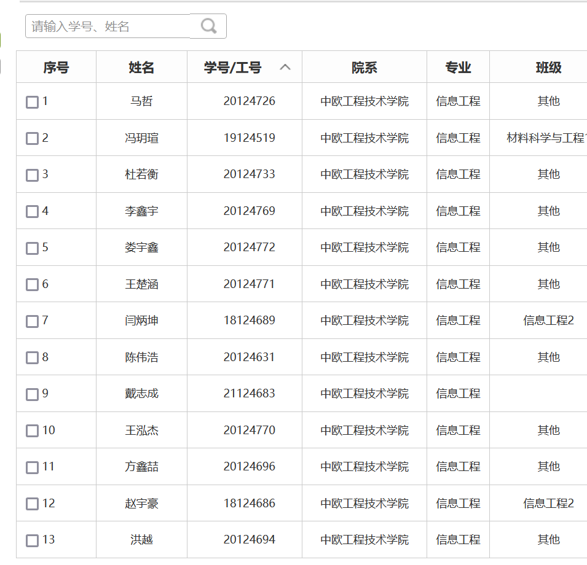

# ML01 Machine Learning

## Language

English. For everything.

## Where and When

### Tencent Meeting

For each session, please always join Tencent Meeting (VooV Meeting):

Room ID：958 9491 5777

### Laptop

For each session, please bring your own Laptop!

### Monday (Lectures and Continuous assessments)

- 20:00 - 21:40
- B313

### Wednesday (Exercise sessions)
- 10:00 - 11:40
- B313

### Thursday (Practice sessions)
- 13:00 - 16:40
- B315


## Lectures (Monday)

### Week 1
- Machine Learning overview

### Week 2
- Linear Regression

### Week 3
- Logistic Regression (for classification)

### Week 4
- Neural networks

### Week 5
- Building a Machine Learning web app

### Week 6
- Model selection

### Week 7
- CNN

### Week 8
- GAN

### Week 9
- AutoEncoder

### Week 10
- DQN

## Continuous assessment (Monday):

Tests will take place on Mondays (some of them).

Each test falls in the topic of its previous week, with some extensions (e.g. some more math).

You are recommended to read materials provided by prof ahead of time, to maximize your chance of success.

In total, 4 tests will be conducted.

Test are on paper, with book closed, no Internet, no electronic device, no discussion with classmates, no asking question to 
prof.

### Week 2

Materials to read before test:
- https://www.t-ott.dev/2021/11/24/animating-normal-distributions
- https://demonstrations.wolfram.com/TheBivariateNormalDistribution/
- https://online.stat.psu.edu/stat505/lesson/4/4.2

Test (20 min):
- Python List
- Numpy slicing
- Bivariate Gaussian Distribution


### Week 4

Materials to read before test:
- 
- 


Test (20 min):
- Linear Regression
- Logistic Regression
- Some math


### Week 6
Materials to read before test:
-
-

Test (20 min):
- Neural network implementation from scratch (1/2)
- Some math


### Week 8

Material to read before test:
-
-

Test (20 min):
- Neural network implementation from scratch (2/2)
- Some math


## Exercise sessions (Wednesday)

Most exercises will correspond to lecture topics, with some extensions.

### Week 1

Starting from this session, we will use Jupyter Notebook

Please install Python, VS Code, and, ideally, you should be able to use Google Colab and GitHub.

Make sure you have a seamless Internet connection to those websites.

Exercise:
- Python
- Numpy

### Week 2


Exercise:
- Linear Regression

### Week 3


### Week 4


### Week 5

### Week 6


### Week 7

### Week 8

### Week 9

### Week 10

## Practice sessions (Thursday)

### Week 1 - Week 2

- https://gitee.com/lundechen/static_website_with_go_hugo

### Week 3 

reveal.js

### Week 4 - Week 6

- https://gitee.com/lundechen/machine_learning_web_app

### Week 7

AWS 

### Week 8 - 10

TBD


## Project

Each group 3 students.

At most ONE group could have 2 or 4 students, provided that `N_Student % 3 != 0`.

Best projects will be hosted on [http://lunde.top](http://lunde.top), to inspire future projects.

## Score

Denoting your Continuous assessment score as `T`, your project score as `P`,
you final score will be 

```python
max(P, 0.4 * T + 0.6 * P)
```

## Asking questions :question:

#### Leveraging **[Gitee Issue](https://gitee.com/lundechen/cpp/issues)** for asking questions
By default, you should ask questions via **[Gitee Issue](https://gitee.com/lundechen/cpp/issues)**. Here is how:
- https://www.bilibili.com/video/BV1364y1h7sb/

#### Principe
Here is the principle for asking questions:

>  **Google First, Peers Second, Profs Last.**

You are expected to ask questions via **[Gitee Issue](https://gitee.com/lundechen/cpp/issues)**. However, as a **secondary**  (and hence, less desirable, less encouraged) choice, you could also ask questions in the WeChat group.

> Why Gitee Issue? Because it's simply more **professional**, and better in every sense.

In Gitee Issue and the WeChat group, questions will be answered selectively. 

Questions won't be answered if:
- they could be solved on a simple Google search
- they are out of the scope of the course
- they are well in advance of the progress of the course
- professors think that it's not interesting for discussion

#### Regarding personal WeChat chats:
- **Questions asked in personal WeChat chats will NOT be answered.**

Learning how to use Google & Baidu & Bing to solve computer science problems is an important skill you should develop during this course.

For private questions, please send your questions by email to:
- lundechen@shu.edu.cn (Lunde Chen)

#### Office visit

Office visit is NOT welcome unless you make an appointment at least one day in advance.


## Student List



