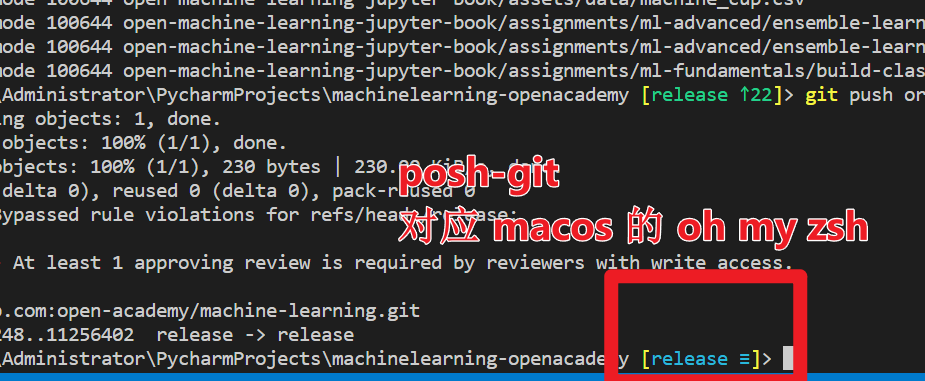
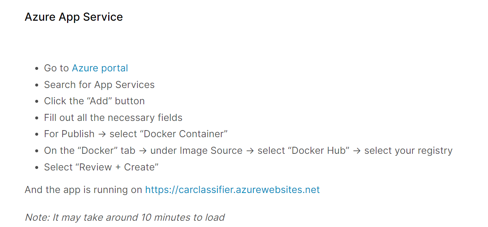

# ML01 Machine Learning, UTSEUS, Shanghai University

## QR Code


## Language

English. For everything.

## Where and When

### Tencent Meeting

For each session, please always join Tencent Meeting (VooV Meeting):
- Room ID：958 9491 5777

### Laptop

For each session, **please bring your own Laptop!**

For Fridays' practice sessions, please bring your headphone as well, because you will watch videos.

### Tuesday (Lectures and Continuous assessments)
Mostly theory.

- 08:00 - 09:40
- D309

### Thursday (Exercise sessions)
Mostly code.

- 13:00 - 14:40
- D309

### Friday (Practice sessions)
Practice sessions can help you to be more instrustry-ready.

- 10:00 - 11:40
- D309


## Lectures (Tuesday)

### Week 1
- Machine Learning overview

### Week 2
- Linear Regression

You might find those links on visualization useful:
- https://observablehq.com/@yizhe-ang/interactive-visualization-of-linear-regression
- https://visualize-it.github.io/polynomial_regression/simulation.html  
- https://uclaacm.github.io/gradient-descent-visualiser/#playground
- https://ben-karr.github.io/react-3d-gradients/

### Week 3
- Logistic Regression (for classification)

You might find those links on visualization useful:
- https://mlpocket.com/ml/supervised/logistic-regression
- https://mlu-explain.github.io/logistic-regression/
- https://playground.tensorflow.org/

### Week 4
- Neural networks

During the class, we will play a little bit with Tensorflow Playground:
- https://playground.tensorflow.org

Those materials can be very interesting as well:
- https://developers.google.com/machine-learning/crash-course/neural-networks/nodes-hidden-layers
- https://developers.google.com/machine-learning/crash-course/neural-networks/activation-functions
- https://www.v7labs.com/blog/neural-networks-activation-functions


AFTER the class, please watch those videos very carefully:
- https://www.youtube.com/watch?v=aircAruvnKk
- https://www.youtube.com/watch?v=IHZwWFHWa-w
- https://www.youtube.com/watch?v=Ilg3gGewQ5U
- https://www.youtube.com/watch?v=tIeHLnjs5U8

### Week 5
- Building a Machine Learning web app
    - https://microsoft.github.io/ML-For-Beginners/#/3-Web-App/1-Web-App/README
    - https://github.com/microsoft/ML-For-Beginners/tree/main/3-Web-App/1-Web-App
    
### Week 6
- Model selection

### Week 7
- CNN
    - for image classification
    - for image segmentation

### Week 8
- GAN

### Week 9
- AutoEncoder

### Week 10
- DQN

## Continuous assessment (Tuesday)

Tests will take place on Tuesdays (Week 2, Week 4, Week 6, Week 8).

Each test falls in the topic of its previous week, with some extensions (e.g. some more math).

You are recommended to read materials provided by prof ahead of time, to maximize your chance of success.

In total, 4 tests will be conducted.

Tests are on paper, with book closed, no Internet, no electronic device, no discussion with classmates, no asking prof questions.

After each test, feel free to forget everything that you have learned for test preparation, because your intuition has already been developed and will stay with you. After you have experienced all this, you gain more confidence on youself and would be more open to new challenges. And that's the most important thing.


### Week 2 (Test 1/4)

Materials to read before test:
- all jupyter notebooks for  lectures and exercises
- https://www.t-ott.dev/2021/11/24/animating-normal-distributions
- https://demonstrations.wolfram.com/TheBivariateNormalDistribution/
- https://online.stat.psu.edu/stat505/lesson/4/4.2


Test (45 min):
- **Code**: Python list, Python string, Python dictionary
- **Code**: Numpy slicing, numpy broadcast
- **Math**: Gaussian Distribution
- **Math**: Bivariate Gaussian Distribution
- **Misc**: GitHub Pull Request (GitHub workflow)


### Week 4 (Test 2/4)

Materials to read before test:
- https://docs.github.com/en/actions/quickstart
- https://resources.github.com/ci-cd/
- https://www.khanacademy.org/math/multivariable-calculus/applications-of-multivariable-derivatives/optimizing-multivariable-functions/a/what-is-gradient-descent


Test (45 min):
- **Code**: Linear Regression implementation from scratch
- **Code**: Logistic Regression implementation from scratch
- **Math**: Gradient Descent
- **Math**: MSE for linear regression
- **Math**: cross-entropy loss function for logistic regression
- **Misc**: ssh key, CI/CD, GitHub Actions, Python pickle, confusion matrix


### Week 6 (Test 3/4)
Materials to read before test:
- all jupyter notebooks for lectures and exercises
- The four 3b1b videos [[1]](https://www.youtube.com/watch?v=aircAruvnKk) [[2]](https://www.youtube.com/watch?v=IHZwWFHWa-w) [[3]](https://www.youtube.com/watch?v=Ilg3gGewQ5U) [[4]](https://www.youtube.com/watch?v=tIeHLnjs5U8)
- https://www.analyticsvidhya.com/blog/2021/04/activation-functions-and-their-derivatives-a-quick-complete-guide/
- https://towardsdatascience.com/7-popular-activation-functions-you-should-know-in-deep-learning-and-how-to-use-them-with-keras-and-27b4d838dfe6
- https://towardsdatascience.com/activation-functions-neural-networks-1cbd9f8d91d6
- https://www.v7labs.com/blog/neural-networks-activation-functions
- https://medium.com/analytics-vidhya/brief-history-of-neural-networks-44c2bf72eec
- https://www.dataversity.net/a-brief-history-of-neural-networks/
- https://pub.towardsai.net/a-brief-history-of-neural-nets-472107bc2c9c
- https://machinelearningmastery.com/the-chain-rule-of-calculus-for-univariate-and-multivariate-functions/
- https://dougenterprises.com/the-neural-network-chain-rule/
- https://theorydish.blog/2021/12/16/backpropagation-%E2%89%A0-chain-rule


Test (30 min):
- **Code**: Neural network implementation from scratch (1/2) 
    - Some basic starter code (>= 70%) will be provided
- **Math**: activation functions
- **Math**: universal approximation theorem
- **Math**: the chain rule of calculus for univariate and multivariate functions
- **Math**: backpropagation algorithm
- **History/Culture**: History of Neural Network/Deep Learning (Pre-2015)

### Week 8 (Test 4/4)

Materials to read before test:
- all jupyter notebooks for  lectures and exercises
- https://gitee.com/lundechen/machine_learning_web_app
- https://zahidhasan.github.io/2020/10/13/bias-variance-trade-off-and-learning-curve.html
- https://towardsdatascience.com/ridge-and-lasso-regression-a-complete-guide-with-python-scikit-learn-e20e34bcbf0b

Test (30 min):
- **Code**: Neural network implementation from scratch (2/2) 
    - Some basic starter code (<= 50%) will be provided
- **Math**: L1 and L2 regularization
- **Math**: Bias Variance Trade-off
- **Math**: Learning Curve for determing overfitting and uderfitting
- **History/Culture**: Major Research and Application breakthroughs of deep learning in recent years (After 2015)
- **Misc**: [Machine Learning Web Application](https://gitee.com/lundechen/machine_learning_web_app): Docker, streamlit, fastapi, swagger, PyCharm debugging, etc.


## Exercise sessions (Thursday)

Most exercises will correspond to lecture topics, with some extensions.

### Week 1

Starting from this session, we will use Jupyter Notebook.

Please install Python, VS Code, and, ideally, you should be able to use Google Colab and GitHub.

Make sure you have a seamless Internet connection to those websites.

Exercise:
- Python
- Numpy
- Pandas

### Week 2

Make sure that you can run our Jupyter Notebooks on VS Code.

Also, make sure you have access to GitHub, Google and YouTube.


Exercise:
- Linear Regression from scratch

### Week 3

Exercise:
- Logistic Regression from scratch    

### Week 4
Exercise:
- Neural Network from scratch  

### Week 5

Exercise:
- Play with those ML apps, and get some ideas for your Project
    - https://www.tensorflow.org/js/demos
    - https://streamlit.io/gallery
    - https://shiny.rstudio.com/gallery/

- PICTH!
    - Present your amazing idea (even if it can be refined later, and should be)
    - Get people to join your team
    - Kick off your projects

### Week 6


### Week 7

### Week 8
- https://poloclub.github.io/ganlab/
- https://todayinsci.com/QuotationsCategories/I_Cat/Intuition-Quotations.htm


### Week 9
- https://douglasduhaime.com/posts/visualizing-latent-spaces.html
- https://www.youtube.com/watch?v=RGBNdD3Wn-g


### Week 10

## Practice sessions (Friday)

### Week ?? - Week ??

Tutorial (with videos):
- https://gitee.com/lundechen/static_website_with_go_hugo

The main goal of this tutorial is **NOT** to teach you Web Technology, but to walk through the main steps for building a static website, and to learn to use, in the meanwhile:
- Git (add, commit, push, pull, checkout, rebase, merge, conflict resolving)
- GitHub (GitHub pull request, GitHub actions)

Week 1:
- Finish deploying the website on GitHub Pages (Video 1 - 5).
- Send the url of your GitHub Pages to the WeChat group when you finish.

Week 2:
- GitHub workflow (Video 6 - 8).
- Each group two students.
- Please install GitLens (VS Code extension).
- Send the url of your GitHub Repositories to the WeChat group when you finish (three urls, for each group of two).

#### Pro tips

用 Windows 的同学，可以按照这个教程，安装 posh-git
- https://gitee.com/lundechen/hello#9-optional-git-branchstatus-indication-on-terminal

Corresponding tutorial video：
- https://www.bilibili.com/video/BV1cq4y1S7Be/ （starting from the 6th minute of the video）

同时 windows 建议使用 Windows Terminal

主要是为了这个：



If you are on MacOS/Linux, you can install *oh my zsh* instead.

同时 windows 建议使用 Windows Terminal

### Week ??

#### Task 1: reveal.js
- Follow the video
    - Create a repo named `cv`
    - Deploy the website as `https:<YOUR-GITHUB-ACCOUNT-NAME>.github.io/cv`
- Go to reveal.js official website, and try out different features
    - [demo](https://revealjs.com/demo), with its corresponding [source code](https://github.com/hakimel/reveal.js/blob/master/demo.html)
    - code highlight
    - image background
    - animation
    - transition
- For each of those different features
    - create a seperate GitHub repository 
    - therefore, you end up with multiple `remote`s on your local repository
- Send the URLs of your reveal.js websites to the WeChat group when you finish

#### Task 2: Deploy the reveal.js/GoHugo websites on Tencent Static Website Hosting Service, or AWS S3
- Send the URLs of your Tencent/AWS S3 websites to the WeChat group when you finish


#### Pro tips

Emoji HTML code:
- https://www.quackit.com/character_sets/emoji/emoji_v3.0/unicode_emoji_v3.0_characters_all.cfm


Make sure you have a Tencent Cloud account, and an AWS account with a Credit Card bound to it.

For a credit card, you might need help from a friend living now in foreign countries. I am not sure a Visa card in China will do or not.

For AWS, it will cost 1$, and then everything is basically free for one year.


### Week ?? - Week ??

Machine Learning web application.


#### Week ?? (Video 1 - Video 7)
Tutorial (with videos): 
- https://gitee.com/lundechen/machine_learning_web_app

Your task:
- Local deployment.
- Data Augmentation for better performance:
    - https://open-academy.github.io/machine-learning/assignments/ml-fundamentals/ml-overview-mnist-digits.html
- [optional] Deploy a [tensorflow.js demo](https://www.tensorflow.org/js/demos) on local
- [optional] Deploy [how-old-are-you-according-to-a-cnn-app](https://www.kaggle.com/code/ubiratanfilho/how-old-are-you-according-to-a-cnn) on local

#### Pro tips

If you really struggle with tensorflow etc. on your local machine, you could consider
- Google Colab
- GitHub Codespace
- AutoDL for renting a GPU machine
    - https://www.autodl.com/

#### Pro tips

If you encounter this issue:
- ModuleNotFoundError: No module named 'streamlit.cli'

here is the solution:
- [solution](https://stackoverflow.com/questions/68162180/modulenotfounderror-no-module-named-streamlit-cli)


#### Week ?? (Video 8 - Video 10)
Tutorial (with videos): 
- https://gitee.com/lundechen/machine_learning_web_app

Your task:
- Cloud VM deployment
    - for the ML web app (Digit Recgonization)
    - for the UFO prediction web app as well
    
- Streamlit Cloud deployment
    - https://docs.streamlit.io/streamlit-community-cloud/

- [optional] GitHub WebHook (no tutorial from prof., things are to be done by students).

- [optional] Deploy a  [tensorflow.js demo](https://www.tensorflow.org/js/demos) on a cloud VM

#### Week ?? (Video 11 - Video 12)
Tutorial (with videos): 
- https://gitee.com/lundechen/machine_learning_web_app

Your task:
- Docker deployment, for the ML web app
- Docker deployment, for GoHugo and reveal.js website
    - https://www.bilibili.com/video/BV1PY4y1t746/
- Send the url of your ML web app to the WeChat group when you finish.
- [optional] Install MySQL and PhpMyAdmin with Docker (Video 13) 
- [optional] Streamlit Cookie (Video 14) 
- [optional] Deploy a  [tensorflow.js demo](https://www.tensorflow.org/js/demos) on a cloud docker container





### Week ??

Docker Compose, Docker Network

### Week 9

- <https://www.youtube.com/watch?v=yznvWW_L7AA>
- https://www.youtube.com/watch?v=5cNrTU6o3Fw
- <https://www.youtube.com/watch?v=s_o8dwzRlu4>
- https://www.youtube.com/watch?v=7bA0gTroJjw

### Week ??

TBD

## Project

### Kick off

Projects kick off at Week 5, in the code session.

### Forming groups

Each group 3 students.

Forming groups:
- https://docs.qq.com/doc/DT2xqVHphanhGUWpR

At most ONE group could have 2 or 4 students, provided that `N_Student % 3 != 0`.

### Get inspired

- https://www.tensorflow.org/js/demos
- https://streamlit.io/gallery
- https://shiny.rstudio.com/gallery/
- https://github.com/MarcSkovMadsen/awesome-streamlit
- Alternatives to streamlit:
    - https://anvil.works/articles/4-alternatives-streamlit
- https://huggingface.co/

### Implementation

Your machine learning web application can be based on streamlit, flask, next.js, tensorflow.js or any other framework. It should be deployed on the cloud (Tencent/Alibaba/Google/Microsoft Cloud).

You can use chatgpt or gpt4, if you have the API key.

You can use AI APIs from Baidu/Tencent/Alibaba/Amazon/Google etc., for example:
- https://cloud.tencent.com/product/ai-class

Apply for a domain name if necessary, e.g. [http://an-interesting-ml-app.com](http://an-interesting-ml-app.com).

As an alternative, a WeChat miniprogram is OK as well.

Use emojis or fontawesome/bootstrap icons where appropriate (How can we deliver messages without emojis! Impossible mission!).

You code should be open-sourced and hosted on GitHub.

### What's expected of your video
- Length of video \>= 10 min
- You video should include those contents:
    - General presentation
    - Where do you get inspirations from for coming up with the idea of your project
    - How to use your ML Web app
    - How did you implement your app
    - How did you deploy your app
    - How CI/CD/GitHub Actions/WebHook plays a role in your deployment
- If possible, make it fun (Because life is good). 
- If possible, make it fancy (Because you are young). 
- If applicable, include an ethics analysis of your project in the video.
- If applicable, include an social impact analysis of your project  in the video.
- If applicable, include an market analysis of your project  in the video.
- If applicable, include an ecology analysis of your project  in the video.
- And yes, your video should be presented in English. 

### Submission of your work

1. Create a folder, in which you put:
    - the video
    - the source code
    - a txt/markdown file indicating 
        - what's the task of each team member
        - the estimated workload/contribution percentage of each team member 
    - a txt/markdown file indicating 
        - the URL of your GitHub repository for hosting your code
        - prof will check the commit history of your GitHub repo to see how each team member is contributing  
1. Zip the folder
1. Upload the zip file to Google Drive
1. Send the sharing link to the prof, by PRIVATE WeChat or by Email
    - Therefore, in the WeChat/Email message, there are no attached files, just an Google Drive URL.

For each team, just one submission of the work is necessary, by one member of your team.

Deadline for submission:
- The First Friday of the 14 days of Exam Weeks of SHU, 23:59.

### Last but not least
Your app should be legal, ethical.

## Score

Denoting your Continuous Assessments score as `T`, your project score as `P`, your final score will be 

```python
0.7 * T + 0.3 * P
```

### Distribution of notes
- 10% A (90-100)
- 20% A- (85-89)
- 30% B (80-84)
- 20% C (75-79)
- 20% D/E/F

Historical failing rate:
- 2021: 10%
- 2023: 10%

## Gallery

### GoHugo/reveal.js website
- https://alexisz12.github.io/
- https://moonoxy.github.io/
- https://huangusr.github.io/
- https://lifelongcoding.github.io
- https://alexandreqiu.github.io/web/
- https://leo-fang-qaq.github.io/
- https://jialing78.github.io/
- https://hong-yue111.github.io/
- https://morganelu.github.io/

### ML web app


### Final project


## Misc


#### Zen of Python

https://peps.python.org/pep-0020/

```text
Beautiful is better than ugly.

Explicit is better than implicit.

Simple is better than complex.

Complex is better than complicated.

Flat is better than nested.

Sparse is better than dense.

Readability counts.

Special cases aren't special enough to break the rules.

Although practicality beats purity.

Errors should never pass silently.

Unless explicitly silenced.

In the face of ambiguity, refuse the temptation to guess.

There should be one-- and preferably only one --obvious way to do it.

Although that way may not be obvious at first unless you're Dutch.

Now is better than never.

Although never is often better than *right* now.

If the implementation is hard to explain, it's a bad idea.

If the implementation is easy to explain, it may be a good idea.

Namespaces are one honking great idea -- let's do more of those!
```

## Asking questions :question:

### Leveraging **[Gitee Issue](https://gitee.com/lundechen/cpp/issues)** for asking questions
By default, you should ask questions via **[Gitee Issue](https://gitee.com/lundechen/cpp/issues)**. Here is how:
- https://www.bilibili.com/video/BV1364y1h7sb/

### Principe
Here is the principle for asking questions:

>  **Google First, Peers Second, Profs Last.**

You are expected to ask questions via **[Gitee Issue](https://gitee.com/lundechen/cpp/issues)**. However, as a **secondary**  (and hence, less desirable, less encouraged) choice, you could also ask questions in the WeChat group.

> Why Gitee Issue? Because it's simply more **professional**, and better in every sense.

In Gitee Issue and the WeChat group, questions will be answered selectively. 

Questions won't be answered if:
- they could be solved on a simple Google search
- they are out of the scope of the course
- they are well in advance of the progress of the course
- professors think that it's not interesting for discussion

### Regarding personal WeChat chats:
- **Questions asked in personal WeChat chats will NOT be answered.**

Learning how to use Google & Baidu & Bing & ChatGTP to solve computer science problems is an important skill you should develop during this course.

For private questions, please send your questions by email to:
- lundechen@shu.edu.cn (Lunde Chen)

### Office visit

Office visit is NOT welcome unless you make an appointment at least one day in advance.

## Student Name List

| 学号/工号    | 姓名  |
| -------- | --- |
| 22124692 | 赵俊凯 | 
| 22124694 | 冯以凡 (休学)| 
| 22124705 | 段轩 | 
| 22124725 | 乔正蓬 | 
| 22124731 | 王嘉浩 | 
| 22124732 | 雷宇杨 | 
| 22124747 | 陈佚 | 
| 22124774 | 杨宇周 | 
| 22124776 | 韦杰 | 
| 22124780 | 刘璐 | 
| 25D61119 | Herbin Mathis |
| 25D61073 | Chiem Romain |
| 25D61022 | Mocquant Henri |
| 25D61098 | Desmaret Mathéo |
| 25D61093 | CORNET Nicolas |
| 25D61118 | Boniface Pierre |
| 25D61034 | Douik Ahmed |
| 25D61086 | Million Corentin |
| 25D61156 | Maxime Boschet |
| 25D61033 | HUWER Paul |
| 25D61069 | Ferrasse--Jamaux Tom |
| 25D61070 | Maillard Camil |
| 25D61089 | Edouard Marchand |
| 25D61071 | CHAUDRY COURPAT Kizzy |
| 25D61125 | Gomes Romain |
| 25D61017 | PEREIRA DE ARAUJO Théo |
| 25D61016 | Morin Loic |
| 25D61130 | Aristide BRUNAUD |
| 25D61136 | LE Rémy |
| 25D61123 | Julie BENED |
| 25D61088 | Lambert Gabin |
| 25D61013 | Fouich Noa |
| 25D61018 | MEDANE Yani |
| 25D61085 | Amaury DUFRENOT |
| 25D61030 | Jean Lagorsse |


## Online resources

1. 吴恩达机器学习系列：
    - https://www.bilibili.com/video/BV164411b7dx
1. 吴恩达深度学习系列：
    - https://www.bilibili.com/video/BV164411m79z

## F.A.Q

#### What characterizes this ML01 machine learning course?
- Stressful, fun and rewarding.

#### Do we have extra-course work?
-  Yes. A lot. 
- At least 5 hours of extra-course work each week is expected from you. 
    - 2 hours for course content revision & test preparation
    - 3 hours for your project (2 is the bare minimum, you might want to shoot up to 20 or 30 towards the end of the trimester).

#### Why this course seems a bit different?
- Well, the prof draws inspirations from courses of Stanford, Berkeley and MIT.
    - http://cs231n.stanford.edu (Stanford)
    - https://c.d2l.ai/berkeley-stat-157 (Berkeley)
    - http://introtodeeplearning.com (MIT)
    - http://cs229.stanford.edu （Stanford）

#### Do we have a slogan?
- Yes. See the picture below &#128071;


## License
This repository is licensed under [MIT](LICENSE).