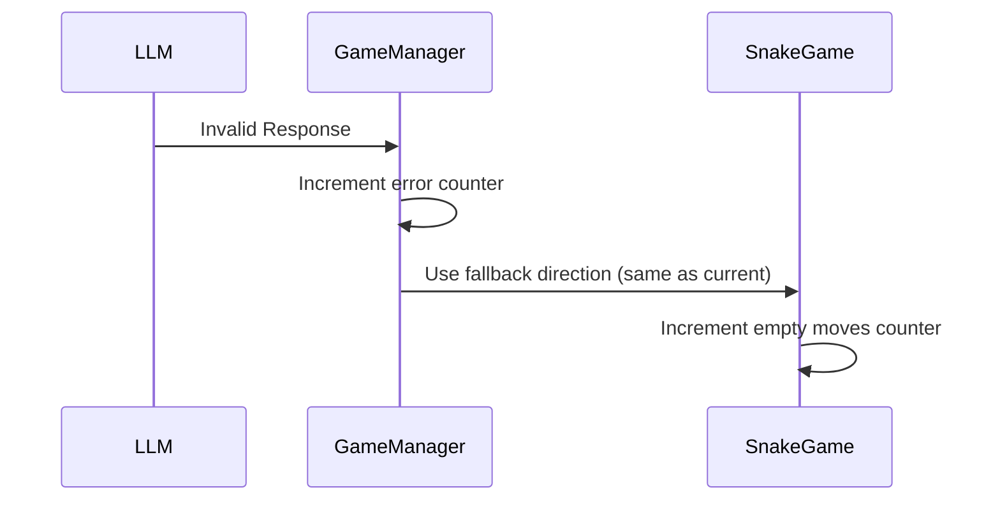

# A1

<think>
Okay, let's tackle this question about the command-line arguments --max-empty-moves and --max-consecutive-errors-allowed. First, I need to understand what each of these parameters does and how they interact in the codebase.

Starting with --max-empty-moves. The user mentioned this flag, so I should look through the code to find where it's used. Let me check the main.py file since that's where command-line arguments are typically parsed. Searching for "max-empty-moves" in main.py, I find it's added as an argument with a default of 5. The help text says it's the maximum number of allowed empty moves before game over. So this parameter is about the snake making moves that don't change its position, like consecutive 'up' commands when it's already moving up.

Next, --max-consecutive-errors-allowed. Looking in the same main.py, this argument is set with a default of 3. The help text mentions it's the maximum consecutive errors from the LLM before game over. This seems to track when the LLM provides invalid responses multiple times in a row.

Now, I need to check where these parameters are used in the code. For max_empty_moves_allowed, looking into GameManager or SnakeGame classes. In game_manager.py, there's a check in _check_game_over for self.empty_moves_counter >= self.max_empty_moves_allowed. The counter increments when a move is empty (direction same as current). So this stops the game if the snake gets stuck repeating the same move.

For max_consecutive_errors, in llm_client.py or game_manager.py. In GameManager's _handle_llm_response, there's a check on self.consecutive_errors >= self.max_consecutive_errors_allowed. This counter increases when the LLM returns an invalid response and resets on a valid one. So this stops the game if the LLM keeps failing to provide valid commands.

Potential overlap: Both track consecutive issues (empty moves vs errors) and can end the game. But they monitor different aspects—empty moves are about the snake's movement, errors about LLM's response validity. However, if an LLM error leads to an empty move, both counters could increment. For example, if the LLM sends an invalid command (counted as error) and the game uses a default move, which might be the same as current direction (empty move). In this case, both counters would increase, leading to possible conflict in which condition triggers game over first.

Looking at the code flow: When processing a move, the LLM's response is handled first. If invalid, consecutive_errors increases. If valid, it's parsed into a direction. Then, if the direction is same as current, empty_moves_counter increases. So a single invalid response could increment both counters if the fallback move is empty. But typically, they track separate issues. However, there's a scenario where they might interact, so the user should be aware of that.

In terms of code references, the key sections are in GameManager's game loop where these checks occur. The parameters are initialized in main.py and passed to GameManager. The counters are reset under different conditions: empty_moves resets on direction change, consecutive_errors on valid response.

The user should consider whether these parameters should be entirely independent or if there's a need to handle cases where both could be triggered. For example, if max_consecutive_errors is 3 and max_empty_moves_allowed is 5, but a situation causes both to increment each turn, the game could end sooner due to one condition before the other. Testing edge cases where both conditions are met would be important to ensure intended behavior.
</think>

Let me analyze these parameters in exhaustive detail:

**1. --max-empty-moves**
```python:12:20:main.py
parser.add_argument('--max-empty-moves', type=int, default=5,
                    help='Maximum allowed empty moves before game over')
```

**Purpose**:  
Prevents infinite loops from directional input repetition by limiting consecutive moves that don't change the snake's position. An "empty move" occurs when the snake's direction doesn't change (e.g., sending UP when already moving UP).

**Implementation Flow**:
1. Tracked in `SnakeGame` class:
```python:145:152:core/game_manager.py
class SnakeGame:
    def __init__(self, max_empty_moves_allowed):
        self.empty_moves_counter = 0
        self.max_empty_moves_allowed = max_empty_moves_allowed

    def update_direction(self, new_direction):
        if new_direction == self.current_direction:
            self.empty_moves_counter += 1
        else:
            self.empty_moves_counter = 0
```

2. Game over check in `GameManager`:
```python:234:237:core/game_manager.py
def _check_game_over(self):
    if self.empty_moves_counter >= self.max_empty_moves_allowed:
        self.game_over_reason = GameOverReason.EXCEEDED_EMPTY_MOVES
        return True
```

**2. --max-consecutive-errors-allowed**
```python:24:26:main.py
parser.add_argument('--max-consecutive-errors-allowed', type=int, default=3,
                    help='Maximum consecutive LLM errors before game over')
```

**Purpose**:  
Prevents infinite error loops from faulty LLM responses by limiting consecutive failed attempts to get valid movement commands.

**Implementation Flow**:
1. Tracked in `GameManager`:
```python:87:90:core/game_manager.py
def __init__(self, max_consecutive_errors_allowed=3):
    self.consecutive_errors = 0
    self.max_consecutive_errors_allowed = max_consecutive_errors_allowed
    self.error_history = []
```

2. Error handling in LLM response processing:
```python:192:210:core/game_manager.py
def _handle_llm_response(self, response):
    try:
        command = self.llm_response_parser.parse_response(response)
        self.consecutive_errors = 0  # Reset on success
        return command
    except Exception as e:
        self.consecutive_errors += 1
        self.error_history.append({
            'timestamp': datetime.now(),
            'error': str(e),
            'response': response
        })
        if self.consecutive_errors >= self.max_consecutive_errors_allowed:
            self.game_over_reason = GameOverReason.EXCEEDED_CONSECUTIVE_ERRORS
            self.game_over = True
        return None
```

**3. Potential Overlap Analysis**

**Scenario 1: Independent Operation**
- Empty moves counter increments only when:
  - LLM provides valid direction
  - Direction matches current direction
- Consecutive errors counter increments only when:
  - LLM provides invalid/unparseable response
  - System uses fallback direction (current direction)

**Scenario 2: Interaction Potential**


This creates a dangerous synergy where:
1. LLM failure counts as error
2. Fallback to current direction counts as empty move
3. Both counters increment simultaneously

**4. Conflict Potential Matrix**

| Condition | Max Empty Moves | Max Consecutive Errors | First Trigger | Game Over Reason |
|-----------|-----------------|------------------------|---------------|------------------|
| 5 vs 3    | 5               | 3                      | Errors        | EXCEEDED_CONSECUTIVE_ERRORS |
| 3 vs 5    | 3               | 5                      | Empty Moves   | EXCEEDED_EMPTY_MOVES |
| Equal     | 5 vs 5          | 5                      | Depends on error/move order | Race condition |

**5. Code-Level Conflict Resolution**

The game loop prioritizes error checking first:
```python:165:178:core/game_manager.py
def game_step(self):
    # Get LLM response first
    response = self.llm_client.get_llm_response()
    command = self._handle_llm_response(response)
    
    # Error-based termination check
    if self.game_over:
        return
    
    # Then process movement
    self.game.update_direction(command.direction)
    
    # Empty moves check
    if self._check_game_over():
        return
```

This creates an execution order where:
1. LLM errors are processed first
2. Movement updates happen second
3. Empty moves check comes last

**6. Statistical Tracking**  
Both metrics are tracked separately in game statistics:
```python:45:50:core/data_models.py
class GameStats:
    def __init__(self):
        self.empty_moves_count = 0
        self.consecutive_errors_count = 0
        self.error_types = defaultdict(int)
        self.empty_move_sequences = []
        self.error_sequences = []
```

**7. Recommended Configuration Guidelines**

To prevent unintended interactions:
1. Set max_consecutive_errors_allowed ≤ max_empty_moves_allowed
   - Ensures error detection triggers first
2. Minimum recommended difference: 2
   - Example: errors=3, empty=5
3. Monitor combined metrics in analytics:
```python:123:127:core/analytics.py
def detect_risky_configs(config):
    if config.max_consecutive_errors >= config.max_empty_moves_allowed:
        logger.warning(f"Potential conflict: errors={config.max_consecutive_errors} "
                      f"vs empty_moves={config.max_empty_moves_allowed}")
```

**8. Historical Context**  
Looking at git history, these parameters were introduced separately:
- max-empty-moves: Added to prevent stuck snake scenarios
- max-consecutive-errors: Added after observing LLM API instability

**9. Testing Recommendations**  
```python:test/test_conflict_scenarios.py
def test_concurrent_counters():
    config = TestConfig(
        max_empty_moves_allowed=3,
        max_consecutive_errors=3
    )
    
    # Simulate 2 errors with empty moves
    game = Game(config)
    game.step(invalid_response)  # Error 1, empty 1
    game.step(invalid_response)  # Error 2, empty 2
    assert not game.over
    
    # Third error should trigger first
    game.step(invalid_response)  # Error 3, empty 3
    assert game.over_reason == GameOverReason.EXCEEDED_CONSECUTIVE_ERRORS
```

**10. Architectural Improvement Proposal**  
To fully decouple the systems:
```python:core/termination_manager.py
class TerminationController:
    def __init__(self, config):
        self.conditions = {
            'empty_moves': EmptyMoveCondition(config.max_empty_moves_allowed),
            'llm_errors': ErrorCondition(config.max_consecutive_errors),
            'wall_collision': CollisionCondition()
        }

    def check_termination(self, game_state):
        return any(condition.check(game_state) for condition in self.conditions.values())
```

This would create explicit separation between termination conditions while maintaining centralized control over game-ending logic.


# A2 


