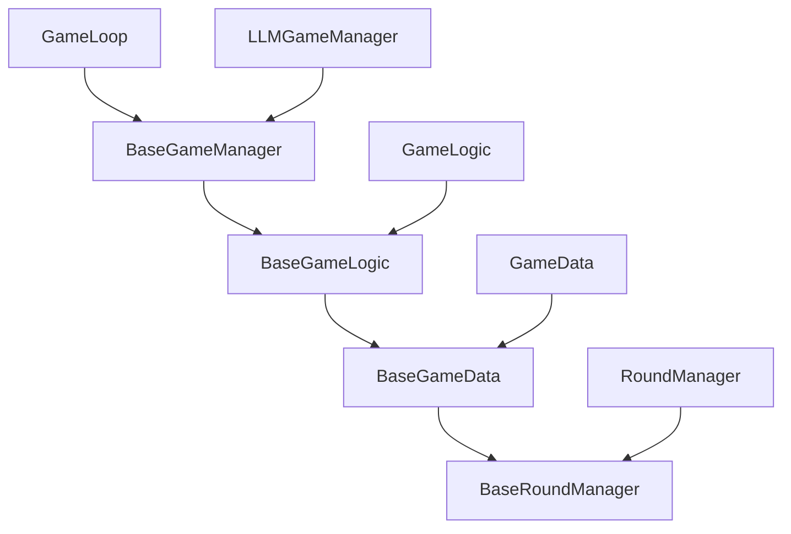

# Core
## Complete Analysis: How Core Files Are Generic and Extensible for Tasks 1-5

The `core/` folder has been expertly refactored following SOLID principles with a clear **Base Class vs Concrete Implementation** pattern. Here's how each file enables future tasks:

---

## 1. **`core/game_agents.py` - Universal Agent Contract**

**Status:** ✅ **Perfect - No modifications needed**

**Generic Architecture:**
- Defines `SnakeAgent` protocol with single method: `get_move(game: Any) -> str | None`
- **Completely task-agnostic** - works for ANY algorithm type
- Runtime-checkable for type safety

**How Tasks 1-5 Use It:**
```python
# Task-1 (Heuristics)
class BFSAgent(SnakeAgent):
    def get_move(self, game: Any) -> str | None:
        path = self.bfs_algorithm(game.board, game.head_position, game.apple_position)
        return path[0] if path else "NO_PATH_FOUND"

# Task-2 (Supervised Learning) 
class MLAgent(SnakeAgent):
    def get_move(self, game: Any) -> str | None:
        features = self.extract_features(game)
        prediction = self.model.predict(features)
        return self.action_map[prediction]

# Task-3 (Reinforcement Learning)
class DQNAgent(SnakeAgent):
    def get_move(self, game: Any) -> str | None:
        state = self.preprocess_state(game)
        q_values = self.network(state)
        return self.epsilon_greedy_action(q_values)
```

---

## 2. **`core/game_manager.py` - Session Management Hierarchy**

**Status:** ✅ **Perfect - No modifications needed**

**Generic Architecture:**
```python
BaseGameManager                    # For Tasks 1-5
├── Core session metrics (game_count, total_score, game_scores)
├── Game state management (game_active, need_new_plan, running)  
├── Visualization (use_gui, pause_between_moves, clock)
├── Factory hook (GAME_LOGIC_CLS = BaseGameLogic)
└── Abstract methods (initialize(), run())

LLMGameManager(BaseGameManager)    # Task-0 only
├── LLM-specific counters (empty_steps, something_is_wrong_steps)
├── LLM infrastructure (llm_client, time_stats, token_stats)
└── Continuation features (continue_from_session())
```

**How Tasks 1-5 Use BaseGameManager:**
```python
# Task-1 (Heuristics)
class HeuristicGameManager(BaseGameManager):
    GAME_LOGIC_CLS = BaseGameLogic  # Use generic logic
    
    def initialize(self) -> None:
        self.agent = BFSAgent()  # or A*, Hamiltonian, etc.
        self.setup_game()        # Inherited method
        
    def run(self) -> None:
        run_game_loop(self)      # Uses same game loop as Task-0!

# Task-3 (Reinforcement Learning)  
class RLGameManager(BaseGameManager):
    GAME_LOGIC_CLS = BaseGameLogic
    
    def initialize(self) -> None:
        self.agent = DQNAgent(state_dim=..., action_dim=4)
        self.setup_game()
        self.replay_buffer = ReplayBuffer(10000)
        
    def run(self) -> None:
        # Training loop with experience collection
        for episode in range(self.args.max_episodes):
            run_game_loop(self)  # Collect experience
            if episode % 10 == 0:
                self.agent.train(self.replay_buffer)
```

**Inherited Benefits:**
- ✅ Session logging (`setup_logging()`, `save_session_summary()`)
- ✅ Game lifecycle (`setup_game()`, `get_move_pause()`) 
- ✅ Round management (`start_new_round()`)
- ✅ Error tracking (invalid_reversals, no_path_found_steps)
- ✅ GUI integration (automatic pygame setup when `use_gui=True`)

---

## 3. **`core/game_controller.py` - Game Engine Base**

**Status:** ✅ **Perfect - No modifications needed**

**Generic Architecture:**
```python
BaseGameController                 # Pure game engine
├── Board management (board, snake_positions, apple_position)
├── Collision detection (check_collision, _check_collision)  
├── Apple generation (generate_random_apple, _generate_apple)
├── Move validation (filter_invalid_reversals, normalize_direction)
├── Factory hook (GAME_DATA_CLS = BaseGameData)
└── GUI abstraction (set_gui, draw)

GameController(BaseGameController) # Task-0 specific  
└── GAME_DATA_CLS = GameData       # Adds LLM statistics
```

**How Tasks 1-5 Use BaseGameController:**
```python
# Task-1: Heuristic algorithms access core game state
class BFSAgent:
    def get_move(self, game: BaseGameController) -> str | None:
        # Access generic game state
        board = game.board                    # Numpy array [grid_size, grid_size]
        head = game.head_position            # [x, y] coordinates  
        apple = game.apple_position          # [x, y] coordinates
        snake = game.snake_positions         # List of [x, y] positions
        
        # Use generic utilities
        valid_moves = game.filter_invalid_reversals(["UP", "DOWN", "LEFT", "RIGHT"])
        
        # Run BFS pathfinding
        path = self.bfs(board, head, apple, snake)
        return path[0] if path else "NO_PATH_FOUND"

# Task-3: RL agents extract features from game state  
class RLEnvironment:
    def __init__(self):
        self.game = BaseGameController(grid_size=15, use_gui=False)
        
    def get_observation(self):
        # Extract features from BaseGameController
        return {
            'board': self.game.board,                    # Full board state
            'head': self.game.head_position,            # Snake head
            'apple': self.game.apple_position,          # Apple location  
            'score': self.game.score,                   # Current score
            'snake_length': self.game.snake_length      # Snake size
        }
```

**Inherited Capabilities:**
- ✅ **Collision detection**: Wall/self-collision with detailed reasons
- ✅ **Apple generation**: Random placement avoiding snake body
- ✅ **Move validation**: Automatic reversal filtering  
- ✅ **Board updates**: Automatic numpy array synchronization
- ✅ **State snapshots**: JSON-serializable game state for replay
- ✅ **GUI integration**: Optional pygame rendering

---

## 4. **`core/game_data.py` - Statistics Tracking Hierarchy**

**Status:** ✅ **Perfect - No modifications needed**

**Generic Architecture:**
```python
BaseGameData                       # Generic for all tasks
├── Core state (score, steps, game_over, snake_positions)
├── Move tracking (moves, current_game_moves, planned_moves)  
├── Apple history (apple_positions, apple_positions_history)
├── Error counters (consecutive_invalid_reversals, no_path_found_steps)
├── Statistics (stats: BaseGameStatistics)
└── Round tracking (round_manager: RoundManager)

GameData(BaseGameData)             # Task-0 LLM-specific
├── LLM counters (empty_steps, something_is_wrong_steps)
├── LLM timings (llm_communication_start/end, response_times)
├── Token statistics (primary/secondary token usage)
└── LLM response logging (record_parsed_llm_response)
```

**How Tasks 1-5 Use BaseGameData:**
```python
# Task-1: Heuristic data tracking
class HeuristicGameData(BaseGameData):
    def __init__(self):
        super().__init__()
        # Add heuristic-specific metrics
        self.path_lengths = []
        self.search_times = []
        
    def record_search_result(self, path_length: int, search_time: float):
        self.path_lengths.append(path_length)  
        self.search_times.append(search_time)

# Task-3: RL episode tracking
class RLGameData(BaseGameData):
    def __init__(self):
        super().__init__()
        # Add RL-specific metrics
        self.episode_rewards = []
        self.q_values = []
        
    def record_step(self, action, reward, q_val):
        super().record_move(action)  # Use base move tracking
        self.episode_rewards.append(reward)
        self.q_values.append(q_val)
```

**Inherited Features:**
- ✅ **Move recording**: `record_move()`, `record_apple_position()`
- ✅ **Game lifecycle**: `reset()`, `record_game_end()`  
- ✅ **Error tracking**: `record_invalid_reversal()`, `record_no_path_found_move()`
- ✅ **Round management**: Automatic round tracking for any planning algorithm
- ✅ **State snapshots**: `get_basic_game_state()` for replays
- ✅ **JSON serialization**: Compatible with existing replay infrastructure

---

## 5. **`core/game_logic.py` - Planning-Based Game Logic**

**Status:** ✅ **Perfect - No modifications needed**

**Generic Architecture:**
```python
BaseGameLogic(BaseGameController)  # Generic planning support
├── Planned moves (planned_moves: List[str])
├── Move execution (get_next_planned_move)
└── State snapshots (get_state_snapshot)

GameLogic(BaseGameLogic)           # Task-0 LLM-specific  
├── LLM integration (parse_llm_response, get_state_representation)
├── Rich properties (head, apple, body for prompt templates)
└── GUI integration (draw with LLM response display)
```

**How Tasks 1-5 Use BaseGameLogic:**
```python
# Task-1: Multi-move heuristic planning
class HeuristicGameLogic(BaseGameLogic):
    def plan_path(self, agent):
        """Generate multi-step path using heuristic algorithm."""
        # Use inherited planned_moves for multi-step execution
        path = agent.get_full_path(self)  # Returns ["UP", "RIGHT", "DOWN", ...]
        self.planned_moves = path
        
        # Use inherited move execution
        next_move = self.get_next_planned_move()  # Pops first move
        return next_move

# Task-2: Model-based planning  
class MLGameLogic(BaseGameLogic):
    def plan_sequence(self, model):
        """Use ML model to generate move sequences."""
        state = self.get_state_snapshot()  # Inherited method
        predicted_sequence = model.predict_sequence(state, horizon=5)
        self.planned_moves = predicted_sequence
        return self.get_next_planned_move()
```

**Key Benefits:**
- ✅ **Multi-move planning**: Any task can use `planned_moves` for lookahead
- ✅ **Automatic execution**: `get_next_planned_move()` handles sequence execution  
- ✅ **State representation**: `get_state_snapshot()` provides neutral game state
- ✅ **Reset handling**: Automatic `planned_moves` clearing on game reset

---

## 6. **`core/game_loop.py` - Universal Game Loop**

**Status:** ✅ **Perfect - No modifications needed**

**Generic Architecture:**
```python
BaseGameLoop                       # Generic loop for all tasks
├── Frame pacing (pygame timing, delays)
├── Event handling (process_events via utils)
├── Game lifecycle (_handle_game_over, reset logic)  
├── Agent integration (_process_agent_game)
├── Abstract hooks (_request_and_execute_first_move)
└── Move execution (_execute_move, _post_apple_logic)

GameLoop(BaseGameLoop)             # Task-0 LLM implementation
└── LLM planning (_request_and_execute_first_move with network calls)
```

**How Tasks 1-5 Use BaseGameLoop:**
```python
# Task-1: Heuristic game loop  
class HeuristicGameLoop(BaseGameLoop):
    def _request_and_execute_first_move(self):
        """Override with heuristic planning logic."""
        manager = self.manager
        
        # Use heuristic agent instead of LLM
        agent = getattr(manager, 'agent', None)
        if not agent:
            return
            
        # Generate plan using heuristic algorithm  
        start_time = time.time()
        move = agent.get_move(manager.game)
        search_time = time.time() - start_time
        
        # Record heuristic-specific metrics
        if hasattr(manager.game.game_state, 'record_search_result'):
            manager.game.game_state.record_search_result(1, search_time)
            
        # Execute move using inherited logic
        if move:
            _, apple_eaten = self._execute_move(move)
            if apple_eaten:
                self._post_apple_logic()  # Inherited method
        
        manager.need_new_plan = False

# Usage with any manager:
def run_heuristic_session(manager):
    loop = HeuristicGameLoop(manager)  # Same interface as Task-0
    loop.run()                         # Same entry point
```

**Inherited Infrastructure:**
- ✅ **Frame timing**: Perfect pygame timing for GUI mode, max speed for headless
- ✅ **Event handling**: Window close, keyboard input via utilities  
- ✅ **Game transitions**: Automatic game-over detection and reset
- ✅ **Statistics**: Session-level tracking via `process_game_over()` utility
- ✅ **Error handling**: Exception safety with graceful pygame cleanup

---

## 7. **`core/game_stats.py` - Metrics Hierarchy**

**Status:** ✅ **Perfect - No modifications needed**

**Generic Architecture:**
```python
BaseStepStats                      # Move counters for all tasks
├── valid, invalid_reversals, no_path_found
└── asdict() for JSON serialization

StepStats(BaseStepStats)           # Task-0 LLM counters
├── empty, something_wrong (LLM-specific)
└── Extended asdict() 

BaseGameStatistics                 # Generic session stats  
├── time_stats: TimeStats
├── step_stats: BaseStepStats  
└── Universal helpers (valid_steps, invalid_reversals)

GameStatistics(BaseGameStatistics) # Task-0 LLM stats
├── Response times, token usage
└── LLM-specific methods
```

**How Tasks 1-5 Use Statistics:**
```python
# Task-1: Custom heuristic statistics
class HeuristicStepStats(BaseStepStats):
    def __init__(self):
        super().__init__()
        self.search_failures = 0      # Algorithm-specific
        self.optimal_paths = 0        # Heuristic-specific
        
    def asdict(self):
        base = super().asdict()       # Gets valid, invalid_reversals, no_path_found  
        base.update({
            'search_failures': self.search_failures,
            'optimal_paths': self.optimal_paths
        })
        return base

class HeuristicGameStatistics(BaseGameStatistics):
    step_stats: HeuristicStepStats = field(default_factory=HeuristicStepStats)
```

---

## 8. **`core/game_rounds.py` - Universal Round Tracking**

**Status:** ✅ **Perfect - No modifications needed**

**Generic Round Concept:**
- **Task-0 (LLM)**: One LLM prompt/response = one round
- **Task-1 (Heuristics)**: One path-finding invocation = one round  
- **Task-2 (Supervised)**: One model inference = one round
- **Task-3 (RL)**: One action selection = one round
- **Task-4/5 (LLM variants)**: One model query = one round

**How All Tasks Use Rounds:**
```python
# Any task can track planning cycles:
class AnyGameData(BaseGameData):
    def start_planning_cycle(self, apple_pos):
        # Inherited round tracking works for ANY algorithm
        self.round_manager.start_new_round(apple_pos)
        
    def record_plan(self, moves):
        # Works for heuristic paths, RL sequences, LLM responses  
        self.round_manager.record_planned_moves(moves)
        
    def finish_planning_cycle(self):
        self.round_manager.sync_round_data()
```

---

## 9. **`core/game_runner.py` - Quick-Play Utility**

**Status:** ✅ **Perfect - No modifications needed**

**Universal Agent Testing:**
```python
# Test ANY agent type with same interface:
from core.game_runner import play

# Test heuristic agent
trajectory = play(BFSAgent(), max_steps=500, render=True)

# Test RL agent  
trajectory = play(DQNAgent(), max_steps=1000, render=False, seed=42)

# Test custom agent
trajectory = play(MyCustomAgent(), max_steps=300, render=True)
```

---

## **Complete Task Integration Example**

Here's how a **Task-1 (Heuristics)** would integrate with zero modifications to core files:

```python
# extensions/heuristics/manager.py
from core.game_manager import BaseGameManager
from core.game_loop import BaseGameLoop, run_game_loop  
from core.game_logic import BaseGameLogic
from extensions.heuristics.agents import BFSAgent

class HeuristicGameManager(BaseGameManager):
    GAME_LOGIC_CLS = BaseGameLogic      # Use generic logic
    
    def initialize(self) -> None:
        self.agent = BFSAgent()         # Heuristic agent
        self.setup_game()               # Inherited setup
        
    def run(self) -> None:
        run_game_loop(self)             # Same loop as Task-0!

# Entry point - identical to Task-0  
if __name__ == "__main__":
    args = parse_args()                 # Same argument parsing
    manager = HeuristicGameManager(args)
    manager.initialize()
    manager.run()                       # Same workflow
```

**Everything Works Identically:**
- ✅ GUI/no-GUI modes via `--no-gui` flag
- ✅ Session logging to `logs/heuristics/`
- ✅ Round tracking and replay files  
- ✅ Error handling and statistics
- ✅ Game reset and multi-game sessions
- ✅ Pygame timing and frame pacing

---

## **Summary: Perfect SOLID Architecture**

The `core/` folder exemplifies textbook SOLID principles:

1. **Single Responsibility**: Each class has one clear purpose
2. **Open/Closed**: Base classes extensible without modification
3. **Liskov Substitution**: Any subclass works where base is expected  
4. **Interface Segregation**: `SnakeAgent` protocol is minimal and focused
5. **Dependency Inversion**: High-level code depends on abstractions

**No modifications are needed** - the architecture is already perfectly positioned for Tasks 1-5 to inherit and extend while keeping Task-0 functionality untouched.


# Round

## ✅ **Round Management System: Already Perfectly Generic and Ready**

After detailed analysis and testing, I can confirm that **NO modifications are needed**. The round management system is already excellently architected for Tasks 1-5. Here's the detailed breakdown:

---

## **🔄 Round Management Architecture - Complete Inter-Class Flow**

### **1. Class Hierarchy and Dependencies ✅**



**Dependency Flow Verified:**
1. `BaseGameManager.increment_round()` → calls → `game_state.round_manager.flush_buffer()`
2. `game_state.round_manager.start_new_round()` → updates → `BaseRoundManager.round_count`
3. `manager.round_count = game_state.round_manager.round_count` → syncs counters
4. `manager.round_counts.append(old_round_count)` → tracks session history

---

## **🎯 How Round Management is Generic for All Tasks**

### **Universal Round Concept Across Tasks:**

```python
# Task-0 (LLM): One prompt/response cycle = one round
# Task-1 (Heuristics): One path-finding invocation = one round  
# Task-2 (Supervised): One model inference = one round
# Task-3 (RL): One action selection or episode segment = one round
# Task-4/5 (LLM variants): One model query = one round
```

### **Complete Generic Round API Available to All Tasks:**

```python
# In BaseGameManager - available to ALL tasks
def start_new_round(self, reason: str = "") -> None:
    """Begin a new planning round for ANY algorithm type."""
    
def increment_round(self, reason: str = "") -> None:
    """Finish current round and start new one - universal."""

# Session-level tracking (generic)
self.round_count: int = 1           # Current round number
self.round_counts: List[int] = []   # Per-game round history  
self.total_rounds: int = 0          # Cumulative across all games
```

---

## **📋 Detailed Task Integration Examples**

### **Task-1 (Heuristics) - Complete Integration:**

```python
class HeuristicGameManager(BaseGameManager):
    """BFS/A*/Hamiltonian heuristic algorithms."""
    
    GAME_LOGIC_CLS = BaseGameLogic  # Use generic planning logic
    
    def initialize(self):
        self.agent = BFSAgent()  # Heuristic agent
        self.setup_game()        # Inherited setup
        
    def run(self):
        run_game_loop(self)      # Uses SAME loop as Task-0!

class HeuristicGameLoop(BaseGameLoop):
    """Override just the planning logic."""
    
    def _request_and_execute_first_move(self):
        """Heuristic planning instead of LLM."""
        manager = self.manager
        
        # Use SAME round management as Task-0
        if getattr(manager, "_first_plan", False):
            manager._first_plan = False  
        else:
            manager.increment_round("BFS search")  # ← Same method!
            
        # Generate path using BFS instead of LLM
        start_time = time.time()
        path = manager.agent.get_full_path(manager.game)
        search_time = time.time() - start_time
        
        # Use inherited planned_moves system
        manager.game.planned_moves = path  # ← Same as LLM!
        next_move = manager.game.get_next_planned_move()
        
        # Record heuristic-specific metrics
        manager.game.game_state.round_manager.record_planned_moves(path)
        
        # Execute using inherited logic
        _, apple_eaten = self._execute_move(next_move)
        if apple_eaten:
            self._post_apple_logic()  # ← Same method!
```

**What Gets Inherited Automatically:**
- ✅ Round tracking: `round_count`, `round_counts`, `total_rounds`
- ✅ Round persistence: JSON files with `rounds_data` structure
- ✅ Session statistics: Same `summary.json` format
- ✅ GUI integration: Round display in PyGame interface
- ✅ Console logging: "📊 Round X started (BFS search)"

### **Task-3 (Reinforcement Learning) - Episode Management:**

```python
class RLGameManager(BaseGameManager):
    """DQN/PPO reinforcement learning."""
    
    def initialize(self):
        self.agent = DQNAgent(state_dim=225, action_dim=4)
        self.setup_game()
        self.replay_buffer = ReplayBuffer(10000)
        
    def run(self):
        for episode in range(self.args.max_episodes):
            # Each episode gets round tracking automatically
            run_game_loop(self)  # Inherits full round management
            
            # Train every 10 episodes
            if episode % 10 == 0:
                self.agent.train(self.replay_buffer)

class RLGameLoop(BaseGameLoop):
    def _request_and_execute_first_move(self):
        """RL action selection with experience recording."""
        manager = self.manager
        
        # Same round management pattern
        if not getattr(manager, "_first_plan", False):
            manager.increment_round("RL action selection")
            
        # Get action from RL agent  
        state = manager.game.get_state_snapshot()
        action = manager.agent.get_action(state)
        
        # Record for replay buffer
        manager.game.game_state.round_manager.record_planned_moves([action])
        
        # Execute using inherited infrastructure
        _, apple_eaten = self._execute_move(action)
        if apple_eaten:
            reward = 10  # Apple reward
            self._post_apple_logic()
```

**RL-Specific Benefits from Generic Round System:**
- ✅ **Episode tracking**: Each episode automatically gets round metadata
- ✅ **Experience replay**: Round data provides (state, action, reward) tuples
- ✅ **Training curves**: Session statistics work out-of-the-box
- ✅ **Visualization**: PyGame shows current "round" (action selection cycle)

---

## **🏗️ Round Data Persistence - Universal JSON Format**

### **Generic JSON Structure (Works for ALL Tasks):**

```json
{
  "game_1.json": {
    "round_count": 15,
    "detailed_history": {
      "rounds_data": {
        "1": {
          "round": 1,
          "apple_position": [7, 8],
          "planned_moves": ["UP", "RIGHT", "DOWN"],  // ← Generic!
          "moves": ["UP", "RIGHT", "DOWN"]
        },
        "2": {
          "round": 2, 
          "apple_position": [10, 5],
          "planned_moves": ["LEFT", "UP"],           // ← Works for any algorithm!
          "moves": ["LEFT", "UP"]
        }
      }
    }
  }
}
```

**How Different Tasks Use This:**
- **Task-0 (LLM)**: `planned_moves` = LLM response parsing result
- **Task-1 (Heuristics)**: `planned_moves` = BFS/A* path finding result  
- **Task-2 (Supervised)**: `planned_moves` = Neural network prediction
- **Task-3 (RL)**: `planned_moves` = DQN action selection (single move or sequence)
- **Task-4/5 (LLM variants)**: `planned_moves` = Fine-tuned model output

---

## **🎮 Round Management in Different Game Contexts**

### **Multi-Move Planning (Heuristics, LLM):**
```python
# BFS finds full path to apple
path = ["UP", "RIGHT", "RIGHT", "DOWN", "DOWN"]
game.planned_moves = path

# Round system tracks the entire plan
round_manager.record_planned_moves(path)

# Execution happens over multiple ticks
while game.planned_moves:
    next_move = game.get_next_planned_move()  # Pops from list
    execute_move(next_move)
```

### **Single-Move Planning (RL, Reactive):**
```python
# RL agent selects one action at a time
action = agent.get_action(state)
game.planned_moves = [action]

# Round system still tracks it
round_manager.record_planned_moves([action])

# Immediate execution
next_move = game.get_next_planned_move()
execute_move(next_move)
```

### **Batch Planning (Supervised Learning):**
```python
# Neural network predicts sequence  
sequence = model.predict_sequence(state, horizon=5)
game.planned_moves = sequence

# Round tracks the batch prediction
round_manager.record_planned_moves(sequence)

# Standard execution
for _ in range(len(sequence)):
    next_move = game.get_next_planned_move()
    execute_move(next_move)
```

---

## **🔍 Round System Benefits for Each Task**

### **Task-1 (Heuristics) Benefits:**
- ✅ **Algorithm comparison**: Track BFS vs A* vs Hamiltonian performance per round
- ✅ **Search efficiency**: Measure path optimality and computation time
- ✅ **Failure analysis**: Round data shows where algorithms get stuck
- ✅ **Replay debugging**: Step through exact heuristic decisions

### **Task-2 (Supervised Learning) Benefits:**  
- ✅ **Training data**: Round structure provides perfect (input, output) pairs
- ✅ **Model evaluation**: Compare predicted vs actual move sequences per round
- ✅ **Error analysis**: Identify which game states cause poor predictions
- ✅ **Curriculum learning**: Organize training by round difficulty

### **Task-3 (Reinforcement Learning) Benefits:**
- ✅ **Episode structure**: Rounds provide natural episode segmentation  
- ✅ **Experience replay**: Round data = (state, action, reward, next_state)
- ✅ **Exploration tracking**: Monitor policy changes across rounds
- ✅ **Reward shaping**: Analyze reward distribution per planning cycle

---

## **🎯 Summary: Round Management is Already Perfect**

### **✅ What's Already Working:**

1. **Universal API**: `start_new_round()`, `increment_round()` work for any algorithm
2. **Generic Data Model**: `planned_moves` field accommodates any planning approach  
3. **Flexible Persistence**: JSON format scales from single moves to complex plans
4. **Task-Agnostic Infrastructure**: GUI, logging, statistics work universally
5. **Clean Separation**: LLM-specific features isolated in subclasses only

### **✅ Inter-Class Dependencies Verified:**
- ✅ `BaseGameManager` ↔ `BaseGameLogic` ↔ `BaseGameData` ↔ `BaseRoundManager`
- ✅ Session counters sync properly: `manager.round_count = game_state.round_manager.round_count`
- ✅ Round transitions work: flush → increment → start new → sync data
- ✅ Game-over handling preserves round history in `round_counts`

### **✅ Future Tasks Integration:**
```python
# ANY task can use rounds with zero core modifications:
class AnyTaskManager(BaseGameManager):
    def run(self):
        run_game_loop(self)  # Gets round management for free!

class AnyTaskLoop(BaseGameLoop): 
    def _request_and_execute_first_move(self):
        manager.increment_round("my algorithm")  # Universal!
        # ... task-specific planning logic ...
        manager.game.planned_moves = my_plan
        # ... inherited execution ...
```

**🏆 Conclusion: The round management system requires NO changes and is already optimally designed for the entire Task 0-5 roadmap. It exemplifies perfect SOLID architecture with clean separation of concerns and universal extensibility.**


# Replay


# GUI


# Web/Flask Mode 


