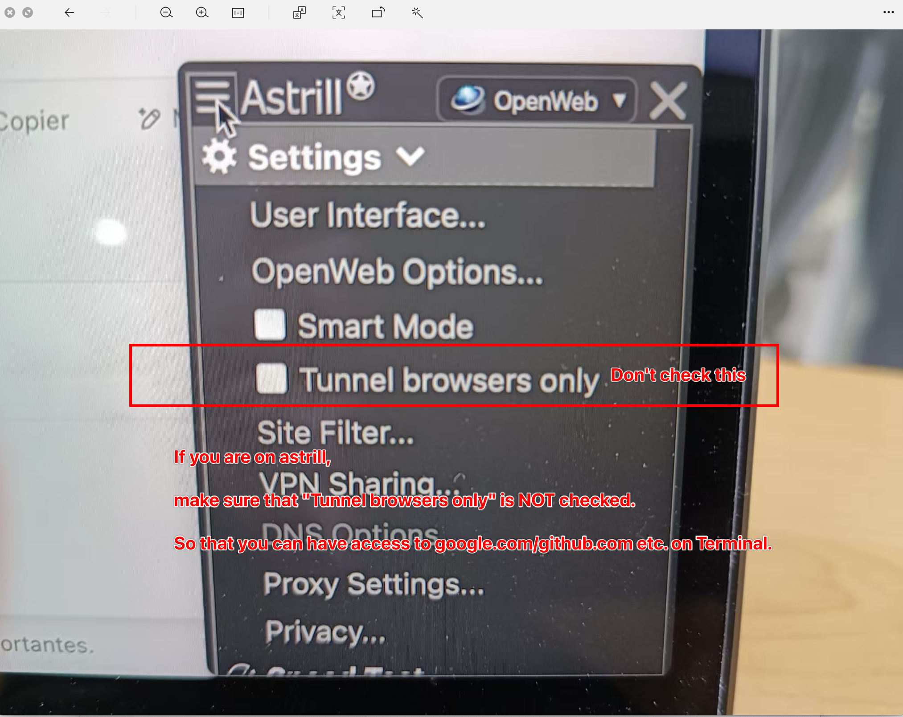

## Great firewall of China



If you are on astrill, 

make sure that "Tunnel browsers only" is NOT checked. 

So that you can have access to google.com/github.com etc. on Terminal.

## Check connections

```
curl google.com

curl github.com

curl baidu.com
```


## Create GitHub Account

You might need this for Authendification: 
- https://chromewebstore.google.com/detail/authenticator/bhghoamapcdpbohphigoooaddinpkbai?hl=en-US&utm_source=ext_sidebar


