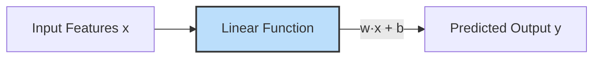
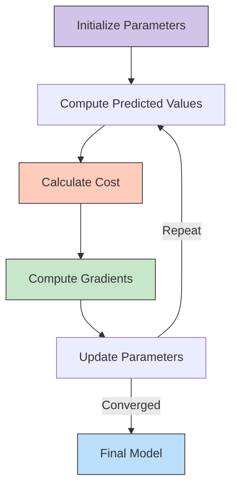
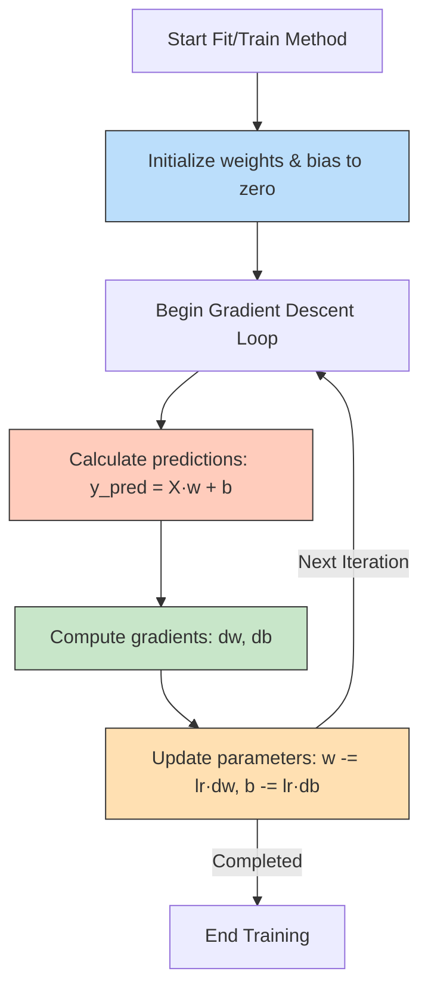
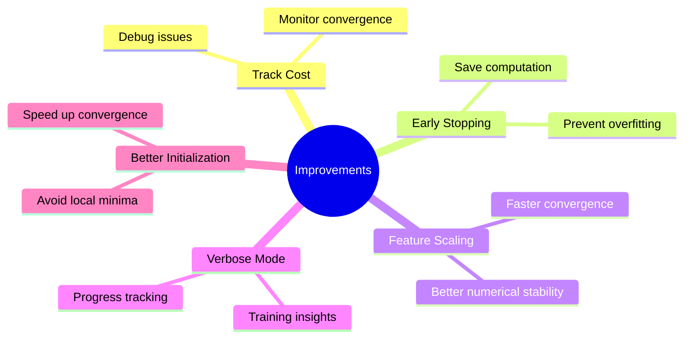
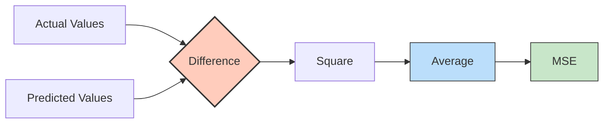
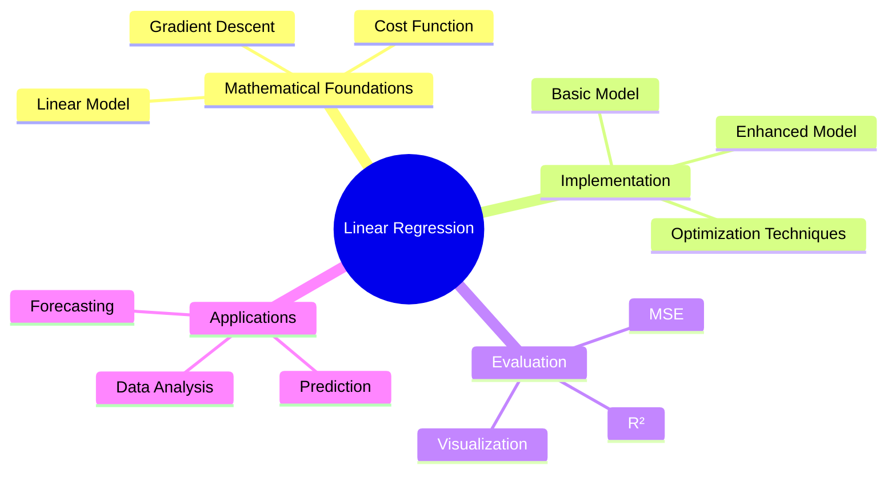

# Simple Linear Regression from Scratch

## Introduction

Linear regression is one of the most fundamental algorithms in machine learning. It models the relationship between a dependent variable and one or more independent variables by fitting a linear equation to observed data. Understanding how linear regression works under the hood provides valuable insights into more complex machine learning models.

In this tutorial, we will explore the mathematical foundations of simple linear regression, implement it from scratch using Python and NumPy, and enhance the basic implementation for improved performance and usability.

<details>
<summary>❓ What are the key differences between simple and multiple linear regression?</summary>

The key differences between simple and multiple linear regression are:

1. **Number of Features**:
   - Simple Linear Regression: Uses only one independent variable (feature) to predict the dependent variable.
   - Multiple Linear Regression: Uses two or more independent variables to predict the dependent variable.

2. **Equation Form**:
   - Simple: y = wx + b (where w and b are scalar values)
   - Multiple: y = w₁x₁ + w₂x₂ + ... + wₙxₙ + b (where w₁, w₂, etc. are weights for different features)

3. **Geometric Interpretation**:
   - Simple: Fits a line in 2D space
   - Multiple: Fits a hyperplane in multi-dimensional space

4. **Complexity**:
   - Simple: Easier to visualize and interpret
   - Multiple: More powerful but can be harder to visualize and interpret

5. **Use Cases**:
   - Simple: When there's a clear relationship between one predictor and the outcome
   - Multiple: When multiple factors affect the outcome, which is more common in real-world scenarios

6. **Coefficient Interpretation**:
   - Simple: Direct effect of the single feature on the outcome
   - Multiple: Effect of each feature while holding all other features constant
</details><br>

## Mathematical Foundations

### The Linear Model

At the core of linear regression is the linear model:

$$
y = \mathbf{w}^\top \mathbf{x} + b
$$

- $y$: Predicted value
- $\mathbf{x}$: Input feature vector
- $\mathbf{w}$: Weight vector
- $b$: Bias term

<details>
<summary>❓ What is the geometric interpretation of weights and bias in linear regression?</summary>

1. **Weights (w)**: 
   - Represent the slope of the regression line
   - Determine how much y changes when x increases by 1
   - Sign indicates positive or negative relationship

2. **Bias (b)**:
   - Represents the y-intercept
   - Value of y when x = 0
   - Shifts the line vertically

3. **Together**: Define a line (or hyperplane) that minimizes the distance to data points.
</details><br>

<details>
<summary>❓ Why do we represent the model as a dot product rather than writing out each feature explicitly?</summary>

1. **Compactness**: Provides concise mathematical notation
2. **Vectorization**: Enables efficient computation with optimized libraries
3. **Performance**: Allows parallel operations and faster computation
4. **Code simplicity**: Eliminates loops, reducing code complexity
5. **Framework compatibility**: Aligns with how modern ML libraries operate
</details><br>



The objective is to find the optimal weights $\mathbf{w}$ and bias $b$ that minimize the difference between the predicted values and the actual target values.

<details>
<summary>❓ Can a linear model capture non-linear relationships in data? Why or why not?</summary>

A standard linear model cannot directly capture non-linear relationships in data, but there are important nuances to understand:

1. **Fundamental Limitation**: By definition, a linear model can only produce outputs that are linear combinations of its inputs, which means it can only fit straight lines or hyperplanes.

2. **Linear Decision Boundaries**: Linear models can only create linear decision boundaries, making them unable to capture curved or complex patterns in data.

3. **Feature Engineering Workaround**: However, we can indirectly model non-linear relationships by:
   - Adding polynomial features (x², x³, etc.)
   - Creating interaction terms (x₁×x₂)
   - Applying non-linear transformations (log(x), sin(x), etc.)

For truly complex patterns, non-linear models (decision trees, neural networks) are more appropriate.
</details><br>

### Cost Function

To quantify the difference between predicted and actual values, we use the Mean Squared Error (MSE) as the cost function:

$$
J(\mathbf{w}, b) = \frac{1}{N} \sum_{i=1}^{N} (y^{(i)} - (\mathbf{w}^\top \mathbf{x}^{(i)} + b))^2
$$

Where:
- $N$: Number of samples
- $y^{(i)}$: Actual target value for the $i$-th sample
- $\mathbf{x}^{(i)}$: Input feature vector for the $i$-th sample

<details>
<summary>❓ Why do we use Mean Squared Error instead of Mean Absolute Error for linear regression?</summary>

MSE is preferred over MAE because:

1. **Mathematical properties**: Differentiable everywhere with smooth gradients
2. **Statistical foundation**: Leads to maximum likelihood estimation with normally distributed errors
3. **Optimization**: Creates a convex function with a single global minimum
4. **Analytical solutions**: Allows closed-form solution (normal equation)
5. **Gradient behavior**: Provides gradients proportional to error magnitude

</details><br>


### Gradient Descent

To minimize the cost function $J(\mathbf{w}, b)$, we employ the Gradient Descent optimization algorithm. Gradient Descent iteratively updates the weights and bias in the direction that reduces the cost.

<details>
<summary>❓ What's the intuition behind gradient descent and why does it work?</summary>

Gradient descent works like walking downhill to reach the valley:

1. The gradient points in the steepest uphill direction
2. Taking steps in the negative gradient direction moves toward lower cost
3. Steps get smaller near the minimum as the gradient approaches zero
4. For convex functions (like MSE), this guarantees finding the global minimum

</details><br>



The gradients of the cost function with respect to the weights and bias are:

$$
\frac{\partial J}{\partial \mathbf{w}} = -\frac{2}{N} \sum_{i=1}^{N} \mathbf{x}^{(i)} (y^{(i)} - \mathbf{w}^\top \mathbf{x}^{(i)} - b)
$$

$$
\frac{\partial J}{\partial b} = -\frac{2}{N} \sum_{i=1}^{N} (y^{(i)} - \mathbf{w}^\top \mathbf{x}^{(i)} - b)
$$

<details>
<summary>❓ How are these gradient equations derived from the cost function?</summary>

Deriving the gradient equations from the MSE cost function involves applying calculus to find the partial derivatives. Here's the step-by-step derivation:

Starting with the MSE cost function:

$$J(\mathbf{w}, b) = \frac{1}{N} \sum_{i=1}^{N} (y^{(i)} - (\mathbf{w}^\top \mathbf{x}^{(i)} + b))^2$$

Let's use the shorthand $\hat{y}^{(i)} = \mathbf{w}^\top \mathbf{x}^{(i)} + b$ for the prediction.

**1. Derivation of ∂J/∂w:**

Applying the chain rule:

$$\frac{\partial J}{\partial \mathbf{w}} = \frac{\partial J}{\partial \hat{y}^{(i)}} \cdot \frac{\partial \hat{y}^{(i)}}{\partial \mathbf{w}}$$

First part:
$$\frac{\partial J}{\partial \hat{y}^{(i)}} = \frac{\partial}{\partial \hat{y}^{(i)}} \frac{1}{N} \sum_{i=1}^{N} (y^{(i)} - \hat{y}^{(i)})^2$$

$$= \frac{1}{N} \sum_{i=1}^{N} \frac{\partial}{\partial \hat{y}^{(i)}} (y^{(i)} - \hat{y}^{(i)})^2$$

$$= \frac{1}{N} \sum_{i=1}^{N} 2(y^{(i)} - \hat{y}^{(i)})(-1)$$

$$= -\frac{2}{N} \sum_{i=1}^{N} (y^{(i)} - \hat{y}^{(i)})$$

Second part:
$$\frac{\partial \hat{y}^{(i)}}{\partial \mathbf{w}} = \frac{\partial}{\partial \mathbf{w}} (\mathbf{w}^\top \mathbf{x}^{(i)} + b) = \mathbf{x}^{(i)}$$

Combining:
$$\frac{\partial J}{\partial \mathbf{w}} = -\frac{2}{N} \sum_{i=1}^{N} (y^{(i)} - \hat{y}^{(i)}) \cdot \mathbf{x}^{(i)}$$

$$= -\frac{2}{N} \sum_{i=1}^{N} \mathbf{x}^{(i)} (y^{(i)} - \mathbf{w}^\top \mathbf{x}^{(i)} - b)$$

**2. Derivation of ∂J/∂b:**

Similarly:
$$\frac{\partial J}{\partial b} = \frac{\partial J}{\partial \hat{y}^{(i)}} \cdot \frac{\partial \hat{y}^{(i)}}{\partial b}$$

We already calculated the first part. For the second part:
$$\frac{\partial \hat{y}^{(i)}}{\partial b} = \frac{\partial}{\partial b} (\mathbf{w}^\top \mathbf{x}^{(i)} + b) = 1$$

Combining:
$$\frac{\partial J}{\partial b} = -\frac{2}{N} \sum_{i=1}^{N} (y^{(i)} - \hat{y}^{(i)}) \cdot 1$$

$$= -\frac{2}{N} \sum_{i=1}^{N} (y^{(i)} - \mathbf{w}^\top \mathbf{x}^{(i)} - b)$$

**Note**: The factor of 2 is sometimes absorbed into the learning rate, which is why you might see these equations without the 2 in some implementations.
</details><br>


Using these gradients, the update rules for weights and bias are:

$$
\mathbf{w} \leftarrow \mathbf{w} - \eta \times \frac{\partial J}{\partial \mathbf{w}}
$$

$$
b \leftarrow b - \eta \times \frac{\partial J}{\partial b}
$$

Where $\eta$ is the learning rate, a hyperparameter that controls the step size in each update.

<details>
<summary>❓ How does the learning rate affect the convergence of gradient descent?</summary>

Learning rate impacts convergence:

1. **Too large**: 
   - Overshoots the minimum
   - May diverge or oscillate
   - Can cause numerical instability

2. **Too small**:
   - Very slow convergence
   - May get stuck in high-precision computations
   - More susceptible to getting trapped in local minima (for non-convex functions)
   - Risks terminating before reaching the actual minimum if using early stopping

3. **Optimal approach**:
   - Use learning rate schedules (gradually decrease)
   - Try adaptive methods (AdaGrad, RMSProp, Adam)
   - Start with a moderate value (0.01) and adjust based on convergence behavior
</details><br>

## Implementing Linear Regression in Python

Let's implement the linear regression model from scratch using Python and NumPy. We will start with a basic implementation and then enhance it for better performance and usability.


### Initial Implementation

Below is the initial implementation of the `MyOwnLinearRegression` class, which includes methods for fitting the model to data and making predictions.

```python
%matplotlib inline
import numpy as np

class MyOwnLinearRegression:
    def __init__(self, learning_rate=0.0001, n_iters=30000):
        self.lr = learning_rate
        self.n_iters = n_iters
        self.weights = None
        self.bias = None

    def fit(self, X, y):
        n_samples, n_features = X.shape
        # Initialize parameters
        self.weights = np.zeros(n_features)
        self.bias = 0

        # Gradient Descent
        for _ in range(self.n_iters):
            # Predict the target values
            y_predicted = np.dot(X, self.weights) + self.bias

            # Compute gradients
            # Questions to students: 1 / n_samples or 2 / n_samples, does that matter? 
            dw = (1 / n_samples) * np.dot(X.T, (y_predicted - y))
            db = (1 / n_samples) * np.sum(y_predicted - y)

            # Update parameters
            self.weights -= self.lr * dw
            self.bias -= self.lr * db

    def predict(self, X):
        return np.dot(X, self.weights) + self.bias


import matplotlib.pyplot as plt
import pandas as pd

# Load dataset
dataset = pd.read_csv('Salary_Data.csv')
X = dataset.iloc[:, :-1].values
y = dataset.iloc[:, -1].values

from sklearn.model_selection import train_test_split
X_train, X_test, y_train, y_test = train_test_split(X, y, test_size = 1/3, random_state = 0)

# Example usage
regressor = MyOwnLinearRegression()
regressor.fit(X_train, y_train)
y_pred = regressor.predict(X_test)

# Visualize the results
plt.scatter(X_train, y_train, color = 'red')
plt.plot(X_train, regressor.predict(X_train), color = 'blue')
plt.title('Salary vs Experience (Training set)')
plt.xlabel('Years of Experience')
plt.ylabel('Salary')
plt.show()
```

<details>
<summary>❓ In the commented question about using 1/n_samples or 2/n_samples for gradient calculation, what is the correct approach and why?</summary>

Both approaches are valid:

1. Mathematically, the correct gradient includes 2/n_samples from differentiating the MSE cost function

2. In practice, using 1/n_samples is common because:
   - The factor of 2 can be absorbed into the learning rate
   - Since learning rate is tuned anyway, removing the 2 simplifies the equation
   - With proper learning rate adjustment, both approaches converge identically

The implementation using 1/n_samples is perfectly acceptable as long as the learning rate is properly tuned.
</details><br>

### Code Explanation 

#### Initialization 

The `__init__` method initializes the learning rate, number of iterations, and placeholders for weights and bias.

#### Fit Method (`fit`)

The `fit` method trains the model using gradient descent:

1. **Parameter Initialization:**
   - Weights are initialized to zeros.
   - Bias is initialized to zero.

2. **Gradient Descent Loop:**
   - For a specified number of iterations:
     - **Prediction:** Calculate the predicted values using the current weights and bias.
     - **Gradient Calculation:** Compute the gradients of the cost function with respect to weights and bias.
     - **Parameter Update:** Update the weights and bias by moving them in the opposite direction of the gradients.




<details>
<summary>❓ Why do we use matrix/vector operations instead of explicit loops in the implementation?</summary>

Matrix operations provide:

1. **Speed**: 10-100× faster than Python loops using optimized C/Fortran code
2. **Hardware utilization**: Leverages SIMD instructions and specialized libraries
3. **Code clarity**: Matches mathematical notation directly
4. **Memory efficiency**: Better cache utilization with contiguous memory
5. **Scalability**: Automatic parallelization across cores

Example comparison:
```python
# Slow: nested loops
for i in range(n_samples):
    for j in range(n_features):
        # calculations

# Fast: vectorized
dw = (1/n_samples) * np.dot(X.T, (y_pred - y))
```
</details><br>

#### Predict Method (`predict`)

The `predict` method generates predictions using the trained weights and bias:

$$
\hat{y} = \mathbf{w}^\top \mathbf{x} + b
$$

## Improving the Model

While the initial implementation works, there are several enhancements we can make to improve performance and usability:



<details>
<summary>❓ How does feature scaling impact gradient descent convergence?</summary>

Feature scaling significantly improves convergence:

1. **Balanced gradients**: Prevents features with large values from dominating updates
2. **Learning rate effectiveness**: Same rate works well for all features
3. **Direct path**: Transforms elliptical cost contours to more circular ones
4. **Faster convergence**: Can reduce iterations by orders of magnitude
5. **Numerical stability**: Prevents extremely large or small gradients

Without scaling, features with large ranges (e.g., income in $) create much larger gradients than features with small ranges (e.g., age), causing inefficient zigzagging during optimization.
</details><br>

1. **Tracking the Cost Function:** Monitor the cost function over iterations to observe convergence.
2. **Early Stopping:** Halt training when the improvement in the cost function becomes negligible.
3. **Feature Scaling:** Normalize the features to ensure better convergence.
4. **Verbose Mode:** Provide insights into the training process by printing periodic updates.
5. **Better Initialization:** Use smarter weight initialization techniques.

### Enhanced Implementation

Below is the improved version of the `MyOwnLinearRegression` class, incorporating the aforementioned enhancements.

```python
import numpy as np

class MyOwnLinearRegression:
    def __init__(self, learning_rate=0.001, n_iters=1000, tolerance=1e-7, verbose=False):
        self.lr = learning_rate
        self.n_iters = n_iters
        self.tolerance = tolerance
        self.verbose = verbose
        self.weights = None
        self.bias = None
        self.cost_history = []

    def fit(self, X, y):
        n_samples, n_features = X.shape
        # Initialize parameters
        self.weights = np.zeros(n_features)
        self.bias = 0

        for i in range(self.n_iters):
            # Prediction
            y_predicted = np.dot(X, self.weights) + self.bias

            # Compute cost (Mean Squared Error)
            cost = (1 / (2 * n_samples)) * np.sum((y_predicted - y) ** 2)
            self.cost_history.append(cost)

            # Compute gradients
            dw = (1 / n_samples) * np.dot(X.T, (y_predicted - y))
            db = (1 / n_samples) * np.sum(y_predicted - y)

            # Update parameters
            self.weights -= self.lr * dw
            self.bias -= self.lr * db

            # Check for convergence
            if i > 0 and abs(self.cost_history[-2] - self.cost_history[-1]) < self.tolerance:
                if self.verbose:
                    print(f"Converged at iteration {i}")
                break

            if self.verbose and i % 100 == 0:
                print(f"Iteration {i}, Cost: {cost}")

    def predict(self, X):
        return np.dot(X, self.weights) + self.bias
```

### Enhancements Explained

1. **Cost Function Tracking:**
   - The `cost_history` list stores the cost at each iteration, allowing us to visualize the convergence.
   
2. **Early Stopping:**
   - The `tolerance` parameter defines the minimum improvement required to continue training. If the improvement between consecutive iterations is less than `tolerance`, training stops early.
   
3. **Verbose Mode:**
   - When `verbose=True`, the model prints updates every 100 iterations and notifies when convergence is achieved.

4. **Adjusted Learning Rate and Iterations:**
   - Increased the default learning rate to 0.001 and reduced the number of iterations to 1000 for faster convergence.


### Complete Implementation with Example Usage

Below is the complete implementation of the `MyOwnLinearRegression` class along with an example of how to use it on a synthetic dataset.

```python
import numpy as np
from sklearn.model_selection import train_test_split
from sklearn.datasets import make_regression
import matplotlib.pyplot as plt

class MyOwnLinearRegression:
    def __init__(self, learning_rate=0.001, n_iters=1000, tolerance=1e-7, verbose=False):
        self.lr = learning_rate
        self.n_iters = n_iters
        self.tolerance = tolerance
        self.verbose = verbose
        self.weights = None
        self.bias = None
        self.cost_history = []

    def fit(self, X, y):
        n_samples, n_features = X.shape
        # Initialize parameters
        self.weights = np.zeros(n_features)
        self.bias = 0

        for i in range(self.n_iters):
            # Prediction
            y_predicted = np.dot(X, self.weights) + self.bias

            # Compute cost (Mean Squared Error)
            cost = (1 / (2 * n_samples)) * np.sum((y_predicted - y) ** 2)
            self.cost_history.append(cost)

            # Compute gradients
            dw = (1 / n_samples) * np.dot(X.T, (y_predicted - y))
            db = (1 / n_samples) * np.sum(y_predicted - y)

            # Update parameters
            self.weights -= self.lr * dw
            self.bias -= self.lr * db

            # Check for convergence
            if i > 0 and abs(self.cost_history[-2] - self.cost_history[-1]) < self.tolerance:
                if self.verbose:
                    print(f"Converged at iteration {i}")
                break

            if self.verbose and i % 100 == 0:
                print(f"Iteration {i}, Cost: {cost}")

    def predict(self, X):
        return np.dot(X, self.weights) + self.bias

if __name__ == "__main__":
    # Generate a synthetic dataset
    X, y = make_regression(n_samples=1000, n_features=1, noise=3, random_state=42)

    # Split the dataset into training and testing sets
    X_train, X_test, y_train, y_test = train_test_split(X, y, test_size=0.2, random_state=42)

    # Feature Scaling (Standardization)
    X_mean = np.mean(X_train, axis=0)
    X_std = np.std(X_train, axis=0)
    X_train = (X_train - X_mean) / X_std
    X_test = (X_test - X_mean) / X_std

    # Initialize and train the model
    regressor = MyOwnLinearRegression(learning_rate=0.01, n_iters=1000, tolerance=1e-8, verbose=True)
    regressor.fit(X_train, y_train)

    # Make predictions
    predictions = regressor.predict(X_test)

    # Plot the results
    plt.figure(figsize=(10,6))
    plt.scatter(X_test, y_test, color='blue', label='Actual')
    plt.scatter(X_test, predictions, color='red', label='Predicted')
    plt.xlabel('Feature')
    plt.ylabel('Target')
    plt.title('Simple Linear Regression: Actual vs Predicted')
    plt.legend()
    plt.show()
```

### Explanation of Example Usage

1. **Dataset Generation:**
   - We use `make_regression` from scikit-learn to create a synthetic dataset with 1000 samples, one feature, and added noise for realism.

2. **Data Splitting:**
   - The dataset is split into training and testing sets with an 80-20 ratio using `train_test_split`.

3. **Feature Scaling:**
   - Features are standardized to have a mean of 0 and a standard deviation of 1. This step ensures that gradient descent converges more efficiently.

4. **Model Initialization and Training:**
   - An instance of `MyOwnLinearRegression` is created with a learning rate of 0.01, 1000 iterations, a tolerance of $1 \times 10^{-8}$, and verbose mode enabled.
   - The model is trained using the `fit` method on the training data.

5. **Making Predictions:**
   - The trained model is used to predict target values for the test set.

6. **Visualization:**
   - A scatter plot visualizes the actual vs. predicted values, showcasing the performance of the regression model.

### Running the Example

To run the example, ensure you have the necessary libraries installed:

```bash
pip install numpy scikit-learn matplotlib
```

Save the complete code above in a Python file `linear_regression_from_scratch.py` and execute it using Python:

```bash
python linear_regression_from_scratch.py
```

You should see iterative cost updates in the console and a plot displaying the actual versus predicted values after training.

## Evaluation Metrics

To evaluate the performance of our linear regression model, we can use metrics such as Mean Squared Error (MSE) and R-squared ($R^2$).

### Mean Squared Error (MSE)

The MSE measures the average of the squares of the errors between predicted and actual values:

$$
\text{MSE} = \frac{1}{N} \sum_{i=1}^{N} (y_{\text{true}}^{(i)} - y_{\text{pred}}^{(i)})^2
$$



### R-squared ($R^2$)

The $R^2$ score indicates the proportion of the variance in the dependent variable that is predictable from the independent variable(s):

$$
R^2 = 1 - \frac{\sum_{i=1}^{N} (y_{\text{true}}^{(i)} - y_{\text{pred}}^{(i)})^2}{\sum_{i=1}^{N} (y_{\text{true}}^{(i)} - \bar{y})^2}
$$

Where $\bar{y}$ is the mean of the actual target values.

### Implementing Evaluation Metrics

We can implement and display these metrics as follows:

```python
from sklearn.metrics import mean_squared_error, r2_score

# Calculate evaluation metrics
mse = mean_squared_error(y_test, predictions)
r2 = r2_score(y_test, predictions)

print(f"Mean Squared Error (MSE): {mse}")
print(f"R-squared (R²): {r2}")
```

Add these lines to the example usage section to evaluate the model's performance after making predictions.

### Visualizing Cost Function Convergence

Plotting the cost function over iterations provides a visual representation of the model's learning process, which can help diagnose potential issues:

```python
# Plotting the Cost Function
plt.figure(figsize=(10,6))
plt.plot(regressor.cost_history, color='purple')
plt.title('Cost Function Convergence')
plt.xlabel('Iterations')
plt.ylabel('Cost')
plt.grid(True, alpha=0.3)
plt.show()
```

Add this snippet after training to visualize how the cost decreases over iterations.

## Conclusion

In this tutorial, we delved into the fundamentals of simple linear regression, exploring both the mathematical foundations and a practical implementation using Python and NumPy. By implementing linear regression from scratch, you gain a deeper understanding of how machine learning models learn from data, optimize their parameters, and make predictions. This foundational knowledge is crucial as you progress to more complex models and algorithms in machine learning.


