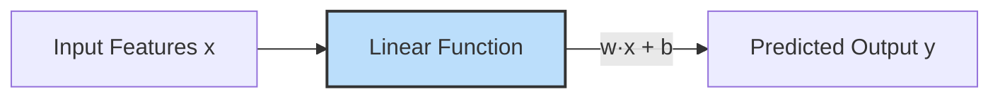
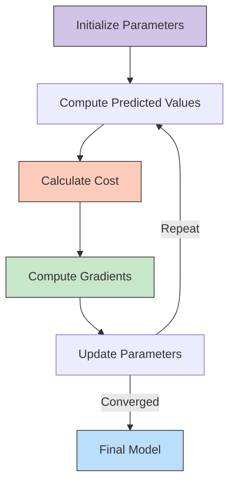
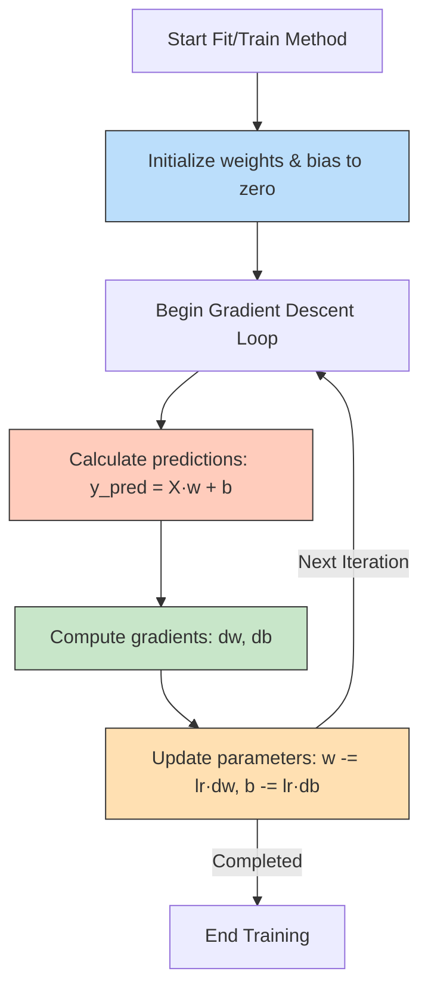
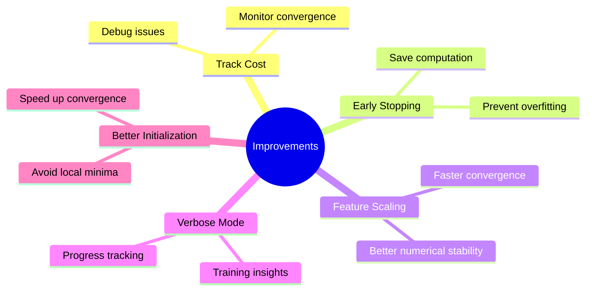
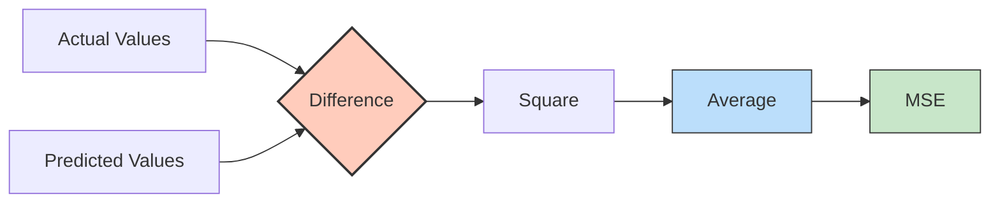
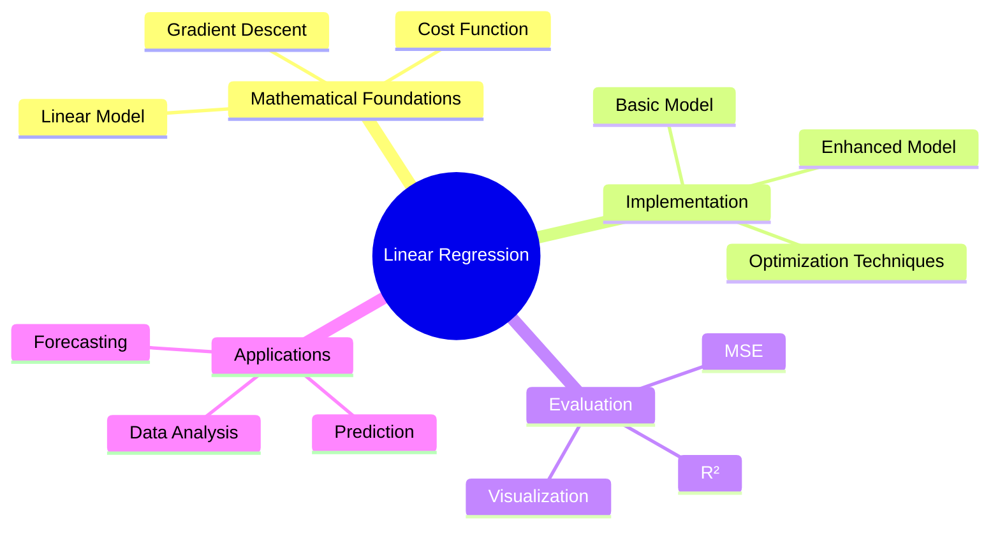

# Simple Linear Regression from Scratch

## Introduction

Linear regression is one of the most fundamental algorithms in machine learning. It models the relationship between a dependent variable and one or more independent variables by fitting a linear equation to observed data. Understanding how linear regression works under the hood provides valuable insights into more complex machine learning models.

In this tutorial, we will explore the mathematical foundations of simple linear regression, implement it from scratch using Python and NumPy, and enhance the basic implementation for improved performance and usability.

<details>
<summary>❓ What are the key differences between simple and multiple linear regression?</summary>

The key differences between simple and multiple linear regression are:

1. **Number of Features**:
   - Simple Linear Regression: Uses only one independent variable (feature) to predict the dependent variable.
   - Multiple Linear Regression: Uses two or more independent variables to predict the dependent variable.

2. **Equation Form**:
   - Simple: y = wx + b (where w and b are scalar values)
   - Multiple: y = w₁x₁ + w₂x₂ + ... + wₙxₙ + b (where w₁, w₂, etc. are weights for different features)

3. **Geometric Interpretation**:
   - Simple: Fits a line in 2D space
   - Multiple: Fits a hyperplane in multi-dimensional space

4. **Complexity**:
   - Simple: Easier to visualize and interpret
   - Multiple: More powerful but can be harder to visualize and interpret

5. **Use Cases**:
   - Simple: When there's a clear relationship between one predictor and the outcome
   - Multiple: When multiple factors affect the outcome, which is more common in real-world scenarios

6. **Coefficient Interpretation**:
   - Simple: Direct effect of the single feature on the outcome
   - Multiple: Effect of each feature while holding all other features constant
</details><br>

## Mathematical Foundations

### The Linear Model

At the core of linear regression is the linear model:

$$
y = \mathbf{w}^\top \mathbf{x} + b
$$

- $y$: Predicted value
- $\mathbf{x}$: Input feature vector
- $\mathbf{w}$: Weight vector
- $b$: Bias term

<details>
<summary>❓ What is the geometric interpretation of weights and bias in linear regression?</summary>

The geometric interpretation of weights and bias in linear regression:

1. **Weights (w)**:
   - Represent the **slope** of the regression line
   - Determine how much the predicted value changes when the feature value changes by one unit
   - Higher absolute values indicate steeper slopes and stronger relationships
   - The sign (+ or -) indicates whether the relationship is direct or inverse
   - In multiple regression, each weight controls the slope in the direction of its corresponding feature dimension

2. **Bias (b)**:
   - Represents the **y-intercept** of the regression line
   - The predicted value when all features are zero
   - Shifts the entire line up or down without changing its slope
   - Allows the model to fit data that doesn't necessarily pass through the origin

3. **Together**:
   - They define a line (in 2D) or hyperplane (in higher dimensions) that best fits the data
   - The line minimizes the distance between itself and the actual data points
   - In 2D, the equation y = wx + b creates a line where:
     - w controls how steep the line is
     - b controls where the line crosses the y-axis
</details><br>

<details>
<summary>❓ Why do we represent the model as a dot product rather than writing out each feature explicitly?</summary>

We represent the linear model as a dot product (y = w^T x + b) rather than writing out each feature explicitly for several important reasons:

1. **Mathematical Compactness**: The dot product notation provides a concise mathematical representation, especially for models with many features.

2. **Vectorization**: It allows for efficient implementation using vector operations, which are computationally optimized in libraries like NumPy.

3. **Computational Efficiency**: Vector operations can be parallelized, leading to faster computation especially when working with large datasets.

4. **Code Simplification**: Implementing the model as a dot product results in cleaner, more maintainable code compared to explicit loops over features.

5. **Framework Compatibility**: Modern machine learning frameworks are optimized for vector operations, making this notation directly translatable to efficient code.
</details><br>



The objective is to find the optimal weights $\mathbf{w}$ and bias $b$ that minimize the difference between the predicted values and the actual target values.

<details>
<summary>❓ Can a linear model capture non-linear relationships in data? Why or why not?</summary>

A standard linear model cannot directly capture non-linear relationships in data, but there are important nuances to understand:

1. **Fundamental Limitation**: By definition, a linear model can only produce outputs that are linear combinations of its inputs, which means it can only fit straight lines or hyperplanes.

2. **Linear Decision Boundaries**: Linear models can only create linear decision boundaries, making them unable to capture curved or complex patterns in data.

3. **Feature Engineering Workaround**: However, we can indirectly model non-linear relationships by:
   - Adding polynomial features (x², x³, etc.)
   - Creating interaction terms (x₁×x₂)
   - Applying non-linear transformations (log(x), sin(x), etc.)

4. **Example**: While y = wx + b can't fit a parabola, y = w₁x + w₂x² + b can.

5. **Limitations of the Workaround**: 
   - Requires domain knowledge to select appropriate transformations
   - Can lead to overfitting with too many polynomial terms
   - Becomes computationally expensive with high-dimensional data

6. **Alternatives**: When true non-linear relationships exist, non-linear models are often more appropriate:
   - Decision trees
   - Neural networks
   - Support vector machines with non-linear kernels
   - Gaussian processes

7. **Interpretability Trade-off**: While non-linear models can capture complex patterns, they often sacrifice the interpretability that makes linear regression valuable.
</details><br>

### Cost Function

To quantify the difference between predicted and actual values, we use the Mean Squared Error (MSE) as the cost function:

$$
J(\mathbf{w}, b) = \frac{1}{N} \sum_{i=1}^{N} (y^{(i)} - (\mathbf{w}^\top \mathbf{x}^{(i)} + b))^2
$$

Where:
- $N$: Number of samples
- $y^{(i)}$: Actual target value for the $i$-th sample
- $\mathbf{x}^{(i)}$: Input feature vector for the $i$-th sample

<details>
<summary>❓ Why do we use Mean Squared Error instead of Mean Absolute Error for linear regression?</summary>

There are several significant reasons why Mean Squared Error (MSE) is typically preferred over Mean Absolute Error (MAE) for linear regression:

1. **Mathematical Properties**:
   - MSE is differentiable everywhere, making it suitable for gradient-based optimization
   - The squared term creates a smooth, convex function with a single global minimum
   - Taking derivatives of squared terms is simpler mathematically

2. **Statistical Foundation**:
   - MSE minimization leads to the same solution as Maximum Likelihood Estimation under the assumption of normally distributed errors
   - When this assumption holds, MSE produces the Best Linear Unbiased Estimator (BLUE)

3. **Outlier Sensitivity**:
   - MSE gives more weight to larger errors due to squaring
   - This makes the model more sensitive to outliers, which can be beneficial when outliers represent important rare cases that shouldn't be ignored

4. **Analytical Solutions**:
   - For linear regression, MSE allows for a closed-form solution (Normal Equation)
   - This isn't possible with MAE, which requires iterative optimization

5. **Gradient Behavior**:
   - MSE's gradient is proportional to the error, creating larger updates for larger errors
   - MAE's gradient is constant (±1), which can lead to slower convergence near the minimum

However, MAE does have advantages in some situations:
   - More robust to outliers when they represent noise rather than signal
   - Produces median estimates rather than mean estimates
   - Can be preferable when the error distribution is not normal (e.g., heavy-tailed)
</details><br>


### Gradient Descent

To minimize the cost function $J(\mathbf{w}, b)$, we employ the Gradient Descent optimization algorithm. Gradient Descent iteratively updates the weights and bias in the direction that reduces the cost.

<details>
<summary>❓ What's the intuition behind gradient descent and why does it work?</summary>

The intuition behind gradient descent and why it works:

1. **Mountain Descent Analogy**:
   - Imagine being on a mountain and wanting to reach the lowest point (valley)
   - If you can only see your immediate surroundings, a good strategy is to look at which direction is steepest downhill and take a step in that direction
   - Repeating this process eventually leads you to a valley (minimum)

2. **Mathematical Intuition**:
   - The gradient (vector of partial derivatives) points in the direction of steepest increase of the function
   - The negative gradient points in the direction of steepest decrease
   - By taking steps proportional to the negative gradient, we move toward lower function values

3. **Why It Works**:
   - For convex functions (like MSE in linear regression), there is only one minimum
   - Each step is guaranteed to decrease the function value (if step size is appropriate)
   - The gradient gets smaller as we approach the minimum, leading to smaller steps
   - Eventually, we converge to a point where the gradient is (nearly) zero, indicating a minimum

4. **Step Size (Learning Rate) Considerations**:
   - Too small: Algorithm takes too long to converge
   - Too large: May overshoot the minimum and potentially diverge
   - Adaptive learning rates help address this challenge

5. **Limitations**:
   - For non-convex functions, may get stuck in local minima
   - Sensitive to feature scaling (features with larger ranges dominate the gradients)
   - Can be slow for flat regions or zigzag in narrow valleys

6. **Why It's Widely Used**:
   - Simple and intuitive
   - Computationally efficient, especially with stochastic variants
   - Works well for many machine learning problems
   - Scales to very high-dimensional problems
</details><br>



The gradients of the cost function with respect to the weights and bias are:

$$
\frac{\partial J}{\partial \mathbf{w}} = -\frac{2}{N} \sum_{i=1}^{N} \mathbf{x}^{(i)} (y^{(i)} - \mathbf{w}^\top \mathbf{x}^{(i)} - b)
$$

$$
\frac{\partial J}{\partial b} = -\frac{2}{N} \sum_{i=1}^{N} (y^{(i)} - \mathbf{w}^\top \mathbf{x}^{(i)} - b)
$$

<details>
<summary>❓ How are these gradient equations derived from the cost function?</summary>

Deriving the gradient equations from the MSE cost function involves applying calculus to find the partial derivatives. Here's the step-by-step derivation:

Starting with the MSE cost function:

$$J(\mathbf{w}, b) = \frac{1}{N} \sum_{i=1}^{N} (y^{(i)} - (\mathbf{w}^\top \mathbf{x}^{(i)} + b))^2$$

Let's use the shorthand $\hat{y}^{(i)} = \mathbf{w}^\top \mathbf{x}^{(i)} + b$ for the prediction.

**1. Derivation of ∂J/∂w:**

Applying the chain rule:

$$\frac{\partial J}{\partial \mathbf{w}} = \frac{\partial J}{\partial \hat{y}^{(i)}} \cdot \frac{\partial \hat{y}^{(i)}}{\partial \mathbf{w}}$$

First part:
$$\frac{\partial J}{\partial \hat{y}^{(i)}} = \frac{\partial}{\partial \hat{y}^{(i)}} \frac{1}{N} \sum_{i=1}^{N} (y^{(i)} - \hat{y}^{(i)})^2$$

$$= \frac{1}{N} \sum_{i=1}^{N} \frac{\partial}{\partial \hat{y}^{(i)}} (y^{(i)} - \hat{y}^{(i)})^2$$

$$= \frac{1}{N} \sum_{i=1}^{N} 2(y^{(i)} - \hat{y}^{(i)})(-1)$$

$$= -\frac{2}{N} \sum_{i=1}^{N} (y^{(i)} - \hat{y}^{(i)})$$

Second part:
$$\frac{\partial \hat{y}^{(i)}}{\partial \mathbf{w}} = \frac{\partial}{\partial \mathbf{w}} (\mathbf{w}^\top \mathbf{x}^{(i)} + b) = \mathbf{x}^{(i)}$$

Combining:
$$\frac{\partial J}{\partial \mathbf{w}} = -\frac{2}{N} \sum_{i=1}^{N} (y^{(i)} - \hat{y}^{(i)}) \cdot \mathbf{x}^{(i)}$$

$$= -\frac{2}{N} \sum_{i=1}^{N} \mathbf{x}^{(i)} (y^{(i)} - \mathbf{w}^\top \mathbf{x}^{(i)} - b)$$

**2. Derivation of ∂J/∂b:**

Similarly:
$$\frac{\partial J}{\partial b} = \frac{\partial J}{\partial \hat{y}^{(i)}} \cdot \frac{\partial \hat{y}^{(i)}}{\partial b}$$

We already calculated the first part. For the second part:
$$\frac{\partial \hat{y}^{(i)}}{\partial b} = \frac{\partial}{\partial b} (\mathbf{w}^\top \mathbf{x}^{(i)} + b) = 1$$

Combining:
$$\frac{\partial J}{\partial b} = -\frac{2}{N} \sum_{i=1}^{N} (y^{(i)} - \hat{y}^{(i)}) \cdot 1$$

$$= -\frac{2}{N} \sum_{i=1}^{N} (y^{(i)} - \mathbf{w}^\top \mathbf{x}^{(i)} - b)$$

**Note**: The factor of 2 is sometimes absorbed into the learning rate, which is why you might see these equations without the 2 in some implementations.
</details><br>


Using these gradients, the update rules for weights and bias are:

$$
\mathbf{w} \leftarrow \mathbf{w} - \eta \times \frac{\partial J}{\partial \mathbf{w}}
$$

$$
b \leftarrow b - \eta \times \frac{\partial J}{\partial b}
$$

Where $\eta$ is the learning rate, a hyperparameter that controls the step size in each update.

<details>
<summary>❓ How does the learning rate affect the convergence of gradient descent?</summary>

The learning rate (η) significantly impacts the convergence behavior of gradient descent in several ways:

1. **Too Large Learning Rate**:
   - Can cause the algorithm to overshoot the minimum
   - May lead to divergence (cost increases instead of decreases)
   - Results in oscillations around the minimum without converging
   - In extreme cases, can cause numerical overflow

2. **Too Small Learning Rate**:
   - Leads to very slow convergence (many iterations needed)
   - May get stuck in high-precision computations
   - More susceptible to getting trapped in local minima (for non-convex functions)
   - Risks terminating before reaching the actual minimum if using early stopping

3. **Optimal Learning Rate**:
   - Depends on the scale of the features and the shape of the cost function
   - Typically requires experimentation to find
   - Often follows the "Goldilocks principle" - neither too large nor too small

4. **Learning Rate Schedules**:
   - **Decreasing**: Start with a larger learning rate and decrease it over time
   - **Step Decay**: Reduce learning rate by a factor after a set number of iterations
   - **Exponential Decay**: Reduce learning rate exponentially over iterations
   
5. **Adaptive Learning Rates**:
   - Algorithms like AdaGrad, RMSProp, and Adam automatically adjust learning rates
   - Different learning rates for different parameters based on their gradients
   - Can significantly improve convergence without manual tuning

6. **Visual Interpretation**:
   - Learning rate represents the "step size" down the cost function slope
   - Large steps: Quick progress but risk overshooting
   - Small steps: Precise progress but very time-consuming

7. **Rule of Thumb**:
   - Start with a small learning rate (e.g., 0.01) and increase/decrease based on convergence behavior
   - If loss explodes, decrease learning rate by a factor of 10
   - If loss decreases very slowly, increase learning rate by a factor of 10
</details><br>

## Implementing Linear Regression in Python

Let's implement the linear regression model from scratch using Python and NumPy. We will start with a basic implementation and then enhance it for better performance and usability.


### Initial Implementation

Below is the initial implementation of the `MyOwnLinearRegression` class, which includes methods for fitting the model to data and making predictions.

```python
%matplotlib inline
import numpy as np

class MyOwnLinearRegression:
    def __init__(self, learning_rate=0.0001, n_iters=30000):
        self.lr = learning_rate
        self.n_iters = n_iters
        self.weights = None
        self.bias = None

    def fit(self, X, y):
        n_samples, n_features = X.shape
        # Initialize parameters
        self.weights = np.zeros(n_features)
        self.bias = 0

        # Gradient Descent
        for _ in range(self.n_iters):
            # Predict the target values
            y_predicted = np.dot(X, self.weights) + self.bias

            # Compute gradients
            # Questions to students: 1 / n_samples or 2 / n_samples, does that matter? 
            dw = (1 / n_samples) * np.dot(X.T, (y_predicted - y))
            db = (1 / n_samples) * np.sum(y_predicted - y)

            # Update parameters
            self.weights -= self.lr * dw
            self.bias -= self.lr * db

    def predict(self, X):
        return np.dot(X, self.weights) + self.bias


import matplotlib.pyplot as plt
import pandas as pd

# Load dataset
dataset = pd.read_csv('Salary_Data.csv')
X = dataset.iloc[:, :-1].values
y = dataset.iloc[:, -1].values

from sklearn.model_selection import train_test_split
X_train, X_test, y_train, y_test = train_test_split(X, y, test_size = 1/3, random_state = 0)

# Example usage
regressor = MyOwnLinearRegression()
regressor.fit(X_train, y_train)
y_pred = regressor.predict(X_test)

# Visualize the results
plt.scatter(X_train, y_train, color = 'red')
plt.plot(X_train, regressor.predict(X_train), color = 'blue')
plt.title('Salary vs Experience (Training set)')
plt.xlabel('Years of Experience')
plt.ylabel('Salary')
plt.show()
```

<details>
<summary>❓ In the commented question about using 1/n_samples or 2/n_samples for gradient calculation, what is the correct approach and why?</summary>

Regarding the question about using 1/n_samples or 2/n_samples for gradient calculation:

1. **Mathematically Correct Formula**: 
   - The mathematically correct gradient for MSE is (2/n_samples) * X.T @ (y_predicted - y) for weights
   - This comes directly from differentiating the MSE cost function

2. **Why Use 1/n_samples Instead**:
   - The factor of 2 is often absorbed into the learning rate parameter
   - Since the learning rate is a hyperparameter you tune anyway, including or excluding the 2 has no practical impact
   - Using 1/n_samples simplifies the formula and is a common convention in many implementations

3. **Effect on Convergence**:
   - Using 2/n_samples would make the gradients twice as large
   - To achieve equivalent updates, you would need to use a learning rate that's half as large
   - The convergence path would be identical between these approaches if learning rates are adjusted accordingly

In practice, the implementation shown with 1/n_samples is widely used and perfectly acceptable as long as you properly tune your learning rate.
</details><br>

### Code Explanation 

#### Initialization 

The `__init__` method initializes the learning rate, number of iterations, and placeholders for weights and bias.

#### Fit Method (`fit`)

The `fit` method trains the model using gradient descent:

1. **Parameter Initialization:**
   - Weights are initialized to zeros.
   - Bias is initialized to zero.

2. **Gradient Descent Loop:**
   - For a specified number of iterations:
     - **Prediction:** Calculate the predicted values using the current weights and bias.
     - **Gradient Calculation:** Compute the gradients of the cost function with respect to weights and bias.
     - **Parameter Update:** Update the weights and bias by moving them in the opposite direction of the gradients.




<details>
<summary>❓ Why do we use matrix/vector operations instead of explicit loops in the implementation?</summary>

Using matrix/vector operations instead of explicit loops offers several critical advantages:

1. **Performance**:
   - **Vectorization**: NumPy's vector operations are implemented in optimized C/Fortran code
   - **SIMD Instructions**: Vector operations can leverage Single Instruction Multiple Data (SIMD) CPU instructions
   - **Speed Improvement**: Often 10-100× faster than equivalent Python loops
   - **Hardware Acceleration**: Can utilize specialized hardware like BLAS libraries

2. **Code Clarity**:
   - **Mathematical Alignment**: Matrix notation matches the mathematical formulation more closely
   - **Conciseness**: Fewer lines of code, reducing potential for errors
   - **Readability**: Clearer expression of the algorithm's intent

3. **Memory Efficiency**:
   - **Contiguous Memory**: Array operations work on contiguous memory blocks
   - **Cache Utilization**: Better CPU cache utilization
   - **Memory Management**: Reduced overhead from Python's memory management

4. **Scalability**:
   - **Parallelization**: NumPy operations can automatically parallelize across CPU cores
   - **Resource Utilization**: Better utilization of computational resources
   - **Large Dataset Handling**: More efficient processing of large datasets

5. **Example Comparison**:

   Loop Implementation:
   ```python
   # Slow implementation with loops
   dw = np.zeros(n_features)
   for i in range(n_samples):
       error = (np.sum(X[i] * weights) + bias) - y[i]
       for j in range(n_features):
           dw[j] += X[i][j] * error
   dw = dw / n_samples
   ```

   Vector Implementation:
   ```python
   # Fast vectorized implementation
   y_pred = np.dot(X, weights) + bias
   dw = (1/n_samples) * np.dot(X.T, (y_pred - y))
   ```

6. **Industry Standard**:
   - Standard practice in data science and machine learning
   - Prepares code for scaling to larger datasets
   - Consistent with other libraries and frameworks

The vectorized approach is not just a performance optimization—it's a fundamental best practice in numerical computing and machine learning implementation.
</details><br>

#### Predict Method (`predict`)

The `predict` method generates predictions using the trained weights and bias:

$$
\hat{y} = \mathbf{w}^\top \mathbf{x} + b
$$

## Improving the Model

While the initial implementation works, there are several enhancements we can make to improve performance and usability:



<details>
<summary>❓ How does feature scaling impact gradient descent convergence?</summary>

Feature scaling significantly impacts gradient descent convergence in several ways:

1. **Convergence Speed**:
   - **Without Scaling**: Features with larger magnitudes dominate the gradient, causing zig-zagging in the optimization path
   - **With Scaling**: More balanced gradients across features, allowing for faster and more direct convergence
   - **Quantitative Impact**: Can reduce required iterations by orders of magnitude

2. **Learning Rate Sensitivity**:
   - **Without Scaling**: Difficult to find an appropriate learning rate that works for all features
   - **With Scaling**: A single learning rate becomes effective for all features
   - **Example**: A learning rate that's too large for one feature but too small for another causes oscillations in one dimension while barely moving in another

3. **Gradient Magnitudes**:
   - **Large-Scale Features**: Create large partial derivatives, causing large parameter updates
   - **Small-Scale Features**: Generate tiny gradients, resulting in very slow parameter updates
   - **After Scaling**: All features contribute more equally to the gradient

4. **Geometric Intuition**:
   - **Without Scaling**: The cost function contours become highly elliptical
   - **With Scaling**: Contours become more circular, making the gradient descent path more direct
   - **Visual Effect**: Transforming a narrow valley into a more bowl-shaped surface

5. **Common Scaling Techniques**:
   - **Standardization**: (x - mean) / std
   - **Min-Max Scaling**: (x - min) / (max - min)
   - **Robust Scaling**: (x - median) / IQR

6. **Mathematical Explanation**:
   - The condition number of the Hessian matrix is improved with scaling
   - Reduced condition number leads to faster convergence
   - Better-conditioned optimization problem is less sensitive to numerical issues

7. **Real-World Impact**:
   - **Large Datasets**: May not converge at all without scaling
   - **Time Savings**: Dramatically reduced training time
   - **Model Quality**: Often better final performance due to more complete convergence

8. **Example Scenario**:
   - Feature 1: Age (20-80 years)
   - Feature 2: Income ($20,000-$200,000)
   - Without scaling, income will dominate the gradients by a factor of ~1000x
</details><br>

1. **Tracking the Cost Function:** Monitor the cost function over iterations to observe convergence.
2. **Early Stopping:** Halt training when the improvement in the cost function becomes negligible.
3. **Feature Scaling:** Normalize the features to ensure better convergence.
4. **Verbose Mode:** Provide insights into the training process by printing periodic updates.
5. **Better Initialization:** Use smarter weight initialization techniques.

### Enhanced Implementation

Below is the improved version of the `MyOwnLinearRegression` class, incorporating the aforementioned enhancements.

```python
import numpy as np

class MyOwnLinearRegression:
    def __init__(self, learning_rate=0.001, n_iters=1000, tolerance=1e-7, verbose=False):
        self.lr = learning_rate
        self.n_iters = n_iters
        self.tolerance = tolerance
        self.verbose = verbose
        self.weights = None
        self.bias = None
        self.cost_history = []

    def fit(self, X, y):
        n_samples, n_features = X.shape
        # Initialize parameters
        self.weights = np.zeros(n_features)
        self.bias = 0

        for i in range(self.n_iters):
            # Prediction
            y_predicted = np.dot(X, self.weights) + self.bias

            # Compute cost (Mean Squared Error)
            cost = (1 / (2 * n_samples)) * np.sum((y_predicted - y) ** 2)
            self.cost_history.append(cost)

            # Compute gradients
            dw = (1 / n_samples) * np.dot(X.T, (y_predicted - y))
            db = (1 / n_samples) * np.sum(y_predicted - y)

            # Update parameters
            self.weights -= self.lr * dw
            self.bias -= self.lr * db

            # Check for convergence
            if i > 0 and abs(self.cost_history[-2] - self.cost_history[-1]) < self.tolerance:
                if self.verbose:
                    print(f"Converged at iteration {i}")
                break

            if self.verbose and i % 100 == 0:
                print(f"Iteration {i}, Cost: {cost}")

    def predict(self, X):
        return np.dot(X, self.weights) + self.bias
```

### Enhancements Explained

1. **Cost Function Tracking:**
   - The `cost_history` list stores the cost at each iteration, allowing us to visualize the convergence.
   
2. **Early Stopping:**
   - The `tolerance` parameter defines the minimum improvement required to continue training. If the improvement between consecutive iterations is less than `tolerance`, training stops early.
   
3. **Verbose Mode:**
   - When `verbose=True`, the model prints updates every 100 iterations and notifies when convergence is achieved.

4. **Adjusted Learning Rate and Iterations:**
   - Increased the default learning rate to 0.001 and reduced the number of iterations to 1000 for faster convergence.


### Complete Implementation with Example Usage

Below is the complete implementation of the `MyOwnLinearRegression` class along with an example of how to use it on a synthetic dataset.

```python
import numpy as np
from sklearn.model_selection import train_test_split
from sklearn.datasets import make_regression
import matplotlib.pyplot as plt

class MyOwnLinearRegression:
    def __init__(self, learning_rate=0.001, n_iters=1000, tolerance=1e-7, verbose=False):
        self.lr = learning_rate
        self.n_iters = n_iters
        self.tolerance = tolerance
        self.verbose = verbose
        self.weights = None
        self.bias = None
        self.cost_history = []

    def fit(self, X, y):
        n_samples, n_features = X.shape
        # Initialize parameters
        self.weights = np.zeros(n_features)
        self.bias = 0

        for i in range(self.n_iters):
            # Prediction
            y_predicted = np.dot(X, self.weights) + self.bias

            # Compute cost (Mean Squared Error)
            cost = (1 / (2 * n_samples)) * np.sum((y_predicted - y) ** 2)
            self.cost_history.append(cost)

            # Compute gradients
            dw = (1 / n_samples) * np.dot(X.T, (y_predicted - y))
            db = (1 / n_samples) * np.sum(y_predicted - y)

            # Update parameters
            self.weights -= self.lr * dw
            self.bias -= self.lr * db

            # Check for convergence
            if i > 0 and abs(self.cost_history[-2] - self.cost_history[-1]) < self.tolerance:
                if self.verbose:
                    print(f"Converged at iteration {i}")
                break

            if self.verbose and i % 100 == 0:
                print(f"Iteration {i}, Cost: {cost}")

    def predict(self, X):
        return np.dot(X, self.weights) + self.bias

if __name__ == "__main__":
    # Generate a synthetic dataset
    X, y = make_regression(n_samples=1000, n_features=1, noise=3, random_state=42)

    # Split the dataset into training and testing sets
    X_train, X_test, y_train, y_test = train_test_split(X, y, test_size=0.2, random_state=42)

    # Feature Scaling (Standardization)
    X_mean = np.mean(X_train, axis=0)
    X_std = np.std(X_train, axis=0)
    X_train = (X_train - X_mean) / X_std
    X_test = (X_test - X_mean) / X_std

    # Initialize and train the model
    regressor = MyOwnLinearRegression(learning_rate=0.01, n_iters=1000, tolerance=1e-8, verbose=True)
    regressor.fit(X_train, y_train)

    # Make predictions
    predictions = regressor.predict(X_test)

    # Plot the results
    plt.figure(figsize=(10,6))
    plt.scatter(X_test, y_test, color='blue', label='Actual')
    plt.scatter(X_test, predictions, color='red', label='Predicted')
    plt.xlabel('Feature')
    plt.ylabel('Target')
    plt.title('Simple Linear Regression: Actual vs Predicted')
    plt.legend()
    plt.show()
```

### Explanation of Example Usage

1. **Dataset Generation:**
   - We use `make_regression` from scikit-learn to create a synthetic dataset with 1000 samples, one feature, and added noise for realism.

2. **Data Splitting:**
   - The dataset is split into training and testing sets with an 80-20 ratio using `train_test_split`.

3. **Feature Scaling:**
   - Features are standardized to have a mean of 0 and a standard deviation of 1. This step ensures that gradient descent converges more efficiently.

4. **Model Initialization and Training:**
   - An instance of `MyOwnLinearRegression` is created with a learning rate of 0.01, 1000 iterations, a tolerance of $1 \times 10^{-8}$, and verbose mode enabled.
   - The model is trained using the `fit` method on the training data.

5. **Making Predictions:**
   - The trained model is used to predict target values for the test set.

6. **Visualization:**
   - A scatter plot visualizes the actual vs. predicted values, showcasing the performance of the regression model.

### Running the Example

To run the example, ensure you have the necessary libraries installed:

```bash
pip install numpy scikit-learn matplotlib
```

Save the complete code above in a Python file `linear_regression_from_scratch.py` and execute it using Python:

```bash
python linear_regression_from_scratch.py
```

You should see iterative cost updates in the console and a plot displaying the actual versus predicted values after training.

## Evaluation Metrics

To evaluate the performance of our linear regression model, we can use metrics such as Mean Squared Error (MSE) and R-squared ($R^2$).

### Mean Squared Error (MSE)

The MSE measures the average of the squares of the errors between predicted and actual values:

$$
\text{MSE} = \frac{1}{N} \sum_{i=1}^{N} (y_{\text{true}}^{(i)} - y_{\text{pred}}^{(i)})^2
$$



### R-squared ($R^2$)

The $R^2$ score indicates the proportion of the variance in the dependent variable that is predictable from the independent variable(s):

$$
R^2 = 1 - \frac{\sum_{i=1}^{N} (y_{\text{true}}^{(i)} - y_{\text{pred}}^{(i)})^2}{\sum_{i=1}^{N} (y_{\text{true}}^{(i)} - \bar{y})^2}
$$

Where $\bar{y}$ is the mean of the actual target values.

### Implementing Evaluation Metrics

We can implement and display these metrics as follows:

```python
from sklearn.metrics import mean_squared_error, r2_score

# Calculate evaluation metrics
mse = mean_squared_error(y_test, predictions)
r2 = r2_score(y_test, predictions)

print(f"Mean Squared Error (MSE): {mse}")
print(f"R-squared (R²): {r2}")
```

Add these lines to the example usage section to evaluate the model's performance after making predictions.

### Visualizing Cost Function Convergence

Plotting the cost function over iterations provides a visual representation of the model's learning process, which can help diagnose potential issues:

```python
# Plotting the Cost Function
plt.figure(figsize=(10,6))
plt.plot(regressor.cost_history, color='purple')
plt.title('Cost Function Convergence')
plt.xlabel('Iterations')
plt.ylabel('Cost')
plt.grid(True, alpha=0.3)
plt.show()
```

Add this snippet after training to visualize how the cost decreases over iterations.

## Conclusion

In this tutorial, we delved into the fundamentals of simple linear regression, exploring both the mathematical foundations and a practical implementation using Python and NumPy. By implementing linear regression from scratch, you gain a deeper understanding of how machine learning models learn from data, optimize their parameters, and make predictions. This foundational knowledge is crucial as you progress to more complex models and algorithms in machine learning.


