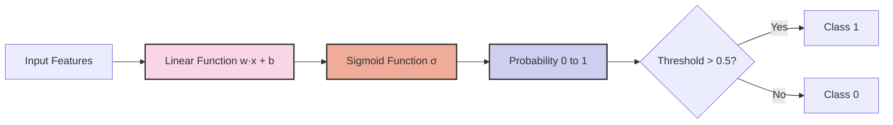
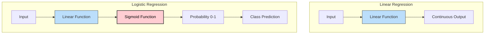
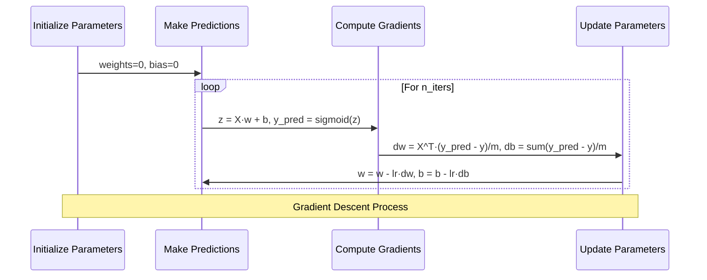
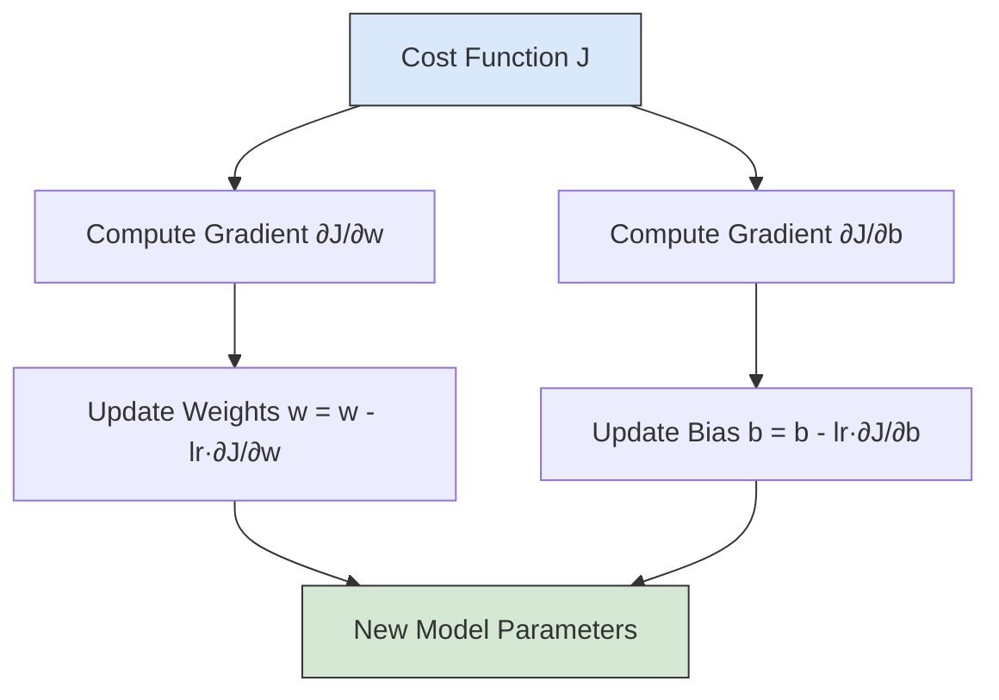
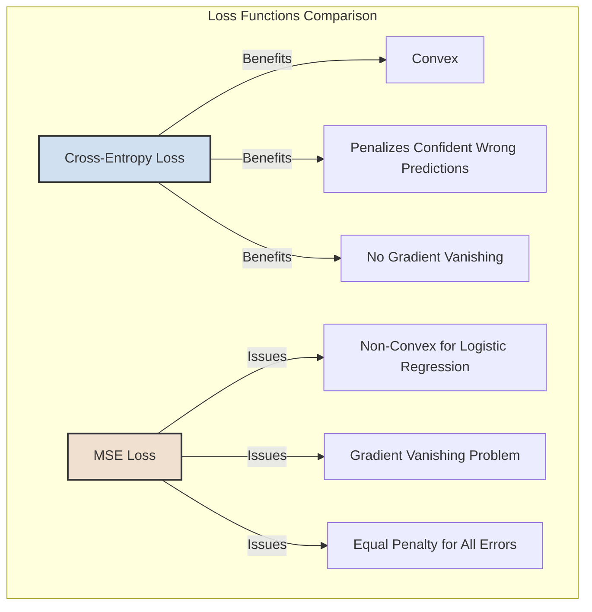
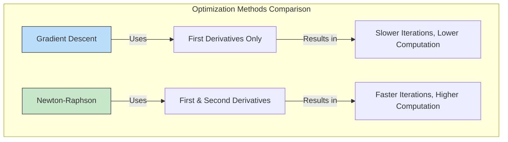
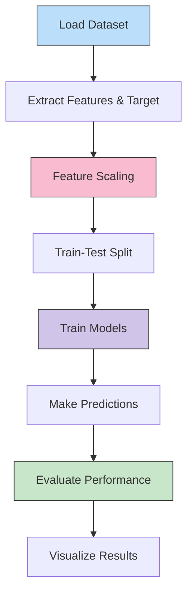
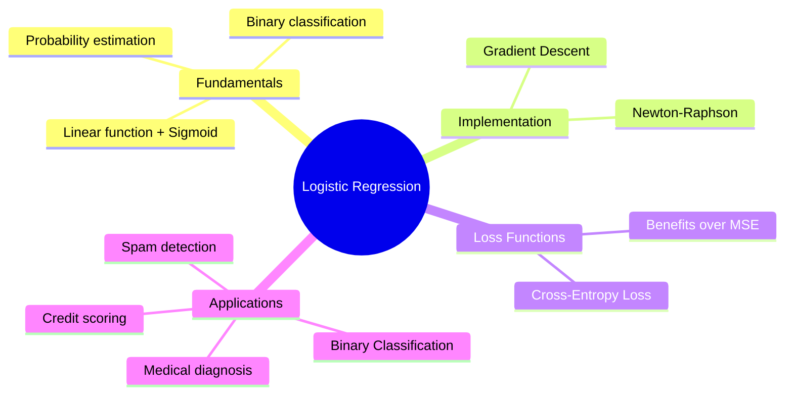

# Logistic Regression from Scratch

## Introduction

Logistic Regression is a fundamental classification algorithm in machine learning. Unlike Linear Regression which predicts continuous values, Logistic Regression predicts the probability of an instance belonging to a particular class. This tutorial will guide you through implementing Logistic Regression from scratch using different optimization methods, helping you understand the underlying mathematics and principles.



## References

For deeper understanding, check out these excellent resources:

- [Towards Data Science: Logistic Regression from Scratch in Python](https://towardsdatascience.com/logistic-regression-from-scratch-in-python-ec66603592e2)
- [Python Engineer: ML From Scratch - Logistic Regression](https://www.python-engineer.com/courses/mlfromscratch/03_logisticregression/)
- [Philipp Muens: Logistic Regression from Scratch](https://philippmuens.com/logistic-regression-from-scratch)


## From Linear Regression to Logistic Regression

To understand Logistic Regression, it's helpful to first recap Linear Regression. In Week 2, we implemented Linear Regression from scratch:

<details>
<summary>❓ What is the fundamental difference in the output interpretation between linear and logistic regression?</summary>

The fundamental difference in output interpretation between linear and logistic regression:

1. **Linear Regression**: Outputs a continuous value that directly represents the predicted value of the dependent variable (e.g., price, temperature, height)

2. **Logistic Regression**: Outputs a value between 0 and 1 that represents the probability of belonging to the positive class, which must then be interpreted with a threshold (typically 0.5) to make a class prediction

This difference reflects their distinct purposes: linear regression predicts quantities while logistic regression predicts probabilities for classification.
</details><br>

```python
%matplotlib inline
import numpy as np
import matplotlib.pyplot as plt
import pandas as pd

dataset = pd.read_csv('Salary_Data.csv')
X = dataset.iloc[:, :-1].values
y = dataset.iloc[:, -1].values

from sklearn.model_selection import train_test_split
X_train, X_test, y_train, y_test = train_test_split(X, y, test_size = 1/3, random_state = 0)


class MyOwnLinearRegression:
    def __init__(self, learning_rate=0.0001, n_iters=30000):
        self.lr = learning_rate
        self.n_iters = n_iters
        self.weights = None
        self.bias = None

    def fit(self, X, y):
        n_samples, n_features = X.shape
        # Initialize parameters
        self.weights = np.zeros(n_features)
        self.bias = 0

        # Gradient Descent
        for _ in range(self.n_iters):
            # Predict the target values
            y_predicted = np.dot(X, self.weights) + self.bias

            # Compute gradients
            dw = (1 / n_samples) * np.dot(X.T, (y_predicted - y))
            db = (1 / n_samples) * np.sum(y_predicted - y)

            # Update parameters
            self.weights -= self.lr * dw
            self.bias -= self.lr * db

    def predict(self, X):
        return np.dot(X, self.weights) + self.bias

# Example usage
regressor = MyOwnLinearRegression()
regressor.fit(X_train, y_train)
y_pred = regressor.predict(X_test)

plt.scatter(X_train, y_train, color = 'red')
plt.plot(X_train, regressor.predict(X_train), color = 'blue')
plt.title('Salary vs Experience (Training set)')
plt.xlabel('Years of Experience')
plt.ylabel('Salary')
plt.show()
```

The key difference between Linear Regression and Logistic Regression is that Logistic Regression applies a sigmoid function to the linear model output to transform the predictions into probabilities between 0 and 1. This makes Logistic Regression suitable for binary classification problems where we need to predict one of two possible outcomes.

<details>
<summary>❓ What is the sigmoid function and why is it useful for classification?</summary>

The sigmoid function (also called the logistic function) is defined as:

σ(z) = 1/(1 + e^(-z))

It's useful for classification because:

1. It maps any real-valued input to a value between 0 and 1, which can be interpreted as a probability
2. It's S-shaped (sigmoidal), providing a smooth transition between the extremes
3. It has a steeper slope in the middle, making it sensitive to changes near the decision boundary
4. Its outputs approach but never reach exactly 0 or 1, representing uncertainty
5. It's differentiable everywhere, which is essential for gradient-based optimization
</details><br>



<details>
<summary>❓ How would you handle a feature that has a non-linear relationship with the log-odds in logistic regression?</summary>

To handle a feature with a non-linear relationship to the log-odds in logistic regression:

1. Apply non-linear transformations to the feature:
   - Polynomial terms (x², x³)
   - Logarithmic transformation (log(x))
   - Exponential (e^x)
   - Root transformations (√x)
   - Binning/discretization for complex patterns

2. Use spline functions to model specific non-linear segments

3. Apply feature interactions if the non-linearity is related to other variables

4. Consider kernel methods to implicitly transform features to higher dimensions

These transformations allow logistic regression to capture non-linear relationships while maintaining its interpretable structure.
</details><br>

## Implementation 1: Logistic Regression with Gradient Descent

Let's implement Logistic Regression using Gradient Descent:

```python
import numpy as np

class LogisticRegressionGD:
    def __init__(self, learning_rate=0.001, n_iters=1000):
        self.lr = learning_rate
        self.n_iters = n_iters
        self.weights = None
        self.bias = None

    def fit(self, X, y):
        n_samples, n_features = X.shape

        # Initialize parameters
        self.weights = np.zeros(n_features)
        self.bias = 0

        # Gradient descent
        for _ in range(self.n_iters):
            # Calculate linear model
            linear_model = np.dot(X, self.weights) + self.bias
            # Apply sigmoid function
            y_predicted = self._sigmoid(linear_model)

            # Compute gradients
            dw = (1 / n_samples) * np.dot(X.T, (y_predicted - y))
            db = (1 / n_samples) * np.sum(y_predicted - y)
            
            # Update parameters
            self.weights -= self.lr * dw
            self.bias -= self.lr * db

    def predict(self, X):
        linear_model = np.dot(X, self.weights) + self.bias
        y_predicted = self._sigmoid(linear_model)
        y_predicted_cls = [1 if i > 0.5 else 0 for i in y_predicted]
        return np.array(y_predicted_cls)

    def _sigmoid(self, x):
        return 1 / (1 + np.exp(-x))
```



### The Math Behind Gradient Descent for Logistic Regression

Logistic Regression uses the sigmoid function to map the linear output to a probability:

$$\sigma(z) = \frac{1}{1 + e^{-z}}$$

where $z = X \cdot w + b$

<details>
<summary>❓ What happens to the sigmoid function as z approaches positive and negative infinity?</summary>

As z approaches positive and negative infinity, the sigmoid function exhibits the following behavior:

- As z → +∞, σ(z) → 1
  The function approaches 1 asymptotically but never quite reaches it

- As z → -∞, σ(z) → 0
  The function approaches 0 asymptotically but never quite reaches it

This limiting behavior makes sigmoid ideal for binary classification, as it compresses any real-valued input to a probability between 0 and 1 without ever actually reaching these exact values, which helps in computing gradients for all possible inputs.
</details><br>

The cost function for Logistic Regression is the Binary Cross Entropy:

$$J(w,b) = -\frac{1}{m} \sum_{i=1}^{m} [y^{(i)} \log(\hat{y}^{(i)}) + (1-y^{(i)}) \log(1-\hat{y}^{(i)})]$$

where $\hat{y}^{(i)} = \sigma(z^{(i)})$

<details>
<summary>❓ Why does the binary cross-entropy function have two terms, and what does each term represent?</summary>

The binary cross-entropy function has two terms because it needs to handle both possible ground truth outcomes (y=1 and y=0):

1. First term: y^(i) log(ŷ^(i))
   - Active when y=1 (positive class)
   - Penalizes the model when it assigns low probability to a positive example
   - As ŷ approaches 0 for a positive example, the loss approaches infinity

2. Second term: (1-y^(i)) log(1-ŷ^(i))
   - Active when y=0 (negative class)
   - Penalizes the model when it assigns high probability to a negative example
   - As ŷ approaches 1 for a negative example, the loss approaches infinity

This two-term structure ensures the model is penalized appropriately for mistakes on both positive and negative examples, creating balanced pressure to correctly classify both classes.
</details><br>

The gradient of this cost function with respect to $w$ and $b$ is:

$$\frac{\partial J}{\partial w} = \frac{1}{m} X^T \cdot (\hat{y} - y)$$
$$\frac{\partial J}{\partial b} = \frac{1}{m} \sum_{i=1}^{m} (\hat{y}^{(i)} - y^{(i)})$$



### Why We Use Cross-Entropy Loss Instead of Mean Squared Error

You'll notice that for the derivatives dw and db we have:

$$dw = \frac{1}{m} X^T \cdot (\hat{y} - y)$$
$$db = \frac{1}{m} \sum_{i=1}^{m} (\hat{y}^{(i)} - y^{(i)})$$

These formulas look remarkably similar to the ones used for Linear Regression, which is a beautiful result of using cross-entropy loss with the sigmoid activation function.

There are several compelling reasons to use cross-entropy loss for logistic regression:

- It's convex and has a single minimum, making optimization more straightforward
- It penalizes confident incorrect predictions more heavily than less confident ones
- The gradient of the cost function doesn't vanish for extreme probability values, avoiding the "flat region" problem that occurs with MSE



## Testing the Gradient Descent Implementation

Let's test our implementation on a simple classification dataset:

```python
# Import necessary libraries
import matplotlib.pyplot as plt
from sklearn import datasets
from sklearn.model_selection import train_test_split
from sklearn.metrics import accuracy_score

# Generate a simple classification dataset
X, y = datasets.make_classification(
    n_samples=100, n_features=2, n_redundant=0, 
    n_informative=2, random_state=1, n_clusters_per_class=1
)

# Split the data into training and testing sets
X_train, X_test, y_train, y_test = train_test_split(
    X, y, test_size=0.2, random_state=42
)

# Create and train the logistic regression model
model = LogisticRegressionGD(learning_rate=0.01, n_iters=1000)
model.fit(X_train, y_train)

# Make predictions
y_pred = model.predict(X_test)

# Calculate accuracy
accuracy = accuracy_score(y_test, y_pred)
print(f"Accuracy: {accuracy:.4f}")

# Visualize the results
def plot_decision_boundary(X, y, model):
    # Define the bounds of the plot
    x_min, x_max = X[:, 0].min() - 0.5, X[:, 0].max() + 0.5
    y_min, y_max = X[:, 1].min() - 0.5, X[:, 1].max() + 0.5
    
    # Create a mesh grid
    xx, yy = np.meshgrid(np.arange(x_min, x_max, 0.01),
                         np.arange(y_min, y_max, 0.01))
    
    # Make predictions on the mesh grid
    Z = model.predict(np.c_[xx.ravel(), yy.ravel()])
    Z = Z.reshape(xx.shape)
    
    # Create a contour plot
    plt.contourf(xx, yy, Z, alpha=0.3)
    
    # Plot the training points
    plt.scatter(X[:, 0], X[:, 1], c=y, edgecolor='k', s=50)
    plt.title('Logistic Regression Decision Boundary')
    plt.xlabel('Feature 1')
    plt.ylabel('Feature 2')
    plt.show()

# Plot the decision boundary
plot_decision_boundary(X, y, model)
```

You should be able to see the decision boundary is a line, and has math formulation:

$$w_1 x_1 + w_2 x_2 + b = 0$$

which is equivalent to:

$$x_2 = -\frac{w_1}{w_2} x_1 - \frac{b}{w_2}$$

<details>
<summary>❓ What does the decision boundary represent geometrically?</summary>

The decision boundary in logistic regression represents:

1. **Geometric definition**: The set of points where the model predicts exactly 0.5 probability
2. **Mathematical form**: The solution to the equation w₁x₁ + w₂x₂ + b = 0
3. **In 2D space**: A straight line separating the two classes
4. **In higher dimensions**: A hyperplane dividing the feature space
5. **Orientation**: Perpendicular to the weight vector w
6. **Distance from origin**: Determined by the bias term b
7. **Classification rule**: Points on one side are classified as class 0, points on the other side as class 1

The linearity of this boundary explains why logistic regression can only effectively separate linearly separable classes without feature engineering.
</details><br>

## Implementation 2: Newton-Raphson Method

The Newton-Raphson method is an alternative optimization technique that often converges faster than gradient descent for logistic regression because it uses second-order derivatives:

```python
class LogisticRegressionNewtonRaphson:
    def __init__(self, n_iters=10):
        self.n_iters = n_iters
        self.beta = None

    def fit(self, X, y):
        n_samples, n_features = X.shape

        # Add a column of ones for the intercept
        X_with_intercept = np.concatenate((np.ones((n_samples, 1)), X), axis=1)

        # Initialize parameters
        self.beta = np.zeros(n_features + 1)

        # Newton Raphson Method
        for _ in range(self.n_iters):
            # Compute the predicted probabilities
            z = np.dot(X_with_intercept, self.beta)
            h = self._sigmoid(z)
            
            # Compute the gradient (first derivative)
            gradient = np.dot(X_with_intercept.T, (h - y)) / n_samples
            
            # Compute the Hessian (second derivative)
            W = np.diag(h * (1 - h))
            hessian = (1 / n_samples) * np.dot(np.dot(X_with_intercept.T, W), X_with_intercept)
            
            # Update parameters using Newton's method
            self.beta = self.beta - np.dot(np.linalg.inv(hessian), gradient)

    def predict(self, X):
        n_samples = X.shape[0]
        X_with_intercept = np.concatenate((np.ones((n_samples, 1)), X), axis=1)

        z = np.dot(X_with_intercept, self.beta)
        y_predicted = self._sigmoid(z)
        y_predicted_cls = [1 if i > 0.5 else 0 for i in y_predicted]
        return np.array(y_predicted_cls)

    def _sigmoid(self, x):
        return 1 / (1 + np.exp(-x))
```

<details>
<summary>❓ What is the Hessian matrix and why is it important for the Newton-Raphson method?</summary>

The Hessian matrix and its importance for the Newton-Raphson method:

1. **Definition**: The Hessian is a square matrix of second-order partial derivatives of the cost function with respect to all pairs of parameters
2. **Size**: For n parameters, the Hessian is an n×n matrix
3. **Contents**: Each element (i,j) represents how the gradient with respect to parameter i changes when parameter j changes
4. **Key importance**: It captures the curvature of the cost function in all directions

5. **Role in Newton-Raphson**:
   - Determines optimal step size and direction in each iteration
   - Accounts for interactions between parameters
   - Speeds convergence by using curvature information

6. **Mathematical intuition**: 
   - It's used in a second-order Taylor approximation of the cost function
   - The inverse Hessian scales the gradient to account for curvature

7. **For logistic regression specifically**:
   - Has a special structure: X^T·W·X where W is a diagonal matrix
   - Always positive definite for logistic regression, ensuring a convex optimization problem

The Hessian essentially provides a "roadmap" of the cost function's landscape, allowing Newton-Raphson to navigate more efficiently to the minimum.
</details><br>

### The Math Behind the Newton-Raphson Method

The Newton-Raphson method uses both the gradient and the Hessian (matrix of second derivatives) to optimize the parameters:

$$\beta_{new} = \beta_{old} - H^{-1} \nabla J$$

where:
- $\nabla J$ is the gradient of the cost function
- $H$ is the Hessian matrix

<details>
<summary>❓ What is the intuition behind the Newton-Raphson update rule?</summary>

The intuition behind the Newton-Raphson update rule can be understood through several perspectives:

1. **Taylor Series Approximation**:
   - It approximates the cost function locally as a quadratic function (second-order Taylor expansion)
   - Then jumps directly to the minimum of this quadratic approximation
   - Each iteration creates a new approximation centered at the current point

2. **Physical Analogy**:
   - Gradient descent is like rolling a ball down a hill
   - Newton-Raphson is like mapping the entire terrain and calculating exactly where the valley bottom is

3. **Geometric Interpretation**:
   - The inverse Hessian (H⁻¹) rescales the gradient
   - In steep directions (large curvature), it takes smaller steps
   - In flat directions (small curvature), it takes larger steps
   - This adaptive scaling leads to more direct paths to the minimum

4. **Mathematical Meaning**:
   - For a perfectly quadratic function, it reaches the exact minimum in a single step
   - For non-quadratic functions, it iteratively improves its quadratic approximation

5. **Calculus Perspective**:
   - Sets the derivative of the quadratic approximation to zero to find its minimum
   - Solves for the parameter values where this occurs

This combination of local approximation and direct minimization explains why Newton-Raphson typically requires fewer iterations than gradient descent.
</details><br>

For logistic regression:
- $\nabla J = X^T (h - y) / n$
- $H = X^T W X / n$, where $W$ is a diagonal matrix with elements $h_i(1-h_i)$

The Newton-Raphson method typically converges in fewer iterations than gradient descent, but each iteration is more computationally expensive, especially for high-dimensional data since it requires matrix inversion of the Hessian. This makes it practical for smaller datasets but potentially impractical for large-scale problems.

## Testing the Newton-Raphson Implementation

```python
# Create and train the Newton-Raphson model
nr_model = LogisticRegressionNewtonRaphson(n_iters=10)
nr_model.fit(X_train, y_train)

# Make predictions
y_pred_nr = nr_model.predict(X_test)

# Calculate accuracy
accuracy_nr = accuracy_score(y_test, y_pred_nr)
print(f"Newton-Raphson Accuracy: {accuracy_nr:.4f}")

# Plot the decision boundary
plot_decision_boundary(X, y, nr_model)
```



## Real-World Example: Social Network Ads Dataset

Let's apply our implementations to a real-world dataset to see how they perform on an actual classification problem:

<details>
<summary>❓ Why is feature scaling particularly important for logistic regression?</summary>

Feature scaling is particularly important for logistic regression for several key reasons:

1. **Gradient-based optimization**: 
   - Unscaled features with different ranges create disproportionate gradients
   - Features with larger values will dominate the weight updates
   - Can cause slow convergence or divergence in gradient descent

2. **Decision boundary quality**:
   - Without scaling, features with larger magnitudes have excessive influence
   - The resulting decision boundary becomes biased toward these features
   - Equal importance for all features requires comparable scales

3. **Numerical stability**:
   - Extreme value differences can cause numerical overflow/underflow in sigmoid
   - Particularly problematic during exponentiation in the sigmoid function
   - Scaling prevents these computational issues

4. **Convergence speed**:
   - Properly scaled features lead to faster and more reliable convergence
   - Reduced number of iterations needed to reach optimal solution
   - More stable learning process

Standard scaling techniques like StandardScaler (z-score normalization) or MinMaxScaler are typically applied to ensure all features contribute appropriately to the model.
</details><br>

```python
# Load the Social Network Ads dataset
social_network = pd.read_csv('Social_Network_Ads.csv')

# Extract features and target
X = social_network[['Age', 'EstimatedSalary']].values
y = social_network['Purchased'].values

# Feature scaling (important for logistic regression)
from sklearn.preprocessing import StandardScaler
sc = StandardScaler()
X = sc.fit_transform(X)

# Split the data
X_train, X_test, y_train, y_test = train_test_split(X, y, test_size=0.25, random_state=0)

# Train models
gd_model = LogisticRegressionGD(learning_rate=0.01, n_iters=1000)
gd_model.fit(X_train, y_train)

nr_model = LogisticRegressionNewtonRaphson(n_iters=10)
nr_model.fit(X_train, y_train)

# Make predictions
y_pred_gd = gd_model.predict(X_test)
y_pred_nr = nr_model.predict(X_test)

# Calculate accuracies
from sklearn.metrics import accuracy_score, confusion_matrix, classification_report

print("Gradient Descent Model:")
print(f"Accuracy: {accuracy_score(y_test, y_pred_gd):.4f}")
print(f"Confusion Matrix:\n{confusion_matrix(y_test, y_pred_gd)}")
print(f"Classification Report:\n{classification_report(y_test, y_pred_gd)}")

print("\nNewton-Raphson Model:")
print(f"Accuracy: {accuracy_score(y_test, y_pred_nr):.4f}")
print(f"Confusion Matrix:\n{confusion_matrix(y_test, y_pred_nr)}")
print(f"Classification Report:\n{classification_report(y_test, y_pred_nr)}")
# Visualize the results for the Gradient Descent model
from matplotlib.colors import ListedColormap

plt.figure(figsize=(12, 10))

# Create a mesh grid
X_set, y_set = X_test, y_test
X1, X2 = np.meshgrid(np.arange(X_set[:, 0].min() - 1, X_set[:, 0].max() + 1, 0.01),
                     np.arange(X_set[:, 1].min() - 1, X_set[:, 1].max() + 1, 0.01))

# Plot the decision boundary
plt.contourf(X1, X2, gd_model.predict(np.array([X1.ravel(), X2.ravel()]).T).reshape(X1.shape),
             alpha=0.75, cmap=ListedColormap(('red', 'green')))

# Plot the test data points
for i, j in enumerate(np.unique(y_set)):
    plt.scatter(X_set[y_set == j, 0], X_set[y_set == j, 1],
                c=ListedColormap(('red', 'green'))(i), label=j)

plt.title('Logistic Regression (Test set)')
plt.xlabel('Age (Standardized)')
plt.ylabel('Estimated Salary (Standardized)')
plt.legend()
plt.show()
```

<details>
<summary>❓ What insights can we get from a confusion matrix in binary classification?</summary>

A confusion matrix provides several critical insights in binary classification:

1. **Basic Counts**:
   - True Positives (TP): Correctly predicted positive cases
   - True Negatives (TN): Correctly predicted negative cases
   - False Positives (FP): Negative cases incorrectly predicted as positive (Type I error)
   - False Negatives (FN): Positive cases incorrectly predicted as negative (Type II error)

2. **Performance Metrics**:
   - Accuracy: (TP+TN)/(TP+TN+FP+FN) - Overall correctness
   - Precision: TP/(TP+FP) - When model predicts positive, how often it's correct
   - Recall/Sensitivity: TP/(TP+FN) - How many actual positives the model captured
   - Specificity: TN/(TN+FP) - How many actual negatives the model captured
   - F1-Score: 2×(Precision×Recall)/(Precision+Recall) - Harmonic mean of precision and recall

3. **Error Analysis**:
   - Identifies which type of error predominates (FP or FN)
   - Helps understand if model is biased toward a particular class
   - Points to subgroups where the model struggles

4. **Business Insights**:
   - Aligns with business costs (e.g., FN might be more costly in medical diagnosis)
   - Guides threshold adjustment based on error tolerance
   - Informs about real-world model performance expectations

5. **Visual Pattern Recognition**:
   - Diagonal elements show correct predictions
   - Off-diagonal elements show errors
   - Balanced vs. imbalanced prediction patterns

The confusion matrix is essential for a comprehensive model evaluation beyond simple accuracy, especially when class imbalance exists or when different types of errors have different costs.
</details><br>

<details>
<summary>❓ How do we interpret precision, recall, and F1-score in the context of this social network ads dataset?</summary>

Interpreting precision, recall, and F1-score in the social network ads context:

1. **Class Meaning**:
   - Positive class (1): User purchased after seeing the ad
   - Negative class (0): User did not purchase

2. **Precision Interpretation**:
   - High precision: When the model predicts a user will purchase, it's usually correct
   - Low precision: Many users predicted to purchase actually don't
   - Business value: Reduces wasted marketing resources on non-converting users
   - Example: 90% precision means 90% of users predicted to purchase actually do purchase

3. **Recall Interpretation**:
   - High recall: The model identifies most users who would purchase
   - Low recall: Many potential customers are missed
   - Business value: Captures more revenue opportunities
   - Example: 80% recall means the model identifies 80% of all users who would purchase

4. **F1-Score Interpretation**:
   - Balances precision and recall trade-offs
   - High F1: Both good at identifying purchasers and minimizing false positives
   - Low F1: Model struggles with either/both identifying purchasers or avoiding false positives
   - Business value: Overall effectiveness of the targeting model

5. **Business Application**:
   - High-cost campaign: Prioritize precision to minimize waste
   - Broad awareness campaign: Prioritize recall to reach more potential customers
   - Limited budget: Use F1-score to balance reach and efficiency
   - A/B testing: Compare these metrics between different targeting models

This interpretation helps marketing teams optimize ad targeting to maximize return on advertising spend.
</details><br>



## Comparison of Methods

Here's a detailed comparison of the two implementations we covered:

1. **Gradient Descent**:
   - **Pros**: 
     - Simple to implement and understand
     - Works well for large datasets
     - Less computationally intensive per iteration
     - No matrix inversion required
   - **Cons**: 
     - Can be slow to converge, requiring many iterations
     - Requires careful tuning of the learning rate
     - May get stuck in plateaus for poorly conditioned problems
   
2. **Newton-Raphson Method**:
   - **Pros**: 
     - Much faster convergence (typically 5-10 iterations)
     - No learning rate to tune
     - Better handling of ill-conditioned problems
   - **Cons**: 
     - Computationally expensive for large datasets (O(n³) complexity)
     - Requires calculating and inverting the Hessian matrix
     - More complex to implement
     - May not converge if the Hessian is not positive definite
   

## Conclusion

In this tutorial, we explored two different implementations of Logistic Regression from scratch. We learned that:



1. Logistic Regression is essentially Linear Regression with a sigmoid function applied to the output
2. The optimization objective is to minimize the Binary Cross-Entropy loss, which is better suited for classification than mean squared error
3. Different optimization methods offer trade-offs between computational complexity and convergence speed

By implementing these algorithms ourselves, we gain a deeper understanding of the mathematics and principles behind logistic regression, which forms the foundation for many other classification algorithms in machine learning.

The concepts learned here - optimization techniques, loss functions, and sigmoid transformations - will serve as building blocks for understanding more complex models like neural networks.


