# Neural Networks from Scratch with Python and NumPy - Session 1

## Introduction

Welcome to the first of our three sessions on implementing neural networks from scratch! We'll build on what we've already learned about linear regression and logistic regression to understand and implement the fundamentals of neural networks using only Python and NumPy.

While libraries like TensorFlow and PyTorch make neural networks accessible, implementing one from scratch provides deeper insights into how they actually work. This knowledge will help you better design, debug, and optimize neural networks in future projects.

Note that some code is intentionally missing so that you have to work on it yourself.

## Session Overview

In this first session, we will focus on:
1. Understanding neural network architecture
2. Building the connection between logistic regression and neural networks
3. Implementing forward propagation step by step
4. Creating and visualizing activation functions
5. Building a simple neural network for MNIST digit classification

The second and third sessions will introduce more advanced techniques and optimizations.

## Prerequisites

- Basic understanding of Python and NumPy
- Familiarity with linear regression and logistic regression concepts
- Basic calculus knowledge (derivatives and the chain rule)
- Python environment with NumPy and Matplotlib installed
- The mnist_train.csv and mnist_test.csv files (already downloaded)

## The Evolution from Linear to Logistic Regression to Neural Networks

### Linear Regression Recap

Previously, we have implemented linear regression, which models the relationship as:

$$y = \mathbf{w}^\top \mathbf{x} + b$$

Where:
- $y$ is the predicted value
- $\mathbf{x}$ is the input feature vector
- $\mathbf{w}$ is the weight vector
- $b$ is the bias term

### Logistic Regression: Adding Non-linearity

In logistic regression, we introduced a non-linearity through the sigmoid function:

$$y = \sigma(\mathbf{w}^\top \mathbf{x} + b)$$

Where $\sigma(z) = \frac{1}{1 + e^{-z}}$ is the sigmoid function that maps any real number to a value between 0 and 1.

### Neural Networks: Multiple Layers of Transformations

A neural network stacks multiple layers of transformations, where each layer:
1. Performs a linear transformation (like in linear regression)
2. Applies a non-linear activation function (like in logistic regression)

The key insight: **a neural network with a single hidden layer is essentially multiple logistic regression units feeding into a final logistic regression output!**

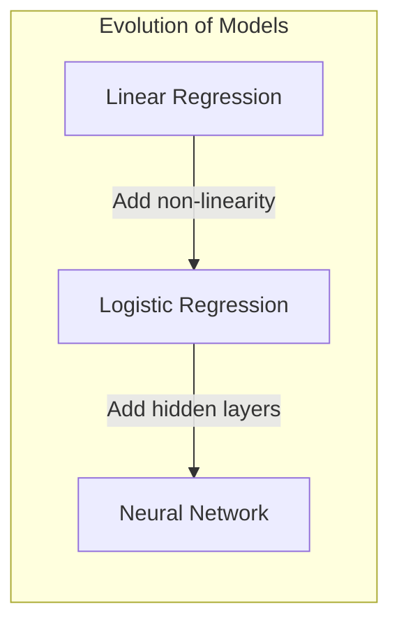

## Neural Network Architecture

Neural networks consist of:

1. **Input Layer**: Neurons that represent our input features
2. **Hidden Layer(s)**: Intermediate layers that perform computations
3. **Output Layer**: Produces the final prediction

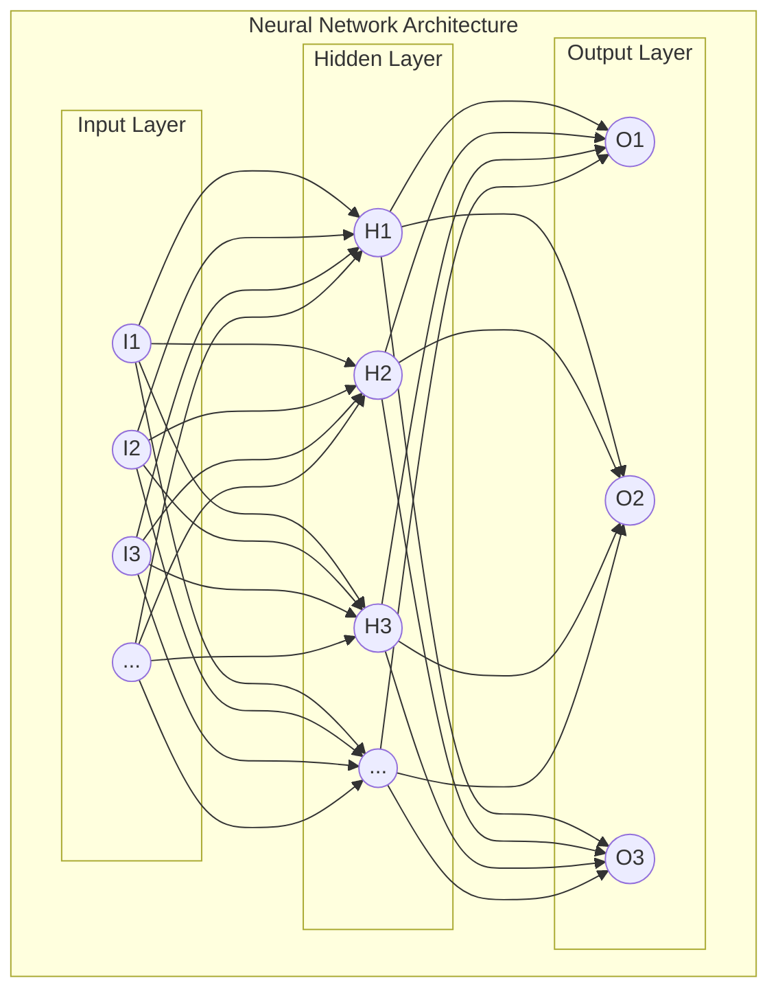

For our MNIST digit classification problem:
- Input layer: 784 neurons (28×28 pixels)
- Hidden layer(s): Customizable number of neurons
- Output layer: 10 neurons (one for each digit 0-9)

## Activation Functions: Adding Non-linearity

One of the key components that make neural networks powerful is the use of non-linear activation functions. Without non-linearity, a neural network (regardless of depth) would only be capable of learning linear relationships.

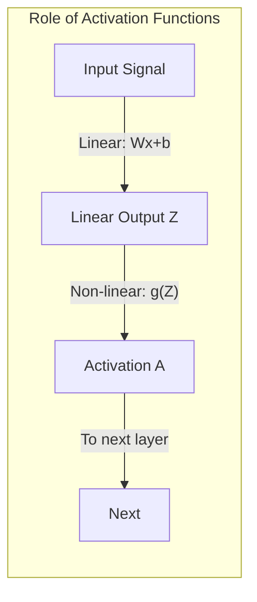

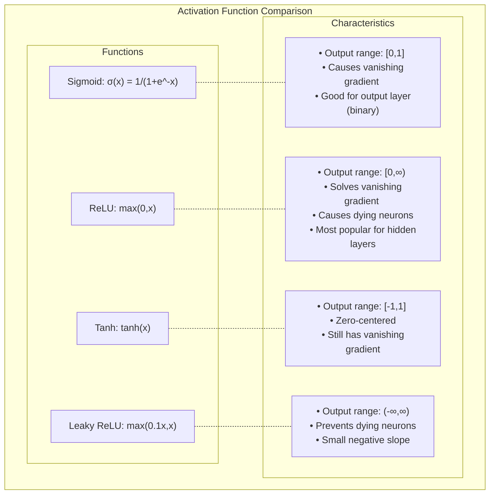

```python
def plot_activation_functions():
    """Visualize common activation functions"""
    # Generate input values
    x = np.linspace(-5, 5, 1000)
    
    # Compute activation functions
    sigmoid = 1 / (1 + np.exp(-x))
    relu = np.maximum(0, x)
    tanh = np.tanh(x)
    leaky_relu = np.where(x > 0, x, 0.1 * x)
    
    # Plotting
    fig, axes = plt.subplots(2, 2, figsize=(12, 8))
    
    # Sigmoid
    axes[0, 0].plot(x, sigmoid, 'b-', linewidth=2)
    axes[0, 0].grid(True, alpha=0.3)
    axes[0, 0].axhline(y=0, color='k', linestyle='-', alpha=0.3)
    axes[0, 0].axvline(x=0, color='k', linestyle='-', alpha=0.3)
    axes[0, 0].set_title('Sigmoid: $\\sigma(x) = \\frac{1}{1 + e^{-x}}$')
    axes[0, 0].set_ylim(-0.1, 1.1)
    
    # ReLU
    axes[0, 1].plot(x, relu, 'r-', linewidth=2)
    axes[0, 1].grid(True, alpha=0.3)
    axes[0, 1].axhline(y=0, color='k', linestyle='-', alpha=0.3)
    axes[0, 1].axvline(x=0, color='k', linestyle='-', alpha=0.3)
    axes[0, 1].set_title('ReLU: $f(x) = max(0, x)$')
    
    # Tanh
    axes[1, 0].plot(x, tanh, 'g-', linewidth=2)
    axes[1, 0].grid(True, alpha=0.3)
    axes[1, 0].axhline(y=0, color='k', linestyle='-', alpha=0.3)
    axes[1, 0].axvline(x=0, color='k', linestyle='-', alpha=0.3)
    axes[1, 0].set_title('Tanh: $f(x) = tanh(x)$')
    axes[1, 0].set_ylim(-1.1, 1.1)
    
    # Leaky ReLU
    axes[1, 1].plot(x, leaky_relu, 'm-', linewidth=2)
    axes[1, 1].grid(True, alpha=0.3)
    axes[1, 1].axhline(y=0, color='k', linestyle='-', alpha=0.3)
    axes[1, 1].axvline(x=0, color='k', linestyle='-', alpha=0.3)
    axes[1, 1].set_title('Leaky ReLU: $f(x) = max(0.1x, x)$')
    
    plt.tight_layout()
    plt.suptitle('Common Activation Functions in Neural Networks', fontsize=16)
    plt.subplots_adjust(top=0.9)
    plt.show()

def plot_activation_derivatives():
    """Visualize derivatives of activation functions"""
    # Generate input values
    x = np.linspace(-5, 5, 1000)
    
    # Compute activation functions and their derivatives
    sigmoid = 1 / (1 + np.exp(-x))
    sigmoid_derivative = sigmoid * (1 - sigmoid)
    
    relu = np.maximum(0, x)
    relu_derivative = np.where(x > 0, 1, 0)
    
    tanh = np.tanh(x)
    tanh_derivative = 1 - tanh**2
    
    leaky_relu = np.where(x > 0, x, 0.1 * x)
    leaky_relu_derivative = np.where(x > 0, 1, 0.1)
    
    # Plotting
    fig, axes = plt.subplots(2, 2, figsize=(12, 8))
    
    # Sigmoid
    axes[0, 0].plot(x, sigmoid, 'b-', linewidth=2, label='Sigmoid')
    axes[0, 0].plot(x, sigmoid_derivative, 'b--', linewidth=2, label='Derivative')
    axes[0, 0].grid(True, alpha=0.3)
    axes[0, 0].axhline(y=0, color='k', linestyle='-', alpha=0.3)
    axes[0, 0].axvline(x=0, color='k', linestyle='-', alpha=0.3)
    axes[0, 0].set_title('Sigmoid and Its Derivative')
    axes[0, 0].set_ylim(-0.1, 1.1)
    axes[0, 0].legend()
    
    # ReLU
    axes[0, 1].plot(x, relu, 'r-', linewidth=2, label='ReLU')
    axes[0, 1].plot(x, relu_derivative, 'r--', linewidth=2, label='Derivative')
    axes[0, 1].grid(True, alpha=0.3)
    axes[0, 1].axhline(y=0, color='k', linestyle='-', alpha=0.3)
    axes[0, 1].axvline(x=0, color='k', linestyle='-', alpha=0.3)
    axes[0, 1].set_title('ReLU and Its Derivative')
    axes[0, 1].set_ylim(-0.1, 1.1)
    axes[0, 1].legend()
    
    # Tanh
    axes[1, 0].plot(x, tanh, 'g-', linewidth=2, label='Tanh')
    axes[1, 0].plot(x, tanh_derivative, 'g--', linewidth=2, label='Derivative')
    axes[1, 0].grid(True, alpha=0.3)
    axes[1, 0].axhline(y=0, color='k', linestyle='-', alpha=0.3)
    axes[1, 0].axvline(x=0, color='k', linestyle='-', alpha=0.3)
    axes[1, 0].set_title('Tanh and Its Derivative')
    axes[1, 0].set_ylim(-1.1, 1.1)
    axes[1, 0].legend()
    
    # Leaky ReLU
    axes[1, 1].plot(x, leaky_relu, 'm-', linewidth=2, label='Leaky ReLU')
    axes[1, 1].plot(x, leaky_relu_derivative, 'm--', linewidth=2, label='Derivative')
    axes[1, 1].grid(True, alpha=0.3)
    axes[1, 1].axhline(y=0, color='k', linestyle='-', alpha=0.3)
    axes[1, 1].axvline(x=0, color='k', linestyle='-', alpha=0.3)
    axes[1, 1].set_title('Leaky ReLU and Its Derivative')
    axes[1, 1].set_ylim(-0.1, 1.1)
    axes[1, 1].legend()
    
    plt.tight_layout()
    plt.suptitle('Activation Functions and Their Derivatives', fontsize=16)
    plt.subplots_adjust(top=0.9)
    plt.show()

plot_activation_functions()
plot_activation_derivatives()
```

### Why ReLU is Popular

ReLU (Rectified Linear Unit), first proposed in 2010 (so pretty young), has become the most popular activation function for hidden layers in neural networks for several reasons:

1. **Computational Efficiency**: It's simple to compute: `max(0, x)`
2. **Avoids Vanishing Gradient**: The gradient is either 0 or 1, helping with the vanishing gradient problem
3. **Sparsity**: It naturally leads to sparse activations (many neurons output 0)
4. **Biological Plausibility**: More similar to how real neurons fire

The main drawback is the "dying ReLU" problem: if a neuron's activation becomes negative, the gradient will be zero, and the neuron might never activate again. Variants like Leaky ReLU help address this issue.

## Forward Propagation: How Neural Networks Make Predictions

Forward propagation is how a neural network makes predictions by passing data through its layers.

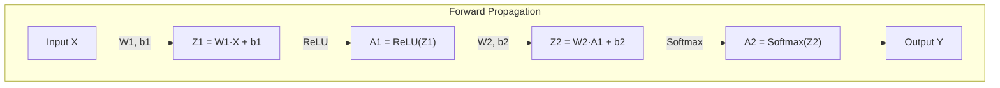

### Layer by Layer Computation

1. **Linear Transformation**: 
   $$Z^{[l]} = W^{[l]} \cdot A^{[l-1]} + b^{[l]}$$

2. **Activation Function**: 
   $$A^{[l]} = g^{[l]}(Z^{[l]})$$

Where:
- $Z^{[l]}$ is the weighted input to layer $l$
- $W^{[l]}$ is the weight matrix for layer $l$
- $A^{[l-1]}$ is the activation from the previous layer
- $b^{[l]}$ is the bias vector for layer $l$
- $g^{[l]}$ is the activation function for layer $l$
- $A^{[l]}$ is the activation output from layer $l$

### Understanding Matrix Operations in Neural Networks

Let's see how matrix operations work in practice:

```python
def demonstrate_matrix_operations():
    """Show how matrix operations work in neural networks"""
    # Set random seed for reproducibility
    np.random.seed(42)
    
    # Create a batch of 3 examples with 4 features each
    X = np.random.rand(3, 4)
    
    # Define a small neural network
    W1 = np.random.randn(4, 5) * 0.1  # 4 features to 5 hidden units
    b1 = np.zeros(5)
    W2 = np.random.randn(5, 2) * 0.1  # 5 hidden units to 2 output classes
    b2 = np.zeros(2)
    
    # Forward pass
    print("Input X (batch_size=3, features=4):")
    print(X)
    print("\nWeight matrix W1 (features=4, hidden_units=5):")
    print(W1)
    
    # First layer computation
    Z1 = np.dot(X, W1) + b1
    print("\nZ1 = X·W1 + b1 (batch_size=3, hidden_units=5):")
    print(Z1)
    
    A1 = np.maximum(0, Z1)  # ReLU activation
    print("\nA1 = ReLU(Z1) (batch_size=3, hidden_units=5):")
    print(A1)
    
    # Second layer computation
    Z2 = np.dot(A1, W2) + b2
    print("\nZ2 = A1·W2 + b2 (batch_size=3, output_units=2):")
    print(Z2)
    
    # Softmax activation for output layer
    exp_scores = np.exp(Z2 - np.max(Z2, axis=1, keepdims=True))
    A2 = exp_scores / np.sum(exp_scores, axis=1, keepdims=True)
    print("\nA2 = softmax(Z2) (batch_size=3, output_units=2):")
    print(A2)
    print("\nSum of probabilities for each example (should be 1):")
    print(np.sum(A2, axis=1))
    
    # Visualizing the shapes
    print("\nMatrix shapes visualization:")
    shapes = [
        ("X", X.shape),
        ("W1", W1.shape),
        ("b1", b1.shape),
        ("Z1", Z1.shape),
        ("A1", A1.shape),
        ("W2", W2.shape),
        ("b2", b2.shape),
        ("Z2", Z2.shape),
        ("A2", A2.shape)
    ]
    
    for name, shape in shapes:
        print(f"{name}: {shape}")
```

## Loading and Preparing the MNIST Dataset

Let's start by loading the MNIST dataset from the CSV files:

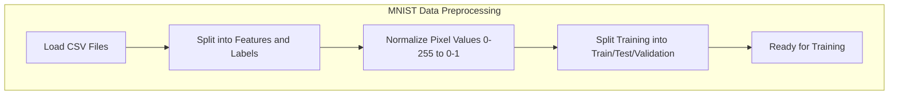

```python
def load_mnist_from_csv(train_csv_path, test_csv_path, val_split=0.1):
    """
    Load MNIST dataset from CSV files and split into train, validation, and test sets
    
    Arguments:
    train_csv_path -- path to the training CSV file
    test_csv_path -- path to the test CSV file
    val_split -- fraction of training data to use for validation
    
    Returns:
    X_train -- training features
    y_train -- training labels
    X_val -- validation features
    y_val -- validation labels
    X_test -- test features
    y_test -- test labels
    """
    print("Loading training data...")
    train_data = pd.read_csv(train_csv_path)
    
    print("Loading test data...")
    test_data = pd.read_csv(test_csv_path)
    
    # Extract labels and features
    y_train_full = train_data.iloc[:, 0].values
    X_train_full = train_data.iloc[:, 1:].values / 255.0  # Normalize pixel values to [0,1]
    
    y_test = test_data.iloc[:, 0].values
    X_test = test_data.iloc[:, 1:].values / 255.0
    
    # Create validation set from training data
    n_val = int(len(X_train_full) * val_split)
    
    # Random indices for validation set
    np.random.seed(42)
    val_indices = np.random.choice(len(X_train_full), n_val, replace=False)
    
    # Create a mask for training indices
    train_mask = np.ones(len(X_train_full), dtype=bool)
    train_mask[val_indices] = False
    
    # Split into train and validation sets
    X_val = X_train_full[val_indices]
    y_val = y_train_full[val_indices]
    
    X_train = X_train_full[train_mask]
    y_train = y_train_full[train_mask]
    
    print(f"Training data shape: {X_train.shape}")
    print(f"Training labels shape: {y_train.shape}")
    print(f"Validation data shape: {X_val.shape}")
    print(f"Validation labels shape: {y_val.shape}")
    print(f"Test data shape: {X_test.shape}")
    print(f"Test labels shape: {y_test.shape}")
    
    return X_train, y_train, X_val, y_val, X_test, y_test

def visualize_mnist_samples(X, y, num_samples=5):
    """Visualize sample images from the MNIST dataset"""
    fig, axes = plt.subplots(1, num_samples, figsize=(12, 3))
    
    for i in range(num_samples):
        # Reshape the 784 pixel values to a 28x28 image
        img = X[i].reshape(28, 28)
        axes[i].imshow(img, cmap='gray')
        axes[i].set_title(f"Label: {y[i]}")
        axes[i].axis('off')
    
    plt.tight_layout()
    plt.show()
```

## Building Neural Network Components from Scratch

Now let's implement the core building blocks of our neural network.

### The Base Layer Class

We'll start with a base `Layer` class that defines the interface for all layer types:

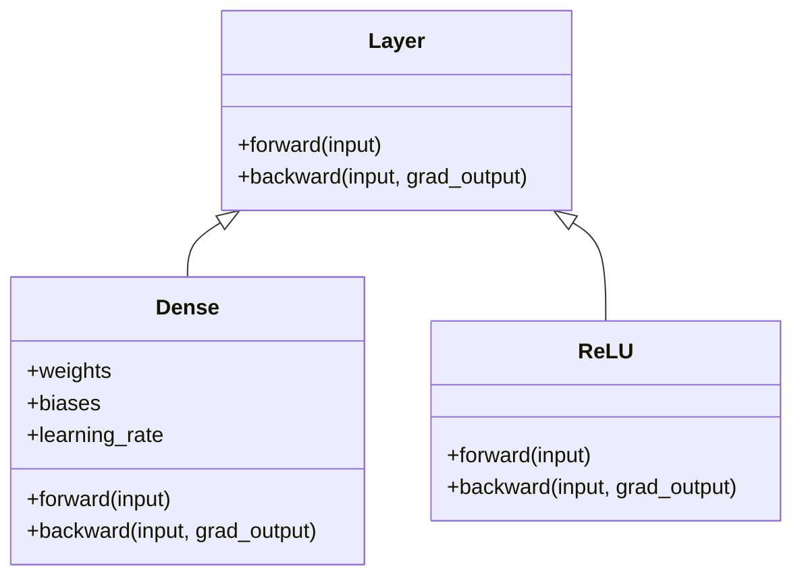

```python
class Layer:
    """
    Base class for neural network layers
    
    Each layer performs two key operations:
    - Forward pass: Compute outputs from inputs
    - Backward pass: Compute gradients and update parameters
    """
    def __init__(self):
        """Initialize layer parameters (if any)"""
        pass
    
    def forward(self, input):
        """
        Forward pass: Compute outputs from inputs
        
        Arguments:
        input -- Input data, shape (batch_size, input_dimension)
        
        Returns:
        output -- Layer output, shape (batch_size, output_dimension)
        """
        # Base implementation (identity function)
        return input
    
    def backward(self, input, grad_output):
        """
        Backward pass: Compute gradient of loss with respect to inputs
        
        Arguments:
        input -- Input data from forward pass
        grad_output -- Gradient of loss with respect to layer output
        
        Returns:
        grad_input -- Gradient of loss with respect to layer input
        """
        # Base implementation (pass gradient unchanged)
        return grad_output
```

### Implementing the ReLU Activation Layer

Now let's implement the ReLU activation function as a layer:

```python
class ReLU(Layer):
    """
    ReLU activation layer
    
    Forward: f(x) = max(0, x)
    Backward gradient: f'(x) = 1 if x > 0 else 0
    """
    def forward(self, input):
        """Apply ReLU activation function"""
        return np.maximum(0, input)
    
    def backward(self, input, grad_output):
        """Compute gradient of loss w.r.t. ReLU input"""
        # ReLU gradient: 1 where input > 0, 0 elsewhere
        relu_grad = input > 0
        return grad_output * relu_grad
```

Let's test our ReLU implementation:

```python
def test_relu_layer():
    """Test the ReLU layer implementation"""
    # Create a ReLU layer
    relu = ReLU()
    
    # Test input
    input = np.array([[-2.0, -1.0, 0.0, 1.0, 2.0]])
    
    # Forward pass
    output = relu.forward(input)
    print("Input:", input)
    print("ReLU output:", output)
    
    # Backward pass
    grad_output = np.ones_like(output)
    grad_input = relu.backward(input, grad_output)
    print("Gradient output (dL/doutput):", grad_output)
    print("Gradient input (dL/dinput):", grad_input)
    
    # Visualize
    plt.figure(figsize=(10, 4))
    
    plt.subplot(1, 2, 1)
    plt.plot(input[0], input[0], 'b--', label='Identity')
    plt.plot(input[0], output[0], 'r-', label='ReLU')
    plt.grid(True, alpha=0.3)
    plt.legend()
    plt.title('ReLU Forward Pass')
    
    plt.subplot(1, 2, 2)
    plt.plot(input[0], np.ones_like(input[0]), 'b--', label='Gradient of Identity')
    plt.plot(input[0], grad_input[0], 'r-', label='Gradient of ReLU')
    plt.grid(True, alpha=0.3)
    plt.legend()
    plt.title('ReLU Backward Pass')
    
    plt.tight_layout()
    plt.show()
```

### Implementing the Dense (Fully Connected) Layer

Next, let's implement the dense layer, which performs the linear transformation:

```python
class Dense(Layer):
    """
    Fully connected (dense) layer
    
    Forward: output = input · weights + bias
    """
    def __init__(self, input_units, output_units, learning_rate=0.1):
        """
        Initialize dense layer
        
        Arguments:
        input_units -- dimension of input
        output_units -- dimension of output
        learning_rate -- learning rate for gradient descent
        """
        self.learning_rate = learning_rate
        
        # Initialize weights with small random values
        # Xavier/Glorot initialization: variance proportional to 1/input_units
        self.weights = np.random.randn(input_units, output_units) * np.sqrt(2.0 / input_units)
        self.biases = np.zeros(output_units)
    
    def forward(self, input):
        """
        Forward pass: compute output = input · weights + bias
        """
        # Store input for backward pass
        self.input = input
        
        # Linear transformation
        return np.dot(input, self.weights) + self.biases
    
    def backward(self, input, grad_output):
        """
        Backward pass: compute gradients and update parameters
        """
        # Gradient of loss w.r.t. weights: input^T · grad_output
        grad_weights = np.dot(input.T, grad_output) / input.shape[0]
        
        # Gradient of loss w.r.t. biases: sum grad_output over batch dimension
        grad_biases = np.mean(grad_output, axis=0)
        
        # Gradient of loss w.r.t. input: grad_output · weights^T
        grad_input = np.dot(grad_output, self.weights.T)
        
        # Update parameters using gradient descent
        # This is the SGD update step: weights = weights - learning_rate * gradient
        # In more advanced implementations, this could be replaced with momentum,
        # RMSprop, Adam, or other optimizers, but the basic SGD is simple and effective
        self.weights = self.weights - self.learning_rate * grad_weights
        self.biases = self.biases - self.learning_rate * grad_biases
        
        return grad_input
```

Let's test our Dense layer implementation:

```python
def test_dense_layer():
    """Test the Dense layer implementation"""
    # Create a small dense layer: 2 inputs, 3 outputs
    dense = Dense(2, 3, learning_rate=0.1)
    
    # Set weights and biases for predictable testing
    dense.weights = np.array([[0.1, 0.2, 0.3], [0.4, 0.5, 0.6]])
    dense.biases = np.array([0.1, 0.2, 0.3])
    
    # Test input: batch of 2 examples
    input = np.array([[1.0, 2.0], [3.0, 4.0]])
    
    # Forward pass
    output = dense.forward(input)
    print("Input shape:", input.shape)
    print("Input:\n", input)
    print("\nWeights shape:", dense.weights.shape)
    print("Weights:\n", dense.weights)
    print("\nBiases:", dense.biases)
    print("\nOutput shape:", output.shape)
    print("Output:\n", output)
    
    # Verify output with manual calculation
    expected_output = np.array([
        [1.0 * 0.1 + 2.0 * 0.4 + 0.1, 1.0 * 0.2 + 2.0 * 0.5 + 0.2, 1.0 * 0.3 + 2.0 * 0.6 + 0.3],
        [3.0 * 0.1 + 4.0 * 0.4 + 0.1, 3.0 * 0.2 + 4.0 * 0.5 + 0.2, 3.0 * 0.3 + 4.0 * 0.6 + 0.3]
    ])
    print("\nCorrect forward pass:", np.allclose(output, expected_output))
    
    # Test backward pass
    grad_output = np.array([[0.1, 0.2, 0.3], [0.4, 0.5, 0.6]])
    
    # Save original weights
    original_weights = dense.weights.copy()
    original_biases = dense.biases.copy()
    
    grad_input = dense.backward(input, grad_output)
    
    print("\nGradient output (dL/doutput):\n", grad_output)
    print("Gradient input (dL/dinput):\n", grad_input)
    
    # Check parameter updates
    print("\nWeights before update:\n", original_weights)
    print("Weights after update:\n", dense.weights)
    print("\nBiases before update:", original_biases)
    print("Biases after update:", dense.biases)
```

## The Loss Function

For our MNIST digit classification, we'll use softmax cross-entropy loss:

```python
def softmax_crossentropy_with_logits(logits, labels):
    """
    Compute softmax cross-entropy loss and its gradient
    
    Arguments:
    logits -- raw model outputs, shape (batch_size, num_classes)
    labels -- true labels, shape (batch_size,)
    
    Returns:
    loss -- scalar value, cross-entropy loss
    grad -- gradient of loss w.r.t. logits, shape (batch_size, num_classes)
    """
    # Create one-hot vectors from labels
    batch_size = logits.shape[0]
    one_hot_labels = np.zeros_like(logits)
    one_hot_labels[np.arange(batch_size), labels] = 1
    
    # Compute softmax (with numeric stability)
    exp_logits = np.exp(logits - np.max(logits, axis=1, keepdims=True))
    softmax_probs = exp_logits / np.sum(exp_logits, axis=1, keepdims=True)
    
    # Compute cross-entropy loss
    loss = -np.sum(one_hot_labels * np.log(softmax_probs + 1e-9)) / batch_size
    
    # Gradient of cross-entropy loss w.r.t. logits
    grad = (softmax_probs - one_hot_labels) / batch_size
    
    return loss, grad
```

## Forward and Backward Pass for the Whole Network

Now let's implement functions to perform forward and backward passes through the entire network:

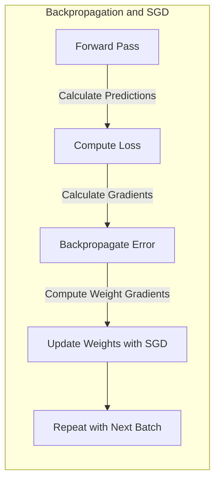

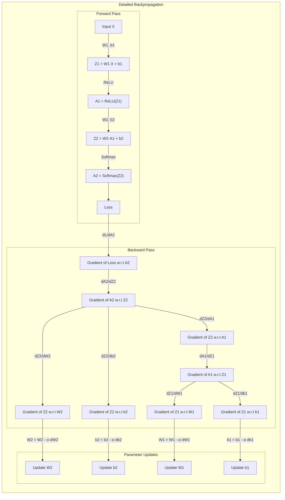

```python
def forward(network, X):
    """
    Perform forward propagation through the network
    
    Arguments:
    network -- list of layers
    X -- input data
    
    Returns:
    layer_activations -- list of activations from each layer
    """
    activations = []
    input = X
    
    # Pass input through each layer
    for layer in network:
        activations.append(layer.forward(input))
        input = activations[-1]  # Output of current layer becomes input to next layer
    
    return activations

def predict(network, X):
    """Get predictions from the network"""
    # Get the output of the last layer
    logits = forward(network, X)[-1]
    # Return the class with highest score
    return np.argmax(logits, axis=-1)

def train(network, X, y):
    """Train the network on a batch of examples"""
    # Forward pass
    layer_activations = forward(network, X)
    layer_inputs = [X] + layer_activations[:-1]  # Inputs to each layer
    logits = layer_activations[-1]
    
    # Compute loss and initial gradient
    loss, grad_logits = softmax_crossentropy_with_logits(logits, y)
    
    # Backward pass (backpropagation)
    grad_output = grad_logits
    for i in range(len(network))[::-1]:  # Reversed order
        layer = network[i]
        layer_input = layer_inputs[i]
        grad_output = layer.backward(layer_input, grad_output)
    
    return loss
```

## Using Stochastic Gradient Descent (SGD)

You may notice that our implementation uses mini-batches in the training function rather than the entire dataset at once. This approach is called **Stochastic Gradient Descent (SGD)**, specifically mini-batch SGD.

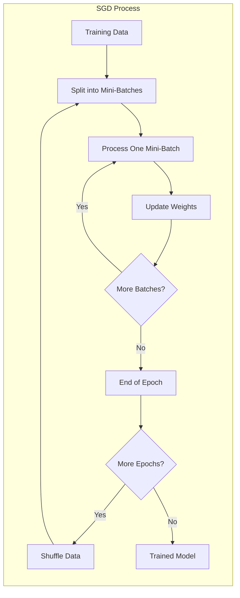

### Why We're Using SGD

SGD is not just a shortcut to make training faster - it's actually the standard approach in modern deep learning for several important reasons:

1. **Better generalization**: Using small batches introduces noise in the gradient, which can help the model escape local minima and find better global solutions.

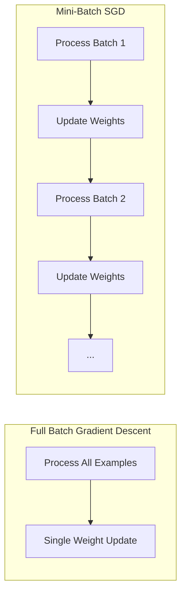

2. **Computational efficiency**: Training on mini-batches requires significantly less memory than using the entire dataset at once.

3. **Faster convergence**: SGD often leads to faster convergence in practice because weights are updated more frequently.

4. **More stable learning**: The high variance in gradients from individual examples gets averaged out in mini-batches, leading to more stable learning.

In our implementation, students shouldn't worry too much about the details - just understand that backpropagation is a method for calculating gradients, and SGD is a way to use those gradients to iteratively update weights. The core idea is that we're using small batches of data to gradually tune our network's weights toward better performance.


## Training a Simple Neural Network on MNIST

Now let's put everything together to train a simple neural network on MNIST:

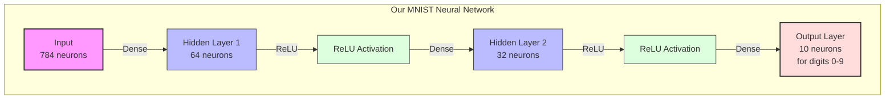

```python
def train_mnist_network(X_train, y_train, X_val, y_val, num_epochs=5, batch_size=32, subset_size=10000):
    """Train a neural network on MNIST dataset"""
    # Initialize the network
    network = [
        Dense(784, 64),     # Input layer -> Hidden layer 1
        ReLU(),             # Activation function
        Dense(64, 32),      # Hidden layer 1 -> Hidden layer 2
        ReLU(),             # Activation function
        Dense(32, 10)       # Hidden layer 2 -> Output layer
    ]
    
    print("Network architecture:")
    for i, layer in enumerate(network):
        if isinstance(layer, Dense):
            print(f"Layer {i}: Dense ({layer.weights.shape[0]} -> {layer.weights.shape[1]})")
        else:
            print(f"Layer {i}: {layer.__class__.__name__}")
    
    # Training history
    train_loss_history = []
    val_accuracy_history = []
    
    # Use a subset for faster training during demo
    if subset_size and subset_size < len(X_train):
        subset_indices = np.random.choice(len(X_train), subset_size, replace=False)
        X_train_subset = X_train[subset_indices]
        y_train_subset = y_train[subset_indices]
    else:
        X_train_subset = X_train
        y_train_subset = y_train
    
    print(f"\nTraining on {len(X_train_subset)} examples")
    
    # Training loop
    for epoch in range(num_epochs):
        print(f"Epoch {epoch+1}/{num_epochs}")
        
        # Shuffle the training data
        indices = np.random.permutation(len(X_train_subset))
        X_shuffled = X_train_subset[indices]
        y_shuffled = y_train_subset[indices]
        
        # Mini-batch training
        num_batches = (len(X_train_subset) + batch_size - 1) // batch_size
        epoch_losses = []
        
        # Note: This is where we implement mini-batch SGD
        # Instead of using the entire dataset at once (batch gradient descent),
        # we process the data in small batches and update weights after each batch.
        # This is the standard approach in modern deep learning.
        for batch in range(num_batches):
            # Extract batch
            start_idx = batch * batch_size
            end_idx = min(start_idx + batch_size, len(X_train_subset))
            
            X_batch = X_shuffled[start_idx:end_idx]
            y_batch = y_shuffled[start_idx:end_idx]
            
            # Train on batch
            loss = train(network, X_batch, y_batch)
            epoch_losses.append(loss)
            train_loss_history.append(loss)
            
            # Print progress
            if batch % 20 == 0:
                print(f"  Batch {batch+1}/{num_batches}, Loss: {loss:.4f}")
        
        # Evaluate on validation set
        val_subset_size = min(1000, len(X_val))  # Use a smaller subset for faster evaluation
        val_indices = np.random.choice(len(X_val), val_subset_size, replace=False)
        
        val_predictions = predict(network, X_val[val_indices])
        val_accuracy = np.mean(val_predictions == y_val[val_indices])
        val_accuracy_history.append(val_accuracy)
        
        avg_loss = np.mean(epoch_losses)
        print(f"  Epoch complete - Avg Loss: {avg_loss:.4f}, Validation Accuracy: {val_accuracy:.4f}")
    
    # Plot training history
    plt.figure(figsize=(12, 4))
    
    plt.subplot(1, 2, 1)
    plt.plot(train_loss_history)
    plt.title('Training Loss')
    plt.xlabel('Batch')
    plt.ylabel('Loss')
    plt.grid(True, alpha=0.3)
    
    plt.subplot(1, 2, 2)
    plt.plot(val_accuracy_history)
    plt.title('Validation Accuracy')
    plt.xlabel('Epoch')
    plt.ylabel('Accuracy')
    plt.grid(True, alpha=0.3)
    
    plt.tight_layout()
    plt.show()
    
    return network
```

## Visualizing Model Predictions

Let's visualize some predictions to better understand our model:

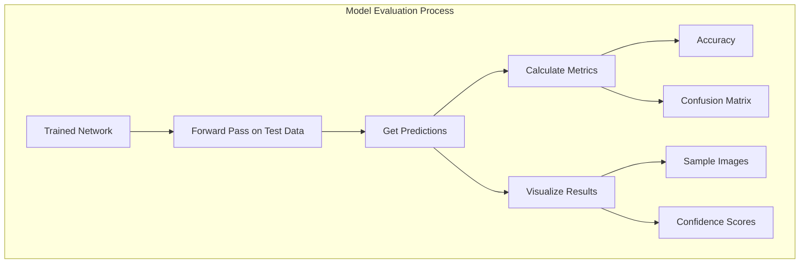

```python
def visualize_predictions(network, X, y, num_samples=10):
    """Visualize model predictions on sample images"""
    # Get random indices
    indices = np.random.choice(len(X), num_samples, replace=False)
    X_samples = X[indices]
    y_samples = y[indices]
    
    # Get predictions
    predictions = predict(network, X_samples)
    
    # Get confidence scores
    logits = forward(network, X_samples)[-1]
    exp_logits = np.exp(logits - np.max(logits, axis=1, keepdims=True))
    probs = exp_logits / np.sum(exp_logits, axis=1, keepdims=True)
    confidence = np.max(probs, axis=1)
    
    # Visualize
    fig, axes = plt.subplots(2, num_samples, figsize=(15, 5))
    
    for i in range(num_samples):
        # Display the image
        axes[0, i].imshow(X_samples[i].reshape(28, 28), cmap='gray')
        axes[0, i].axis('off')
        
        # Color-code the prediction: green if correct, red if wrong
        color = 'green' if predictions[i] == y_samples[i] else 'red'
        axes[0, i].set_title(f"Pred: {predictions[i]}", color=color)
        
        # Plot the probability distribution
        digit_probs = probs[i]
        axes[1, i].bar(range(10), digit_probs, color='skyblue')
        axes[1, i].set_xticks(range(10))
        axes[1, i].set_ylim(0, 1)
        axes[1, i].set_title(f"Confidence: {confidence[i]:.2f}")
    
    plt.tight_layout()
    plt.show()
```

## Conclusion

In this first session, we've built the foundations of neural networks from scratch:

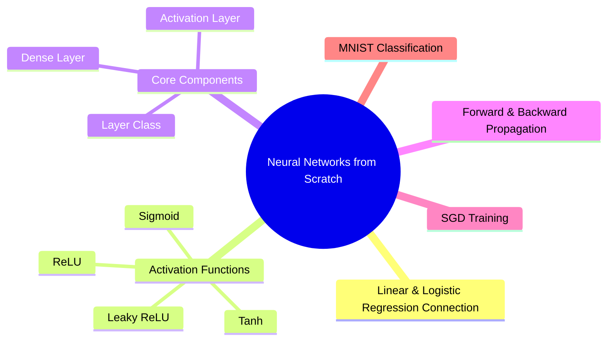

1. We connected neural networks to our previous knowledge of linear and logistic regression
2. We visualized and implemented activation functions
3. We built the core layer types (Dense and ReLU)
4. We implemented forward and backward propagation
5. We trained a simple neural network on MNIST digit classification
