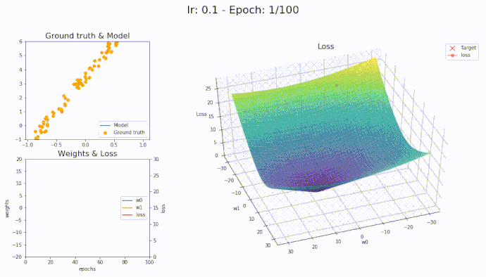

# Neural Networks from Scratch with Python and NumPy  
## Session 2: Backpropagation, SGD, and Adam with MNIST

### Introduction

In this session, we'll build on our first session's neural network foundations and focus on the learning process. While Session 1 covered the architecture and forward propagation, now we'll implement **Backpropagation (BP)**, the fundamental algorithm for computing gradients, and explore optimization methods starting with **Stochastic Gradient Descent (SGD)** and extending to the adaptive **Adam optimizer**.

We'll work with the classic **MNIST** dataset of handwritten digits to demonstrate these concepts in practice. To maintain our "from scratch" philosophy, we'll implement everything using only NumPy, with minimal dependencies.

<details>
<summary>❓ Why is backpropagation considered fundamental to neural network training?</summary>

Backpropagation is fundamental because:
- It efficiently computes gradients of the loss function with respect to all parameters in the network
- It enables the network to learn by understanding how each parameter affects the output error
- It applies the chain rule of calculus to distribute error gradients through layers
- Without backpropagation, training deep neural networks would be computationally infeasible
- It's what allows neural networks to automatically learn hierarchical features from data
</details>





### Session Overview

In this session we will cover:
1. **Practical Backpropagation Implementation**  
   - Converting our theoretical understanding into working code
   - Implementing gradient flow through custom layer classes
   - Setting up both forward and backward passes in a clean, modular way

2. **Advanced Optimization Techniques**  
   - **Extending SGD:** Building on the mini-batch SGD approach
   - **Adam Optimizer:** Implementing adaptive moment estimation for faster convergence

3. **Dataset: MNIST**  
   - How to load and preprocess MNIST from sklearn
   - Converting MNIST images into a format suitable for our neural network

4. **End-to-End Neural Network Training**  
   - Creating a complete training pipeline with both SGD and Adam
   - Comparing optimizer performance and visualizing results

<details>
<summary>❓ Before we dive in, can you explain why we need both forward and backward passes in neural networks?</summary>

We need both forward and backward passes because:
- **Forward pass**: Computes predictions by propagating inputs through the network's layers, generating an output that can be compared to the true target
- **Backward pass**: Computes gradients by propagating errors backward through the network, determining how each parameter should be adjusted
- Together they form a complete cycle: the forward pass evaluates the current model's performance, while the backward pass provides information on how to improve it
- This cycle enables the iterative optimization process that is core to neural network training
</details>

<details>
<summary>❓ What would you expect to see when comparing SGD and Adam optimizer performance?</summary>

When comparing SGD and Adam optimizer performance, you might expect to see:
- **Convergence speed**: Adam typically converges faster than SGD in early training
- **Final performance**: SGD sometimes reaches slightly better final solutions (though this varies)
- **Sensitivity to hyperparameters**: Adam is generally less sensitive to learning rate choice than SGD
- **Computational cost**: Adam has slightly higher memory and computation requirements
- **Learning stability**: Adam typically shows more stable learning curves with less fluctuation
- **Problem-dependence**: The relative performance depends on the specific dataset and network architecture
</details>

### 1. Backpropagation Implementation

#### 1.1. From Theory to Code

In our first session, we implemented forward propagation. Now we need to implement backpropagation to allow our neural network to learn. Our approach uses a modular, object-oriented design where each layer knows how to:
1. Perform a forward pass (compute outputs from inputs)
2. Perform a backward pass (compute gradients with respect to inputs and parameters)
3. Update its own parameters using gradients

This design follows directly from the chain rule and allows us to build networks of arbitrary depth by stacking layers together.

<details>
<summary>❓ What is the chain rule and why is it essential for backpropagation?</summary>

The chain rule is a fundamental concept from calculus that allows us to calculate the derivative of a composite function. In backpropagation:
- It enables us to compute gradients through multiple layers of a neural network
- Mathematically: if z = f(y) and y = g(x), then dz/dx = (dz/dy) × (dy/dx)
- For neural networks with many layers, we apply this rule repeatedly to propagate gradients backward
- This is crucial because it allows us to determine how each parameter (even in early layers) contributes to the final loss
- Without the chain rule, we would struggle to train deep networks efficiently as we wouldn't know how to update early layer parameters
</details>


#### 1.2. Code Implementation of Backpropagation

Our code builds on the layer classes from session one, extending them with backward pass functionality:

```python
import numpy as np
import matplotlib.pyplot as plt
from sklearn.datasets import fetch_openml
from tqdm import tqdm  # For progress bars

# ---------------------------
# Layer Base Class
# ---------------------------
class Layer:
    """
    Base class for neural network layers.
    Defines the interface for forward and backward propagation.
    """
    def __init__(self):
        pass

    def forward(self, input):
        """
        Forward pass: Compute the output given the input.
        """
        return input

    def backward(self, input, grad_output):
        """
        Backward pass: Compute gradients and propagate them backward.
        """
        return grad_output

# ---------------------------
# ReLU Activation Layer
# ---------------------------
class ReLU(Layer):
    """
    Implements the Rectified Linear Unit (ReLU) activation function.
    Forward: output = max(0, input)
    Backward: gradient is 1 for input > 0, else 0.
    """
    def forward(self, input):
        self.input = input  # Store for backward pass
        return np.maximum(0, input)
    
    def backward(self, input, grad_output):
        relu_grad = (input > 0).astype(float)
        return grad_output * relu_grad

# ---------------------------
# Dense (Fully Connected) Layer
# ---------------------------
class Dense(Layer):
    """
    Implements a fully connected (dense) layer.
    Forward: output = input.dot(weights) + biases
    """
    def __init__(self, input_units, output_units, learning_rate=0.1, optimizer=None):
        self.learning_rate = learning_rate
        # Xavier/Glorot initialization for weights
        self.weights = np.random.randn(input_units, output_units) * np.sqrt(2.0 / input_units)
        self.biases = np.zeros(output_units)
        self.optimizer = optimizer  # We'll update parameters using the optimizer
    
    def forward(self, input):
        self.input = input  # Cache input for backpropagation
        return np.dot(input, self.weights) + self.biases
    
    def backward(self, input, grad_output):
        # Compute gradients with respect to parameters
        grad_weights = np.dot(input.T, grad_output) / input.shape[0]
        grad_biases = np.mean(grad_output, axis=0)
        grad_input = np.dot(grad_output, self.weights.T)
        
        # If an optimizer is provided, use it to update parameters
        if self.optimizer is None:
            # Basic SGD update
            self.weights -= self.learning_rate * grad_weights
            self.biases -= self.learning_rate * grad_biases
        else:
            # Use optimizer's update method (more on this below)
            self.weights, self.biases = self.optimizer.update(self.weights, self.biases, grad_weights, grad_biases)
        
        return grad_input

# ---------------------------
# Loss Function: Softmax Cross-Entropy
# ---------------------------
def softmax_crossentropy_with_logits(logits, labels):
    """
    Computes softmax cross-entropy loss and gradient.
    Arguments:
      logits -- raw predictions from the network, shape (batch_size, num_classes)
      labels -- true labels, shape (batch_size,)
    Returns:
      loss -- scalar value for cross-entropy loss
      grad -- gradient of loss with respect to logits
    """
    batch_size = logits.shape[0]
    # One-hot encoding for labels
    one_hot_labels = np.zeros_like(logits)
    one_hot_labels[np.arange(batch_size), labels] = 1
    
    # Softmax computation with stability trick
    exp_logits = np.exp(logits - np.max(logits, axis=1, keepdims=True))
    softmax_probs = exp_logits / np.sum(exp_logits, axis=1, keepdims=True)
    
    loss = -np.sum(one_hot_labels * np.log(softmax_probs + 1e-9)) / batch_size
    grad = (softmax_probs - one_hot_labels) / batch_size
    
    return loss, grad

# ---------------------------
# Forward and Backward for the Network
# ---------------------------
def forward(network, X):
    """
    Computes forward pass through the entire network.
    Returns a list of activations for each layer.
    """
    activations = []
    input = X
    for layer in network:
        output = layer.forward(input)
        activations.append(output)
        input = output
    return activations

def predict(network, X):
    """
    Get class predictions for input X.
    """
    logits = forward(network, X)[-1]
    return np.argmax(logits, axis=-1)

def train_batch(network, X, y):
    """
    Train the network on a single batch using backpropagation.
    """
    # Forward pass
    activations = forward(network, X)
    layer_inputs = [X] + activations[:-1]
    logits = activations[-1]
    
    # Compute loss and initial gradient using our loss function
    loss, grad_logits = softmax_crossentropy_with_logits(logits, y)
    
    # Backward pass - traverse layers in reverse order
    grad = grad_logits
    for i in range(len(network) - 1, -1, -1):
        layer = network[i]
        grad = layer.backward(layer_inputs[i], grad)
    
    return loss
```


<details>
<summary>❓ Why is the softmax function combined with a "stability trick" in the code?</summary>

The softmax stability trick (subtracting the max value before exponentiation) is used because:
- Direct computation of exp(x) for large values of x can cause numerical overflow
- Softmax(x) = exp(x) / sum(exp(x)) mathematically equals exp(x-c) / sum(exp(x-c))
- By choosing c = max(x), we ensure the largest exponent is e^0 = 1
- This prevents potential infinity or NaN values that would break the training
- It's a simple trick that greatly improves numerical stability with no mathematical cost
- Without this trick, training could fail when dealing with large logit values
</details>


Note how the `backward` method in each layer computes both the gradient with respect to inputs (to propagate backwards) and updates the layer's parameters. This encapsulates the core of backpropagation in a clean, modular design.

<details>
<summary>❓ Can you explain why we traverse the network in reverse order during the backward pass?</summary>

We traverse the network in reverse order during the backward pass because:
- The chain rule requires us to compute gradients from the loss backward
- Each layer needs the gradient from its outputs to compute gradients for its inputs and parameters
- The gradient flows backward from the output layer toward the input layer
- This reverse order ensures each layer receives the correct gradient information from layers closer to the loss
- It's analogous to finding the derivative of a composite function from the outside in
- This backward flow gives backpropagation its name ("back" + "propagation" of error)
</details>

### 2. Optimization in Practice

#### 2.1. Mini-Batch SGD: The Foundation

Stochastic Gradient Descent (SGD) is a core optimization strategy for neural networks. The key insight of SGD is that we don't need to compute gradients over the entire dataset - we can use small random batches instead.

<details>
<summary>❓ What are the key differences between batch gradient descent, stochastic gradient descent, and mini-batch SGD?</summary>

Key differences between gradient descent variants:

**Batch Gradient Descent**:
- Uses the entire dataset for each parameter update
- Provides the most accurate gradient estimate
- Very slow for large datasets
- May require more memory than available
- Makes one update per epoch

**Stochastic Gradient Descent (SGD)**:
- Uses a single sample for each parameter update
- Provides noisy but frequent updates
- Much faster for large datasets
- Can escape local minima due to noise
- Makes as many updates as there are samples per epoch

**Mini-batch SGD**:
- Uses a small batch (e.g., 32, 64, 128 samples) for each update
- Balances accuracy and speed
- Enables vectorization for computational efficiency
- Provides a good compromise between the other methods
- Allows for efficient GPU utilization
- Makes (dataset_size / batch_size) updates per epoch
</details>

Our implementation is built around this mini-batch approach:

```python
for batch in tqdm(range(num_batches), desc=f"Epoch {epoch+1}/{num_epochs}"):
    start = batch * batch_size
    end = min(start + batch_size, num_samples)
    X_batch = X_train_shuffled[start:end]
    y_batch = y_train_shuffled[start:end]
    
    loss = train_batch(network, X_batch, y_batch)
```

This mini-batch processing is the essence of SGD - we're not using the whole dataset for each update, but rather small random subsets. This approach offers critical benefits:

- **Memory efficiency:** We only need to store a small batch in memory
- **Computational speedup:** More frequent parameter updates lead to faster convergence
- **Better generalization:** The noise from batch sampling helps escape local minima

<details>
<summary>❓ Why do we shuffle the data before creating mini-batches?</summary>

We shuffle the data before creating mini-batches because:
- It prevents the network from learning the order of the training data
- It reduces the risk of getting stuck in cycles or oscillations
- It exposes the model to a wider variety of transitions between examples
- It helps break any existing patterns in the dataset organization
- It improves generalization by ensuring each batch has a diverse mix of examples
- It's especially important when the dataset might have inherent ordering (e.g., sorted by class)
- It helps prevent overfitting to specific sequences in the data
</details>

The basic parameter update rule in SGD is straightforward:

$$\theta = \theta - \alpha \nabla_\theta L$$

Where:
- θ is a parameter (weight or bias)
- α is the learning rate
- ∇θL is the gradient of the loss with respect to the parameter

In our code, this is implemented directly in the `Dense` layer's `backward` method:

```python
# Basic SGD update
self.weights -= self.learning_rate * grad_weights
self.biases -= self.learning_rate * grad_biases
```

We also implement this as a standalone optimizer class for cleaner organization:

```python
# ---------------------------
# Optimizer: SGD and Adam Classes
# ---------------------------
class SGD:
    """
    Stochastic Gradient Descent optimizer.
    """
    def __init__(self, learning_rate=0.1):
        self.learning_rate = learning_rate

    def update(self, weights, biases, grad_weights, grad_biases):
        weights_updated = weights - self.learning_rate * grad_weights
        biases_updated = biases - self.learning_rate * grad_biases
        return weights_updated, biases_updated

class Adam:
    """
    Adam optimizer implementation.
    """
    def __init__(self, learning_rate=0.001, beta1=0.9, beta2=0.999, epsilon=1e-8):
        self.learning_rate = learning_rate
        self.beta1 = beta1
        self.beta2 = beta2
        self.epsilon = epsilon
        
        # State dictionaries for first and second moment estimates
        self.m_weights = {}
        self.v_weights = {}
        self.m_biases = {}
        self.v_biases = {}
        self.t = 0

    def update(self, weights, biases, grad_weights, grad_biases):
        self.t += 1
        
        # Identify parameters uniquely via id() (for multiple layers)
        key_w, key_b = id(weights), id(biases)
        
        if key_w not in self.m_weights:
            # Initialize moment estimates with zeros, same shape as parameters
            self.m_weights[key_w] = np.zeros_like(grad_weights)
            self.v_weights[key_w] = np.zeros_like(grad_weights)
            self.m_biases[key_b] = np.zeros_like(grad_biases)
            self.v_biases[key_b] = np.zeros_like(grad_biases)
        
        # Update biased first moment estimate for weights and biases
        self.m_weights[key_w] = self.beta1 * self.m_weights[key_w] + (1 - self.beta1) * grad_weights
        self.m_biases[key_b] = self.beta1 * self.m_biases[key_b] + (1 - self.beta1) * grad_biases
        
        # Update biased second moment estimate for weights and biases
        self.v_weights[key_w] = self.beta2 * self.v_weights[key_w] + (1 - self.beta2) * (grad_weights ** 2)
        self.v_biases[key_b] = self.beta2 * self.v_biases[key_b] + (1 - self.beta2) * (grad_biases ** 2)
        
        # Bias-corrected estimates
        m_hat_weights = self.m_weights[key_w] / (1 - self.beta1 ** self.t)
        v_hat_weights = self.v_weights[key_w] / (1 - self.beta2 ** self.t)
        m_hat_biases = self.m_biases[key_b] / (1 - self.beta1 ** self.t)
        v_hat_biases = self.v_biases[key_b] / (1 - self.beta2 ** self.t)
        
        # Update parameters
        weights_updated = weights - self.learning_rate * m_hat_weights / (np.sqrt(v_hat_weights) + self.epsilon)
        biases_updated = biases - self.learning_rate * m_hat_biases / (np.sqrt(v_hat_biases) + self.epsilon)
        
        return weights_updated, biases_updated
```

#### 2.2. Adam Optimizer

**Adam** (Adaptive Moment Estimation) combines the advantages of two other extensions of SGD: momentum and RMSProp. It maintains two moving averages for each parameter: one for the gradients (first moment) and one for the squared gradients (second moment). 

**Benefits of Adam:**
- **Adaptive Learning Rates:** Adam adjusts the learning rate for each parameter individually based on the historical gradients, allowing for more efficient training.
- **Faster Convergence:** By using both momentum and adaptive learning rates, Adam often converges faster than SGD, especially in complex problems.
- **Less Tuning Required:** Adam typically requires less tuning of the learning rate compared to SGD, making it easier to use in practice.

<details>
<summary>❓ What is the role of the beta1 and beta2 hyperparameters in Adam?</summary>

The beta1 and beta2 hyperparameters in Adam control:

**beta1 (typically 0.9)**:
- Controls the exponential decay rate for the first moment estimate (momentum)
- Determines how much to weight recent vs. historical gradients
- Higher values (closer to 1) give more weight to past gradients, creating more momentum
- Lower values make the optimizer respond more quickly to recent gradient changes
- Affects how quickly the optimizer adapts to changes in the gradient direction

**beta2 (typically 0.999)**:
- Controls the exponential decay rate for the second moment estimate (squared gradients)
- Determines how much to weight recent vs. historical squared gradients
- Higher values create a longer-term memory of past squared gradients
- Affects the adaptive learning rate by controlling how quickly variance estimates change
- Influences the optimizer's sensitivity to gradient magnitudes

Together, these hyperparameters balance between fast adaptation to new gradients and stability from historical information.
</details>

The update rules for Adam are:

1. **First Moment Estimate (mean):**  
   \(m_t = \beta_1 \cdot m_{t-1} + (1 - \beta_1) \cdot g_t\)

2. **Second Moment Estimate (uncentered variance):**  
   \(v_t = \beta_2 \cdot v_{t-1} + (1 - \beta_2) \cdot g_t^2\)

3. **Bias-Corrected Estimates:**  
   \(\hat{m}_t = \frac{m_t}{1 - \beta_1^t}\)  
   \(\hat{v}_t = \frac{v_t}{1 - \beta_2^t}\)

4. **Parameter Update:**  
   \(\theta = \theta - \alpha \frac{\hat{m}_t}{\sqrt{\hat{v}_t} + \epsilon}\)

> **Key Point:**  
> Both SGD and Adam share the same interface – an `update` method that accepts current parameters and gradients, and returns updated values. This design makes it easy to swap optimizers in our training loop.


### 3. MNIST Dataset Preparation

In this session, we'll be using the MNIST dataset, a classic benchmark in machine learning. MNIST contains 70,000 grayscale images of handwritten digits (28x28 pixels), with 60,000 training examples and 10,000 test examples.

<details>
<summary>❓ Why do we typically split datasets into training, validation, and test sets?</summary>

We split datasets into different sets because:

**Training set**:
- Used to update the model parameters through backpropagation
- The model directly "sees" and learns from this data
- Largest portion of the dataset (typically 60-80%)

**Validation set**:
- Used to tune hyperparameters (learning rate, network architecture, etc.)
- Helps detect overfitting during training
- Not used for parameter updates, only for evaluation
- Medium portion of the dataset (typically 10-20%)

**Test set**:
- Used to evaluate the final model performance
- Never used during training or hyperparameter tuning
- Provides an unbiased estimate of model performance on unseen data
- Smallest portion of the dataset (typically 10-20%)

This separation prevents data leakage and gives us a more realistic estimate of how the model will perform on new, unseen data.
</details>

We'll load the dataset using sklearn's `fetch_openml` function and implement preprocessing steps to prepare it for our neural network:

```python
def load_mnist():
    """
    Load the MNIST dataset from sklearn
    
    Returns:
    X_train -- training images, shape (n_samples, 28, 28)
    y_train -- training labels, shape (n_samples,)
    X_test -- test images, shape (n_samples, 28, 28)
    y_test -- test labels, shape (n_samples,)
    """
    print("Loading MNIST dataset from sklearn...")
    # Load data from https://www.openml.org/d/554
    X, y = fetch_openml('mnist_784', version=1, return_X_y=True, parser='auto')
    
    # Convert pandas DataFrame to numpy arrays
    X = X.to_numpy().astype('float32')
    y = y.to_numpy().astype('int')
    
    # Reshape to (samples, 28, 28)
    X = X.reshape(-1, 28, 28)
    
    # Split the data into train and test
    X_train, X_test = X[:60000], X[60000:]
    y_train, y_test = y[:60000], y[60000:]
    
    # Normalize the data (scale pixel values to [0, 1])
    X_train = X_train / 255.0
    X_test = X_test / 255.0
    
    print(f"Training data shape: {X_train.shape}")
    print(f"Training labels shape: {y_train.shape}")
    print(f"Test data shape: {X_test.shape}")
    print(f"Test labels shape: {y_test.shape}")
    
    return X_train, y_train, X_test, y_test

def visualize_mnist_samples(X, y, num_samples=10):
    """Visualize sample images from the MNIST dataset"""
    indices = np.random.choice(len(X), size=num_samples, replace=False)
    
    fig, axes = plt.subplots(1, num_samples, figsize=(15, 3))
    
    for i, idx in enumerate(indices):
        # MNIST images are grayscale
        axes[i].imshow(X[idx], cmap='gray')
        axes[i].set_title(f"Label: {y[idx]}")
        axes[i].axis('off')
    
    plt.tight_layout()
    plt.show()
```

<details>
<summary>❓ Why do we normalize the pixel values by dividing by 255.0?</summary>

We normalize pixel values by dividing by 255.0 because:
- Raw pixel values range from 0 to 255 (8-bit grayscale)
- Neural networks work better with input values in a smaller, standardized range
- Normalization to [0,1] improves numerical stability during training
- It helps the gradient descent algorithm converge faster
- Different scales between inputs can cause some features to dominate others
- Consistent scaling makes weights more comparable across features
- It makes the learning rate's effect more predictable and consistent
</details>

After loading the dataset, we need to preprocess it to suit our neural network. This involves:
- Flattening the 2D images (28×28) into 1D vectors (784)
- Normalizing the data to have zero mean and unit variance
- Creating validation and training splits

```python
def preprocess_mnist(X_train, y_train, X_test, y_test):
    """Preprocess MNIST data for our neural network"""
    # Flatten the images from (N, 28, 28) to (N, 784)
    X_train_flat = X_train.reshape(X_train.shape[0], -1)
    X_test_flat = X_test.reshape(X_test.shape[0], -1)
    
    print(f"Flattened training data shape: {X_train_flat.shape}")
    print(f"Flattened test data shape: {X_test_flat.shape}")
    
    # Normalize data to have zero mean and unit variance
    # Compute mean and std on training data
    mean = np.mean(X_train_flat, axis=0)
    std = np.std(X_train_flat, axis=0) + 1e-9  # Add small constant to avoid division by zero
    
    X_train_normalized = (X_train_flat - mean) / std
    X_test_normalized = (X_test_flat - mean) / std
    
    # Create a validation set from training data
    val_size = 5000
    val_indices = np.random.choice(len(X_train_normalized), val_size, replace=False)
    
    X_val = X_train_normalized[val_indices]
    y_val = y_train[val_indices]
    
    # Remove validation samples from training set
    train_mask = np.ones(len(X_train_normalized), dtype=bool)
    train_mask[val_indices] = False
    X_train_final = X_train_normalized[train_mask]
    y_train_final = y_train[train_mask]
    
    return X_train_final, y_train_final, X_val, y_val, X_test_normalized, y_test
```

<details>
<summary>❓ Why do we add a small constant (1e-9) when standardizing the data?</summary>

We add a small constant (1e-9) to the standard deviation because:
- It prevents division by zero when a pixel has zero standard deviation
- Some pixels might have the same value across all training images (especially background pixels)
- Without this constant, we could get NaN (Not a Number) values when dividing by zero
- It's a form of numerical stability that avoids potential errors during training
- The constant is small enough that it doesn't significantly affect properly calculated standardization
- This is a common practice in machine learning preprocessing to avoid numerical issues
</details>

<details>
<summary>❓ Why do we flatten the 2D images before feeding them to our neural network?</summary>

We flatten 2D images into 1D vectors because:
- Our current Dense (fully connected) layers expect 1D input vectors
- Each pixel becomes a separate input feature
- This simplifies the implementation for a basic neural network
- Spatial relationships between pixels are not explicitly preserved in this representation
- It's a standard approach for simple feed-forward networks (though not optimal for image data)
- More advanced architectures like CNNs would preserve the 2D structure
- For MNIST digits, this flattening still works well because the images are small and well-centered
</details>

Let's load and preprocess the data:

```python
# Load MNIST dataset
X_train, y_train, X_test, y_test = load_mnist()

# Visualize some samples
visualize_mnist_samples(X_train, y_train)

# Preprocess the data
X_train, y_train, X_val, y_val, X_test, y_test = preprocess_mnist(X_train, y_train, X_test, y_test)
```

### 4. Building and Training the Neural Network with Backpropagation & Optimizers

Now, we integrate all pieces together to build a neural network that uses backpropagation and either SGD or Adam for weight updates. We'll construct a multi-layer network with three hidden layers and train it on MNIST.

#### 4.1. Creating the Network

We set up the network using our Dense and ReLU layers. This time, we pass an optimizer instance (either SGD or Adam) to the Dense layers so that parameter updates are performed through the chosen method.

```python
def create_network(optimizer_type='sgd'):
    """
    Creates a neural network with three hidden layers using the specified optimizer.
    Arguments:
        optimizer_type -- 'sgd' or 'adam'
    Returns:
        network -- list of layers forming the network.
    """
    if optimizer_type == 'sgd':
        optimizer = SGD(learning_rate=0.05)
    elif optimizer_type == 'adam':
        optimizer = Adam(learning_rate=0.0005, beta1=0.9, beta2=0.999)
    else:
        raise ValueError("Unsupported optimizer type. Use 'sgd' or 'adam'.")
    
    network = [
        Dense(input_units=784, output_units=256, learning_rate=0.03, optimizer=optimizer),
        ReLU(),
        Dense(input_units=256, output_units=128, learning_rate=0.03, optimizer=optimizer),
        ReLU(),
        Dense(input_units=128, output_units=64, learning_rate=0.03, optimizer=optimizer),
        ReLU(),
        Dense(input_units=64, output_units=10, learning_rate=0.03, optimizer=optimizer)
    ]
    return network
```

#### 4.2. Training Loop and Evaluation

Our training loop processes the data in mini-batches, calls `train_batch` for each batch, and reports the loss periodically. After each epoch, we evaluate accuracy on a validation subset.

```python
def train_network(network, X_train, y_train, X_val, y_val, num_epochs=10, batch_size=64):
    """
    Trains the neural network on training data and periodically evaluates on validation data.
    """
    num_samples = X_train.shape[0]
    num_batches = int(np.ceil(num_samples / batch_size))
    history = {'loss': [], 'val_accuracy': []}
    
    for epoch in range(num_epochs):
        # Shuffle training data at each epoch
        indices = np.random.permutation(num_samples)
        X_train_shuffled = X_train[indices]
        y_train_shuffled = y_train[indices]
        
        epoch_losses = []
        for batch in tqdm(range(num_batches), desc=f"Epoch {epoch+1}/{num_epochs}"):
            start = batch * batch_size
            end = min(start + batch_size, num_samples)
            X_batch = X_train_shuffled[start:end]
            y_batch = y_train_shuffled[start:end]
            
            loss = train_batch(network, X_batch, y_batch)
            epoch_losses.append(loss)
        
        avg_loss = np.mean(epoch_losses)
        history['loss'].append(avg_loss)
        print(f"Epoch {epoch+1} complete. Average Loss: {avg_loss:.4f}")
        
        # Evaluate validation accuracy on a subset (for speed)
        val_indices = np.random.choice(X_val.shape[0], size=1000, replace=False)
        val_preds = predict(network, X_val[val_indices])
        val_acc = np.mean(val_preds == y_val[val_indices])
        history['val_accuracy'].append(val_acc)
        print(f"Validation Accuracy: {val_acc*100:.2f}%\n")
    
    return history

def evaluate_network(network, X_test, y_test):
    """
    Evaluate and print accuracy on the test set.
    """
    test_preds = predict(network, X_test)
    accuracy = np.mean(test_preds == y_test)
    print(f"Test Accuracy: {accuracy*100:.2f}%")
    
    # Create a confusion matrix
    conf_matrix = np.zeros((10, 10), dtype=int)
    for i in range(len(y_test)):
        conf_matrix[y_test[i], test_preds[i]] += 1
    
    # Plot confusion matrix
    plt.figure(figsize=(10, 8))
    plt.imshow(conf_matrix, cmap='Blues')
    plt.colorbar()
    
    # Add labels
    plt.xticks(np.arange(10), np.arange(10))
    plt.yticks(np.arange(10), np.arange(10))
    plt.xlabel('Predicted')
    plt.ylabel('True')
    plt.title('Confusion Matrix')
    
    # Add text annotations
    for i in range(10):
        for j in range(10):
            plt.text(j, i, str(conf_matrix[i, j]), 
                   ha="center", va="center", 
                   color="white" if conf_matrix[i, j] > conf_matrix.max() / 2 else "black")
    
    plt.tight_layout()
    plt.show()
    
    return accuracy
```

#### 4.3. Running Training with Both Optimizers

We'll train two models - one with Adam and one with SGD - to compare their performance:

```python
# Use a subset of data for quicker training during demo
subset_size = 20000
indices = np.random.choice(X_train.shape[0], subset_size, replace=False)
X_train_subset = X_train[indices]
y_train_subset = y_train[indices]

# Create a validation set from the training data
val_size = 1000
val_indices = np.random.choice(X_val.shape[0], val_size, replace=False)
X_val_subset = X_val[val_indices]
y_val_subset = y_val[val_indices]

# Create network using Adam optimizer
network_adam = create_network(optimizer_type='adam')
print("Training with Adam optimizer...")
history_adam = train_network(
    network_adam,
    X_train_subset,
    y_train_subset,
    X_val_subset,
    y_val_subset,
    num_epochs=20,
    batch_size=64
)

# Create network using SGD optimizer for comparison
network_sgd = create_network(optimizer_type='sgd')
print("\nTraining with SGD optimizer...")
history_sgd = train_network(
    network_sgd,
    X_train_subset,
    y_train_subset,
    X_val_subset,
    y_val_subset,
    num_epochs=20,
    batch_size=64
)

# Evaluate both models on test data
print("\nEvaluating Adam model...")
adam_accuracy = evaluate_network(network_adam, X_test, y_test)

print("\nEvaluating SGD model...")
sgd_accuracy = evaluate_network(network_sgd, X_test, y_test)

print(f"\nAdam accuracy: {adam_accuracy*100:.2f}%")
print(f"SGD accuracy: {sgd_accuracy*100:.2f}%")
```

<details>
<summary>❓ How might the results change if we trained on the full dataset instead of a subset?</summary>

Using the full dataset instead of a subset would likely:

- **Improve overall accuracy**: More training examples generally lead to better generalization
- **Reduce overfitting**: Larger datasets help the model avoid memorizing specific examples
- **Increase training time**: Training would take longer due to more batches per epoch
- **Smooth learning curves**: Larger datasets typically produce smoother loss and accuracy curves
- **Reduce performance gap**: The gap between optimizers might change, as some optimizers perform better with more data
- **Better representation**: The model would see a more complete distribution of digits and writing styles
- **Diminishing returns**: There would be a point of diminishing returns where more data adds minimal benefit
- **Memory constraints**: Might require more memory-efficient implementation or hardware

While our subset approach is good for demonstration and comparison, production models would typically use all available training data.
</details>

#### 4.4. Visualizing Training History and Comparing Optimizers

Plotting the training loss and validation accuracy across epochs helps us compare the performance of SGD and Adam.

```python
def plot_training_comparison(history_adam, history_sgd):
    """Compare training performance between Adam and SGD optimizers"""
    epochs = range(1, len(history_adam['loss']) + 1)
    plt.figure(figsize=(12, 5))
    
    plt.subplot(1, 2, 1)
    plt.plot(epochs, history_adam['loss'], marker='o', label='Adam')
    plt.plot(epochs, history_sgd['loss'], marker='s', label='SGD')
    plt.title("Training Loss Comparison")
    plt.xlabel("Epoch")
    plt.ylabel("Loss")
    plt.grid(True, alpha=0.3)
    plt.legend()
    
    plt.subplot(1, 2, 2)
    plt.plot(epochs, history_adam['val_accuracy'], marker='o', label='Adam')
    plt.plot(epochs, history_sgd['val_accuracy'], marker='s', label='SGD')
    plt.title("Validation Accuracy Comparison")
    plt.xlabel("Epoch")
    plt.ylabel("Accuracy")
    plt.grid(True, alpha=0.3)
    plt.legend()
    
    plt.tight_layout()
    plt.show()

plot_training_comparison(history_adam, history_sgd)
```

#### 4.5. Visualizing Predictions

Finally, let's visualize some example images along with their predictions:

```python
def visualize_predictions(network, X, y, num_samples=10):
    """Visualize predictions on sample images"""
    # Select random samples
    indices = np.random.choice(len(X), size=num_samples, replace=False)
    X_samples = X[indices]
    y_samples = y[indices]
    
    # Get predictions
    predictions = predict(network, X_samples)
    
    # Plot
    fig, axes = plt.subplots(2, num_samples, figsize=(15, 6))
    
    for i, idx in enumerate(range(num_samples)):
        # Reshape for visualization (to 28x28)
        img = X_samples[idx].reshape(28, 28)
        
        # Plot original image
        axes[0, i].imshow(img, cmap='gray')
        axes[0, i].set_title(f"True: {y_samples[idx]}")
        axes[0, i].axis('off')
        
        # Add prediction with color coding (green for correct, red for incorrect)
        color = 'green' if predictions[idx] == y_samples[idx] else 'red'
        axes[1, i].text(0.5, 0.5, f"Pred: {predictions[idx]}", 
                      horizontalalignment='center',
                      verticalalignment='center',
                      color=color, fontsize=12)
        axes[1, i].axis('off')
    
    plt.tight_layout()
    plt.show()

# Visualize predictions using the better model
better_network = network_adam if adam_accuracy > sgd_accuracy else network_sgd
visualize_predictions(better_network, X_test, y_test)
```

### 5. Conclusion

In this second session we have:

1. **Implemented Backpropagation:**  
   - Built on our first session's neural network foundation
   - Created a modular design where each layer handles its own gradient computation
   - Implemented the chain rule through our backward methods

2. **Explored Optimization Methods:**  
   - Implemented basic SGD with mini-batch processing
   - Developed the more sophisticated Adam optimizer
   - Demonstrated how to swap optimizers in our architecture

3. **Applied Our Network to MNIST:**  
   - Loaded and preprocessed the MNIST dataset
   - Created a multi-layer network with ReLU activations
   - Achieved good classification accuracy

4. **Compared Optimization Approaches:**  
   - Visualized training progress with different optimizers
   - Analyzed performance differences between SGD and Adam
   - Demonstrated the power of adaptive learning rates

While our models can now learn effectively, they still face the challenge of overfitting. In Session 3, we'll complete our neural network implementation by adding regularization techniques including Dropout, Early Stopping, and L1/L2 regularization. These methods will help our networks generalize better to unseen data, addressing one of the most common issues in practical machine learning.

