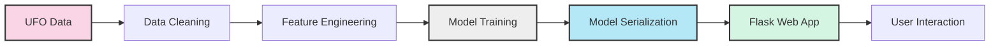

# Building a Web App with Machine Learning Integration

In this lesson, you will train a machine learning model on an intriguing dataset: _UFO sightings over the past century_, sourced from NUFORC's database (National UFO Reporting Center).

You will learn:

- How to serialize ('pickle') a trained model for deployment
- How to integrate the model into a Flask web application

We will use Jupyter notebooks for data cleaning and model training, then take the process further by deploying the model in a web application.

## Overall Workflow



## From Model to Web Application

There are several approaches to integrating machine learning models into applications. The architecture you choose may influence how you train and deploy your model. Consider this scenario: you're working with a data science team that has trained a model they want you to integrate into an application.

### Key Architectural Considerations

Before implementation, consider these important questions:

- **Platform requirements:** Are you building a web app, mobile app, or IoT application? For mobile or IoT contexts, [TensorFlow Lite](https://www.tensorflow.org/lite/) might be appropriate for Android or iOS.
- **Model deployment location:** Will the model be cloud-hosted or run locally on the device?
- **Offline functionality:** Does the application need to function without internet connectivity?
- **Training technology compatibility:** The technology used to train the model significantly impacts your integration options:
    - **TensorFlow models** can be converted for web applications using [TensorFlow.js](https://www.tensorflow.org/js/)
    - **PyTorch models** can be exported to [ONNX format](https://onnx.ai/) (Open Neural Network Exchange) for use in JavaScript web apps with [Onnx Runtime](https://www.onnxruntime.ai/)


It's also possible to build a Flask application that can train the model directly in a web browser using TensorFlow.js in a JavaScript environment.

For this lesson, since we've been working with Python-based notebooks, we'll explore how to export a trained model from a notebook for integration with a Python web application.

## Technologies Used

This project requires two main Python tools:

✅ **Flask**: A lightweight "micro-framework" for building web applications in Python with an integrated templating engine. For more practice with Flask, check out [this Learn module](https://docs.microsoft.com/learn/modules/python-flask-build-ai-web-app?WT.mc_id=academic-77952-leestott).

✅ **Pickle**: A Python module that serializes and deserializes Python objects. When you "pickle" a model, you convert its structure into a format usable in web applications. Note: pickle is not inherently secure, so be cautious when unpickling files from unknown sources. Pickled files use the `.pkl` extension.


## Exercise 1: Data Preparation

In this lesson, we'll work with data from 80,000 UFO sightings collected by [NUFORC](https://nuforc.org). This dataset contains fascinating descriptions of UFO sightings, such as:

- **Detailed example:** "A man emerges from a beam of light that shines on a grassy field at night and he runs towards the Texas Instruments parking lot"
- **Brief example:** "the lights chased us"

The [ufos.csv](./data/ufos.csv) dataset includes information about the `city`, `state`, and `country` of each sighting, the object's `shape`, and its `latitude` and `longitude` coordinates.


In the [notebook](notebook.ipynb) provided with this lesson:

1. Import the necessary libraries and load the UFO dataset:

    ```python
    import pandas as pd
    import numpy as np
    
    ufos = pd.read_csv('./data/ufos.csv')
    ufos.head()
    ```

2. Create a streamlined dataframe with relevant columns and examine unique country values:

    ```python
    ufos = pd.DataFrame({
        'Seconds': ufos['duration (seconds)'], 
        'Country': ufos['country'],
        'Latitude': ufos['latitude'],
        'Longitude': ufos['longitude']
    })
    
    ufos.Country.unique()
    ```

3. Clean the data by removing null values and filtering for sightings between 1-60 seconds:

    ```python
    ufos.dropna(inplace=True)
    
    ufos = ufos[(ufos['Seconds'] >= 1) & (ufos['Seconds'] <= 60)]
    
    ufos.info()
    ```

4. Use Scikit-learn's `LabelEncoder` to convert country names to numeric values:

    ```python
    from sklearn.preprocessing import LabelEncoder
    
    ufos['Country'] = LabelEncoder().fit_transform(ufos['Country'])
    
    ufos.head()
    ```

    After encoding, your data should look like this:

    ```
    	Seconds	Country	Latitude	Longitude
    2	20.0	3		53.200000	-2.916667
    3	20.0	4		28.978333	-96.645833
    14	30.0	4		35.823889	-80.253611
    23	60.0	4		45.582778	-122.352222
    24	3.0		3		51.783333	-0.783333
    ```

    Note: LabelEncoder transforms text values alphabetically into numeric identifiers.

## Exercise 2: Model Training

Now, prepare the data for training by splitting it into training and testing sets:


1. Define your feature set (X) and target variable (y):

    ```python
    from sklearn.model_selection import train_test_split
    
    Selected_features = ['Seconds', 'Latitude', 'Longitude']
    
    X = ufos[Selected_features]
    y = ufos['Country']
    
    X_train, X_test, y_train, y_test = train_test_split(X, y, test_size=0.2, random_state=0)
    ```

2. Train a logistic regression model and evaluate its performance:

    ```python
    from sklearn.metrics import accuracy_score, classification_report
    from sklearn.linear_model import LogisticRegression
    
    model = LogisticRegression()
    model.fit(X_train, y_train)
    predictions = model.predict(X_test)
    
    print(classification_report(y_test, predictions))
    print('Predicted labels: ', predictions)
    print('Accuracy: ', accuracy_score(y_test, predictions))
    ```

The model achieves approximately 95% accuracy, which isn't surprising given the correlation between `Country` and geographical coordinates (`Latitude/Longitude`). While this model isn't revolutionary, it provides a good exercise in cleaning data, training a model, and deploying it in a web application.

## Exercise 3: Model Serialization with Pickle

Now, serialize your model for web deployment:


```python
import pickle

model_filename = 'ufo-model.pkl'
pickle.dump(model, open(model_filename, 'wb'))

# Verify the model works after loading
model = pickle.load(open('ufo-model.pkl', 'rb'))
print(model.predict([[50, 44, -12]]))
```

The model returns **'3'**, which corresponds to the UK in our encoded country values. Success! 👽

## Exercise 4: Building a Flask Web Application

Now, create a Flask application to provide a user interface for your model:


1. Create the following directory structure next to your notebook file:

    ```
    web-app/
      static/
        css/
      templates/
    notebook.ipynb
    ufo-model.pkl
    ```

2. Create a **requirements.txt** file in the _web-app_ folder to specify dependencies:

    ```text
    scikit-learn
    pandas
    numpy
    flask
    ```

3. Install the required libraries:

    ```bash
    cd web-app
    pip install -r requirements.txt
    ```

4. Create the following files:

    a. **app.py** in the root directory
    b. **index.html** in the _templates_ directory
    c. **styles.css** in the _static/css_ directory

5. Add styles to **styles.css**:

    ```css
    body {
    	width: 100%;
    	height: 100%;
    	font-family: 'Helvetica';
    	background: black;
    	color: #fff;
    	text-align: center;
    	letter-spacing: 1.4px;
    	font-size: 30px;
    }
    
    input {
    	min-width: 150px;
    }
    
    .grid {
    	width: 300px;
    	border: 1px solid #2d2d2d;
    	display: grid;
    	justify-content: center;
    	margin: 20px auto;
    }
    
    .box {
    	color: #fff;
    	background: #2d2d2d;
    	padding: 12px;
    	display: inline-block;
    }
    ```

6. Create the HTML template in **index.html**:

    ```html
    <!DOCTYPE html>
    <html>
      <head>
        <meta charset="UTF-8">
        <title>🛸 UFO Appearance Prediction! 👽</title>
        <link rel="stylesheet" href="{{ url_for('static', filename='css/styles.css') }}">
      </head>
    
      <body>
        <div class="grid">
    
          <div class="box">
    
            <p>According to the number of seconds, latitude and longitude, which country is likely to have reported seeing a UFO?</p>
    
            <form action="{{ url_for('predict')}}" method="post">
              <input type="number" name="seconds" placeholder="Seconds" required="required" min="0" max="60" />
              <input type="text" name="latitude" placeholder="Latitude" required="required" />
              <input type="text" name="longitude" placeholder="Longitude" required="required" />
              <button type="submit" class="btn">Predict country where the UFO is seen</button>
            </form>
    
            <p>{{ prediction_text }}</p>
    
          </div>
    
        </div>
    
      </body>
    </html>
    ```

    Note the template syntax with double curly braces `{{}}` for variables provided by the Flask application, and the form that posts to the `/predict` route.

7. Implement the Flask application in **app.py**:

    ```python
    import numpy as np
    from flask import Flask, request, render_template
    import pickle
    
    app = Flask(__name__)
    
    model = pickle.load(open("./ufo-model.pkl", "rb"))
    
    
    @app.route("/")
    def home():
        return render_template("index.html")
    
    
    @app.route("/predict", methods=["POST"])
    def predict():
    
        int_features = [int(x) for x in request.form.values()]
        final_features = [np.array(int_features)]
        prediction = model.predict(final_features)
    
        output = prediction[0]
    
        countries = ["Australia", "Canada", "Germany", "UK", "US"]
    
        return render_template(
            "index.html", prediction_text="Likely country: {}".format(countries[output])
        )
    
    
    if __name__ == "__main__":
        app.run(debug=True)
    ```

    > 💡 Tip: Setting `debug=True` enables Flask's development mode, which automatically refreshes the application when you make changes, without requiring a server restart. Important: Never enable debug mode in production environments!


To run your application, execute `python app.py` or `python3 app.py`. The server will start locally, allowing you to interact with a form that predicts UFO sighting locations based on your input parameters.

### Understanding the Flask Application

Let's break down how **app.py** works:

1. **Initialization**: Dependencies are loaded and the Flask application is created
2. **Model Loading**: The pickled model is imported
3. **Home Route**: The `/` route renders the index.html template
4. **Predict Route**: The `/predict` route handles form submissions by:
   - Collecting form data and converting it to a numpy array
   - Passing the data to the model to get a prediction
   - Converting numeric country codes to readable country names
   - Sending the result back to index.html for display

This approach to model integration with Flask is relatively straightforward. The most challenging aspect is understanding the format of data required by the model, which depends entirely on how the model was trained. This particular model requires three specific data points to generate a prediction.

In professional settings, effective communication between model developers and application developers is essential. In this case, you're handling both roles!

---

## 🚀 Challenge

Instead of training the model in a notebook and importing it into the Flask app, try implementing model training directly within the Flask application. Convert your notebook code to train the model on a new route called `/train`. Consider the advantages and disadvantages of this approach.


## Review & Self Study

There are multiple approaches to integrating machine learning models into web applications. Create a list of different methods using JavaScript or Python. Consider architectural questions: Should the model reside in the application or in the cloud? If cloud-hosted, how would you access it? Sketch an architectural diagram for a web application with integrated machine learning.


