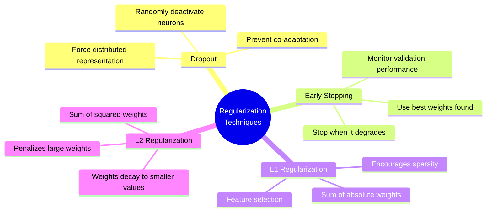
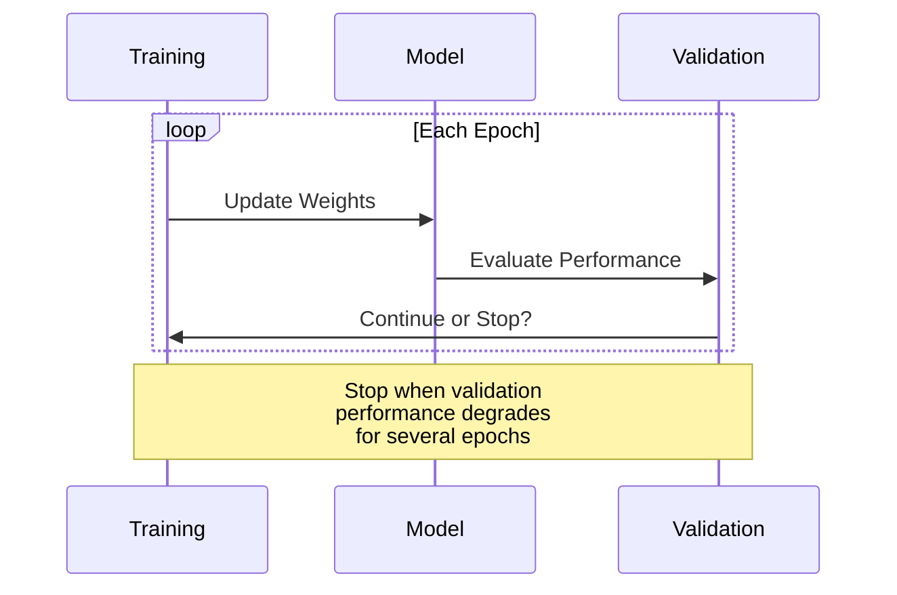
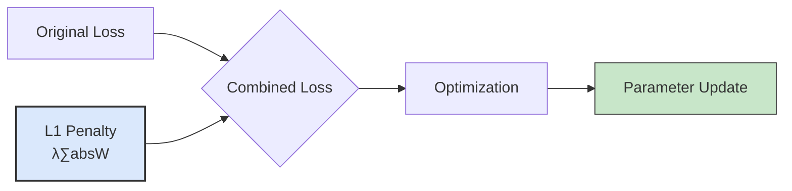
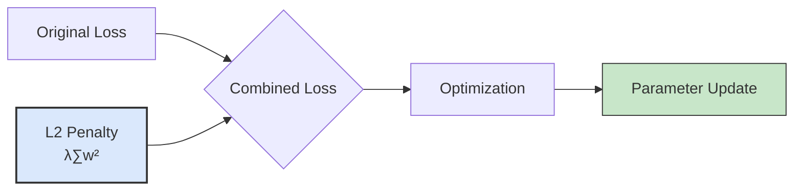
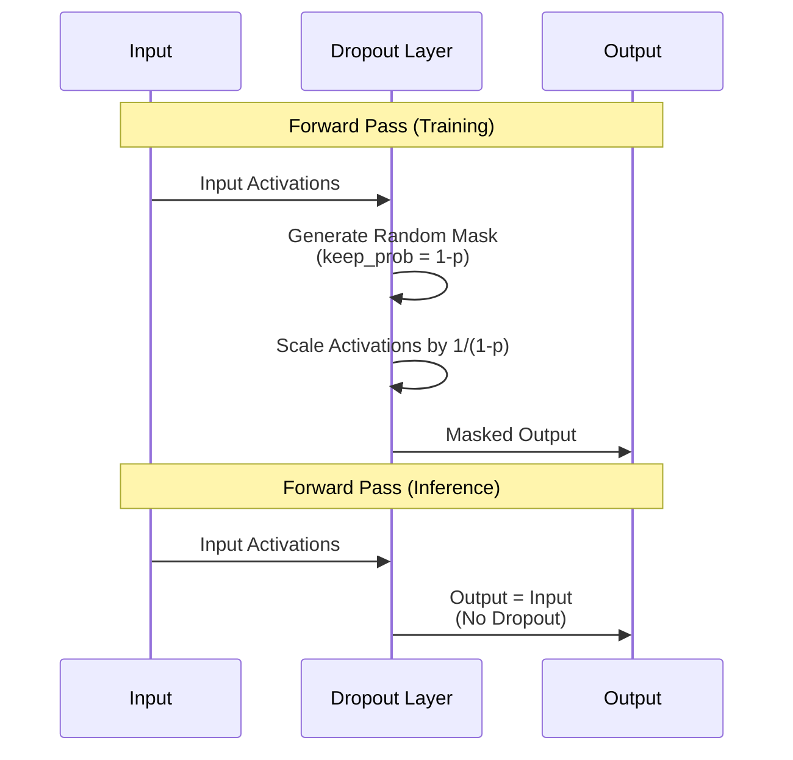
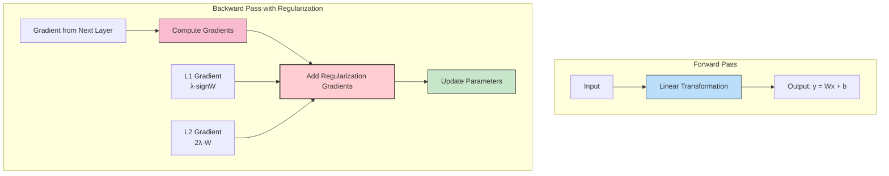
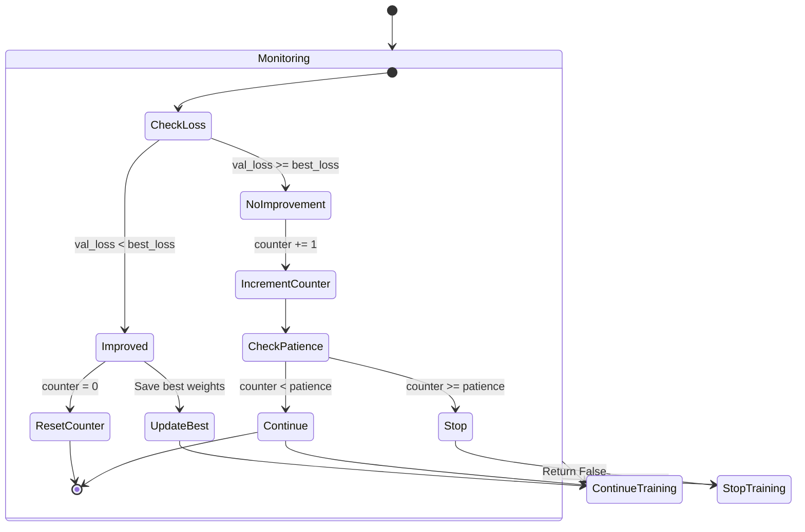
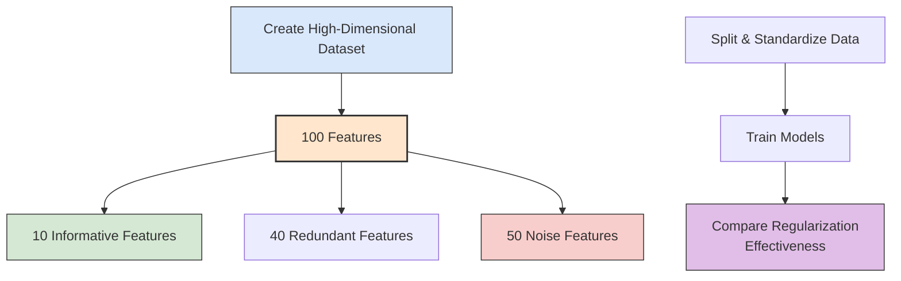
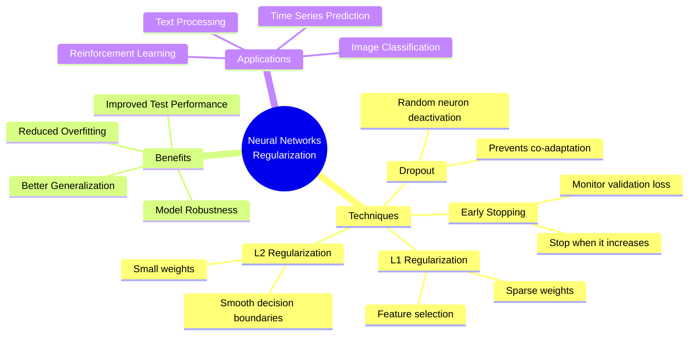

# Neural Networks from Scratch with Python and NumPy  
## Session 3: Regularization Techniques - Dropout, Early Stopping, L1, and L2

### Introduction

In this session, we build on our previous work implementing neural networks from scratch. While we've successfully created a functioning neural network with backpropagation and optimization algorithms, real-world machine learning faces a persistent challenge: **overfitting**. This occurs when our model performs exceptionally well on training data but fails to generalize to unseen data.

Today, we implement four powerful regularization techniques to combat overfitting:

1. **Dropout**: Randomly "turning off" neurons during training to prevent co-adaptation
2. **Early Stopping**: Halting training when validation performance begins to degrade
3. **L1 Regularization**: Adding the sum of absolute weights to the loss function
4. **L2 Regularization**: Adding the sum of squared weights to the loss function



We'll use synthetic datasets from scikit-learn to clearly demonstrate overfitting scenarios and how each regularization technique helps address them.

### Session Overview

1. **Regularization Basics**  
   - Understanding overfitting and the need for regularization
   - Brief explanation of each technique and its theoretical foundation

2. **Implementing Regularization Techniques**  
   - Dropout layer implementation
   - Early stopping mechanism
   - L1 and L2 regularization in the loss function and optimizers

3. **Dataset Generation**  
   - Creating synthetic datasets with scikit-learn
   - Visualizing the data and creating training/validation/test splits

4. **Comparing Regularization Techniques**  
   - Training multiple models with different regularization approaches
   - Analyzing and visualizing their performance on training and validation data

### 1. Regularization: Understanding the Problem and Solutions

#### 1.1. The Overfitting Challenge

Overfitting occurs when our model learns the training data too well, capturing noise rather than the underlying pattern. Signs of overfitting include:
- Training loss continues to decrease
- Validation loss initially decreases, then starts increasing
- Large gap between training and validation performance

The model essentially "memorizes" the training data rather than learning generalizable patterns, resulting in poor performance on new data.

<details>
<summary>❓ How should regularization strength be adjusted as dataset size changes?</summary>

Regularization strength should generally decrease as dataset size increases. Small datasets need stronger regularization to prevent overfitting, while large datasets may need minimal regularization. However, model complexity, data quality, and task difficulty also influence the optimal strength. Always use validation performance to guide final regularization settings.
</details><br>

<details>
<summary>❓ What challenges might arise when combining multiple regularization techniques together?</summary>

Combining regularization techniques can lead to: over-regularization causing underfitting, explosion of hyperparameters to tune, techniques potentially counteracting each other, increased computational costs, harder debugging when performance is poor, and more complex implementation. Balance is key to avoid these issues.
</details><br>

#### 1.2. Regularization Techniques Overview

**Dropout**: Introduced by Hinton et al. (2012), dropout randomly "turns off" neurons during training with a specified probability. This prevents neurons from co-adapting and forces the network to learn more robust features. During inference, all neurons are active but their outputs are scaled appropriately.

<details>
<summary>❓ What is the "co-adaptation of features" that dropout helps prevent?</summary>

Co-adaptation of features, which dropout helps prevent, refers to:

1. **Feature Dependency**: Neurons developing complex dependencies where they only work correctly in conjunction with specific other neurons.

2. **Brittle Representations**: Network representations becoming overly specialized to the training data patterns, making them fragile to unseen data.

3. **Correlated Behavior**: Multiple neurons learning to detect the same features, creating redundancy rather than diversity.

4. **Distributed Learning Impediment**: An obstacle to truly distributed representations, where network knowledge should be spread across many neurons.

5. **Ensemble Fragility**: Reduces the network's ability to function like an ensemble of models, making it less robust.

6. **Memorization Facilitation**: Enables the network to effectively memorize training examples rather than learning generalizable patterns.
</details><br>

**Early Stopping**: A simple but effective technique where we monitor validation performance and stop training when it starts deteriorating, even if training performance continues to improve.

<details>
<summary>❓ What makes early stopping different from other regularization techniques?</summary>

Early stopping differs by: controlling training duration rather than directly constraining parameters, requiring fewer hyperparameters (typically just patience), reducing total training time, not adding explicit mathematical penalties to the objective function, and being conceptually simpler to implement than many alternatives.
</details><br>



**L1 Regularization**: Adds the sum of absolute values of the weights to the loss function. This encourages sparse solutions, effectively "zeroing out" less important weights, leading to feature selection.

<details>
<summary>❓ When would L1 regularization be preferred over L2 regularization?</summary>

L1 regularization is preferred when: automatic feature selection is desired, model sparsity (many weights exactly zero) is important for interpretability or memory efficiency, working with high-dimensional data where many features may be irrelevant, or dealing with highly redundant features where selecting a subset is beneficial.
</details><br>




**L2 Regularization**: Adds the sum of squared weights to the loss function. This penalizes large weights, encouraging the model to distribute importance more evenly across features.

<details>
<summary>❓ Why might L2 regularization be considered a form of "weight decay"?</summary>

1. **Mathematical Equivalence**: The weight update rule with L2 regularization (w = w - learning_rate * (gradient + lambda * w)) can be rewritten as w = w * (1 - learning_rate * lambda) - learning_rate * gradient.

2. **Automatic Shrinkage**: L2 regularization automatically shrinks weights toward zero after each update, with larger weights decaying more rapidly than smaller ones.

3. **Contrast with L1**: Unlike L1 regularization which can drive weights exactly to zero, L2 causes gradual decay toward zero without generally reaching it.

</details><br>

<details>
<summary>❓ How do L1 and L2 regularization differ in their effect on model weights?</summary>

L1 and L2 regularization differ in their effects on model weights in the following ways:

- **L1 Regularization (Lasso)**:
  - Adds the sum of absolute values of weights to the loss function
  - Tends to produce sparse models by driving some weights exactly to zero
  - Acts as a feature selection mechanism by eliminating less important features
  - Creates models that are more interpretable due to fewer active features
  - Mathematically adds λ∑|w| to the loss function
  - Gradient is constant (sign of weight) regardless of weight magnitude

- **L2 Regularization (Ridge)**:
  - Adds the sum of squared weights to the loss function
  - Tends to distribute weight values more evenly, making them smaller but non-zero
  - All features typically remain in the model, just with reduced importance
  - Better for handling correlated features than L1
  - Mathematically adds λ∑w² to the loss function
  - Gradient is proportional to weight value (2λw), so larger weights are penalized more
</details><br>



### 2. Implementation of Regularization Techniques

Let's build on our previous code and implement these regularization techniques. We'll start by importing the necessary libraries and setting up our base classes from the previous session.

```python
import numpy as np
import matplotlib.pyplot as plt
from sklearn.datasets import make_moons, make_classification
from sklearn.model_selection import train_test_split
from sklearn.preprocessing import StandardScaler
from tqdm import tqdm

# ---------------------------
# Layer Base Class (From Previous Session)
# ---------------------------
class Layer:
    """
    Base class for neural network layers.
    Defines the interface for forward and backward propagation.
    """
    def __init__(self):
        pass

    def forward(self, input):
        """Forward pass: Compute the output given the input."""
        return input

    def backward(self, input, grad_output):
        """Backward pass: Compute gradients and propagate them backward."""
        return grad_output
    
    def train(self):
        """Set the layer to training mode."""
        pass
    
    def eval(self):
        """Set the layer to evaluation mode."""
        pass

# ---------------------------
# ReLU Activation Layer
# ---------------------------
class ReLU(Layer):
    """
    Implements the Rectified Linear Unit (ReLU) activation function.
    Forward: output = max(0, input)
    Backward: gradient is 1 for input > 0, else 0.
    """
    def forward(self, input):
        self.input = input  # Store for backward pass
        return np.maximum(0, input)
    
    def backward(self, input, grad_output):
        relu_grad = (input > 0).astype(float)
        return grad_output * relu_grad
```

#### 2.1. Dropout Layer Implementation

First, let's implement the Dropout layer:



```python
class Dropout(Layer):
    """
    Implements Dropout regularization.
    During training, randomly zeros elements with probability p.
    During inference, scales outputs by (1-p) to maintain expected sum.
    """
    def __init__(self, p=0.5):
        self.p = p  # Probability of dropping a unit
        self.mask = None
        self.training = True
    
    def forward(self, input):
        if self.training:
            # Generate mask of 0s and 1s with probability (1-p) for 1s
            self.mask = np.random.binomial(1, 1-self.p, size=input.shape) / (1-self.p)
            # Apply mask (multiply by 0 drops the unit)
            return input * self.mask
        else:
            # During evaluation, no dropout but we don't need to scale
            # since we already scaled during training
            return input
    
    def backward(self, input, grad_output):
        # Apply same mask to gradients
        if self.training:
            return grad_output * self.mask
        else:
            return grad_output
    
    def train(self):
        """Set layer to training mode"""
        self.training = True
    
    def eval(self):
        """Set layer to evaluation mode"""
        self.training = False
```

#### 2.2. Implementing L1 and L2 Regularization in the Dense Layer

Next, we'll modify our Dense layer to support L1 and L2 regularization:



```python
class Dense(Layer):
    """
    Implements a fully connected (dense) layer with optional L1/L2 regularization.
    """
    def __init__(self, input_units, output_units, learning_rate=0.1, 
                 optimizer=None, l1=0.0, l2=0.0):
        self.learning_rate = learning_rate
        # Xavier/Glorot initialization for weights
        self.weights = np.random.randn(input_units, output_units) * np.sqrt(2.0 / input_units)
        self.biases = np.zeros(output_units)
        self.optimizer = optimizer  # We'll update parameters using the optimizer
        self.l1 = l1  # L1 regularization strength
        self.l2 = l2  # L2 regularization strength
    
    def forward(self, input):
        self.input = input  # Cache input for backpropagation
        return np.dot(input, self.weights) + self.biases
    
    def backward(self, input, grad_output):
        # Compute gradients with respect to parameters
        grad_weights = np.dot(input.T, grad_output) / input.shape[0]
        grad_biases = np.mean(grad_output, axis=0)
        
        # Add regularization gradients
        if self.l1 > 0:
            grad_weights += self.l1 * np.sign(self.weights)
        if self.l2 > 0:
            grad_weights += self.l2 * 2 * self.weights
        
        # Compute gradient with respect to inputs
        grad_input = np.dot(grad_output, self.weights.T)
        
        # If an optimizer is provided, use it to update parameters
        if self.optimizer is None:
            # Basic update with regularization
            self.weights -= self.learning_rate * grad_weights
            self.biases -= self.learning_rate * grad_biases
        else:
            # Use optimizer's update method
            self.weights, self.biases = self.optimizer.update(
                self.weights, self.biases, grad_weights, grad_biases)
        
        return grad_input
    
    def l1_penalty(self):
        """Compute L1 regularization penalty"""
        if self.l1 > 0:
            return self.l1 * np.sum(np.abs(self.weights))
        return 0
    
    def l2_penalty(self):
        """Compute L2 regularization penalty"""
        if self.l2 > 0:
            return self.l2 * np.sum(self.weights**2)
        return 0
```

#### 2.3. Modified Loss Function with Regularization

Let's update our loss function to account for regularization penalties:

```python
def softmax_crossentropy_with_logits(logits, labels, network=None):
    """
    Computes softmax cross-entropy loss and gradient, including regularization.
    Arguments:
      logits -- raw predictions from the network, shape (batch_size, num_classes)
      labels -- true labels, shape (batch_size,)
      network -- optional network for computing regularization penalties
    Returns:
      loss -- scalar value for cross-entropy loss plus regularization
      grad -- gradient of loss with respect to logits
    """
    batch_size = logits.shape[0]
    # One-hot encoding for labels
    one_hot_labels = np.zeros_like(logits)
    one_hot_labels[np.arange(batch_size), labels] = 1
    
    # Softmax computation with stability trick
    exp_logits = np.exp(logits - np.max(logits, axis=1, keepdims=True))
    softmax_probs = exp_logits / np.sum(exp_logits, axis=1, keepdims=True)
    
    # Base loss
    base_loss = -np.sum(one_hot_labels * np.log(softmax_probs + 1e-9)) / batch_size
    
    # Add regularization penalties if network is provided
    reg_loss = 0
    if network is not None:
        for layer in network:
            if isinstance(layer, Dense):
                reg_loss += layer.l1_penalty()
                reg_loss += layer.l2_penalty()
    
    loss = base_loss + reg_loss
    grad = (softmax_probs - one_hot_labels) / batch_size
    
    return loss, grad
```

#### 2.4. Modifying the Optimizers for Regularization

Now, let's update our optimizers to handle regularization:

```python
class SGD:
    """
    Stochastic Gradient Descent optimizer.
    """
    def __init__(self, learning_rate=0.1):
        self.learning_rate = learning_rate

    def update(self, weights, biases, grad_weights, grad_biases):
        weights_updated = weights - self.learning_rate * grad_weights
        biases_updated = biases - self.learning_rate * grad_biases
        return weights_updated, biases_updated

class Adam:
    """
    Adam optimizer implementation with support for L1 and L2 regularization.
    """
    def __init__(self, learning_rate=0.001, beta1=0.9, beta2=0.999, epsilon=1e-8):
        self.learning_rate = learning_rate
        self.beta1 = beta1
        self.beta2 = beta2
        self.epsilon = epsilon
        
        # State dictionaries for first and second moment estimates
        self.m_weights = {}
        self.v_weights = {}
        self.m_biases = {}
        self.v_biases = {}
        self.t = 0

    def update(self, weights, biases, grad_weights, grad_biases):
        self.t += 1
        
        # Identify parameters uniquely via id() (for multiple layers)
        key_w, key_b = id(weights), id(biases)
        
        if key_w not in self.m_weights:
            # Initialize moment estimates with zeros, same shape as parameters
            self.m_weights[key_w] = np.zeros_like(grad_weights)
            self.v_weights[key_w] = np.zeros_like(grad_weights)
            self.m_biases[key_b] = np.zeros_like(grad_biases)
            self.v_biases[key_b] = np.zeros_like(grad_biases)
        
        # Update biased first moment estimate for weights and biases
        self.m_weights[key_w] = self.beta1 * self.m_weights[key_w] + (1 - self.beta1) * grad_weights
        self.m_biases[key_b] = self.beta1 * self.m_biases[key_b] + (1 - self.beta1) * grad_biases
        
        # Update biased second moment estimate for weights and biases
        self.v_weights[key_w] = self.beta2 * self.v_weights[key_w] + (1 - self.beta2) * (grad_weights ** 2)
        self.v_biases[key_b] = self.beta2 * self.v_biases[key_b] + (1 - self.beta2) * (grad_biases ** 2)
        
        # Bias-corrected estimates
        m_hat_weights = self.m_weights[key_w] / (1 - self.beta1 ** self.t)
        v_hat_weights = self.v_weights[key_w] / (1 - self.beta2 ** self.t)
        m_hat_biases = self.m_biases[key_b] / (1 - self.beta1 ** self.t)
        v_hat_biases = self.v_biases[key_b] / (1 - self.beta2 ** self.t)
        
        # Update parameters
        weights_updated = weights - self.learning_rate * m_hat_weights / (np.sqrt(v_hat_weights) + self.epsilon)
        biases_updated = biases - self.learning_rate * m_hat_biases / (np.sqrt(v_hat_biases) + self.epsilon)
        
        return weights_updated, biases_updated
```

#### 2.5. Early Stopping Implementation

We'll implement early stopping as part of our training loop, but first let's create a helper class to manage it:



```python
class EarlyStopping:
    """
    Early stopping implementation to halt training when validation 
    performance stops improving.
    """
    def __init__(self, patience=5, min_delta=0.0):
        self.patience = patience  # How many epochs to wait after last improvement
        self.min_delta = min_delta  # Minimum change to qualify as improvement
        self.best_loss = np.inf
        self.counter = 0
        self.best_weights = None
    
    def __call__(self, val_loss, network):
        """
        Check if training should stop.
        Returns True if training should stop, False otherwise.
        """
        if val_loss < self.best_loss - self.min_delta:
            # Improvement found
            self.best_loss = val_loss
            self.counter = 0
            # Save best weights (deep copy)
            self.best_weights = [
                (layer.weights.copy(), layer.biases.copy()) 
                if isinstance(layer, Dense) else None
                for layer in network
            ]
            return False
        else:
            # No improvement
            self.counter += 1
            if self.counter >= self.patience:
                return True  # Stop training
            return False  # Continue training
    
    def restore_best_weights(self, network):
        """Restore model to the best weights."""
        if self.best_weights is not None:
            for i, layer in enumerate(network):
                if isinstance(layer, Dense) and self.best_weights[i] is not None:
                    weights, biases = self.best_weights[i]
                    layer.weights = weights.copy()
                    layer.biases = biases.copy()
```

### 3. Dataset Generation and Preparation

Instead of MNIST, we'll use synthetic datasets from scikit-learn. These datasets will allow us to better visualize and understand the impact of regularization.

```python
def generate_classification_dataset():
    """Generate a synthetic classification dataset with clear decision boundaries."""
    # Create a challenging nonlinear classification problem
    X, y = make_moons(n_samples=2000, noise=0.3, random_state=42)
    
    # Make the dataset more complex by adding irrelevant features
    n_features = 20  # Total number of features
    n_informative = 2  # The first 2 features (from make_moons) are informative
    
    # Add random features
    random_features = np.random.randn(X.shape[0], n_features - X.shape[1])
    X = np.hstack([X, random_features])
    
    # Split data into train, validation, and test sets
    X_train_val, X_test, y_train_val, y_test = train_test_split(
        X, y, test_size=0.2, random_state=42)
    X_train, X_val, y_train, y_val = train_test_split(
        X_train_val, y_train_val, test_size=0.2, random_state=42)
    
    # Standardize features
    scaler = StandardScaler()
    X_train = scaler.fit_transform(X_train)
    X_val = scaler.transform(X_val)
    X_test = scaler.transform(X_test)
    
    print(f"Training data shape: {X_train.shape}")
    print(f"Validation data shape: {X_val.shape}")
    print(f"Test data shape: {X_test.shape}")
    
    return X_train, y_train, X_val, y_val, X_test, y_test

def visualize_dataset(X, y, title="Dataset Visualization"):
    """Visualize the first two dimensions of the dataset."""
    plt.figure(figsize=(10, 6))
    plt.scatter(X[:, 0], X[:, 1], c=y, cmap='viridis', s=40, alpha=0.8)
    plt.title(title)
    plt.colorbar(label='Class')
    plt.xlabel("Feature 1")
    plt.ylabel("Feature 2")
    plt.grid(True, alpha=0.3)
    plt.show()
```

### 4. Network Creation and Training with Regularization

Now, let's put everything together to create our neural network with regularization:

```python
def create_network(l1=0.0, l2=0.0, use_dropout=False, dropout_rate=0.5):
    """
    Creates a neural network with regularization options.
    Arguments:
        l1 -- L1 regularization strength
        l2 -- L2 regularization strength
        use_dropout -- whether to use dropout
        dropout_rate -- dropout rate (1 - keep_prob)
    Returns:
        network -- list of layers forming the network
    """
    # Use Adam optimizer
    optimizer = Adam(learning_rate=0.001, beta1=0.9, beta2=0.999)
    
    network = [
        # Input layer has n_features neurons based on our dataset
        Dense(input_units=20, output_units=128, learning_rate=0.001, 
              optimizer=optimizer, l1=l1, l2=l2),
        ReLU()
    ]
    
    if use_dropout:
        network.append(Dropout(p=dropout_rate))
    
    network.extend([
        Dense(input_units=128, output_units=64, learning_rate=0.001, 
              optimizer=optimizer, l1=l1, l2=l2),
        ReLU()
    ])
    
    if use_dropout:
        network.append(Dropout(p=dropout_rate))
    
    network.extend([
        Dense(input_units=64, output_units=2, learning_rate=0.001, 
              optimizer=optimizer, l1=l1, l2=l2)
    ])
    
    return network

def set_network_mode(network, training=True):
    """Set all layers in network to training or evaluation mode."""
    for layer in network:
        if hasattr(layer, 'train') and hasattr(layer, 'eval'):
            if training:
                layer.train()
            else:
                layer.eval()

def forward(network, X):
    """
    Computes forward pass through the entire network.
    Returns a list of activations for each layer.
    """
    activations = []
    input = X
    for layer in network:
        output = layer.forward(input)
        activations.append(output)
        input = output
    return activations

def predict(network, X):
    """Get class predictions for input X."""
    set_network_mode(network, training=False)  # Set to evaluation mode
    logits = forward(network, X)[-1]
    return np.argmax(logits, axis=-1)

def compute_accuracy(network, X, y):
    """Compute accuracy of the network on given data."""
    predictions = predict(network, X)
    return np.mean(predictions == y)

def train_network(network, X_train, y_train, X_val, y_val, 
                 num_epochs=100, batch_size=64, use_early_stopping=False, 
                 patience=10, return_best=True):
    """
    Train the network with options for regularization and early stopping.
    """
    num_samples = X_train.shape[0]
    num_batches = int(np.ceil(num_samples / batch_size))
    history = {'train_loss': [], 'train_acc': [], 'val_loss': [], 'val_acc': []}
    
    # Set up early stopping if enabled
    early_stopping = EarlyStopping(patience=patience) if use_early_stopping else None
    
    for epoch in range(num_epochs):
        # Shuffle training data at each epoch
        indices = np.random.permutation(num_samples)
        X_train_shuffled = X_train[indices]
        y_train_shuffled = y_train[indices]
        
        epoch_losses = []
        set_network_mode(network, training=True)  # Set to training mode
        
        for batch in range(num_batches):
            start = batch * batch_size
            end = min(start + batch_size, num_samples)
            X_batch = X_train_shuffled[start:end]
            y_batch = y_train_shuffled[start:end]
            
            # Forward pass
            activations = forward(network, X_batch)
            layer_inputs = [X_batch] + activations[:-1]
            logits = activations[-1]
            
            # Compute loss and initial gradient
            loss, grad_logits = softmax_crossentropy_with_logits(logits, y_batch, network)
            epoch_losses.append(loss)
            
            # Backward pass
            grad = grad_logits
            for i in range(len(network) - 1, -1, -1):
                layer = network[i]
                grad = layer.backward(layer_inputs[i], grad)
        
        # Compute average epoch loss and training accuracy
        avg_train_loss = np.mean(epoch_losses)
        train_acc = compute_accuracy(network, X_train, y_train)
        
        # Evaluate on validation set
        set_network_mode(network, training=False)  # Set to evaluation mode
        val_logits = forward(network, X_val)[-1]
        val_loss, _ = softmax_crossentropy_with_logits(val_logits, y_val, network)
        val_acc = compute_accuracy(network, X_val, y_val)
        
        # Save metrics
        history['train_loss'].append(avg_train_loss)
        history['train_acc'].append(train_acc)
        history['val_loss'].append(val_loss)
        history['val_acc'].append(val_acc)
        
        # Progress report
        print(f"Epoch {epoch+1}/{num_epochs}: train_loss={avg_train_loss:.4f}, train_acc={train_acc:.4f}, "
              f"val_loss={val_loss:.4f}, val_acc={val_acc:.4f}")
        
        # Check early stopping
        if use_early_stopping and early_stopping(val_loss, network):
            print(f"Early stopping triggered after {epoch+1} epochs")
            if return_best:
                early_stopping.restore_best_weights(network)
            break
    
    return history
```

### 5. Running Experiments and Visualizing Results

Now we'll train multiple networks with different regularization techniques and compare their performance:

```python
def plot_training_history(histories, labels):
    """Plot training histories for multiple models."""
    plt.figure(figsize=(12, 10))
    
    plt.subplot(2, 2, 1)
    for i, (history, label) in enumerate(zip(histories, labels)):
        plt.plot(history['train_loss'], label=f"{label} (Train)")
    plt.title("Training Loss")
    plt.xlabel("Epoch")
    plt.ylabel("Loss")
    plt.grid(True, alpha=0.3)
    plt.legend()
    
    plt.subplot(2, 2, 2)
    for i, (history, label) in enumerate(zip(histories, labels)):
        plt.plot(history['val_loss'], label=f"{label} (Val)")
    plt.title("Validation Loss")
    plt.xlabel("Epoch")
    plt.ylabel("Loss")
    plt.grid(True, alpha=0.3)
    plt.legend()
    
    plt.subplot(2, 2, 3)
    for i, (history, label) in enumerate(zip(histories, labels)):
        plt.plot(history['train_acc'], label=f"{label} (Train)")
    plt.title("Training Accuracy")
    plt.xlabel("Epoch")
    plt.ylabel("Accuracy")
    plt.grid(True, alpha=0.3)
    plt.legend()
    
    plt.subplot(2, 2, 4)
    for i, (history, label) in enumerate(zip(histories, labels)):
        plt.plot(history['val_acc'], label=f"{label} (Val)")
    plt.title("Validation Accuracy")
    plt.xlabel("Epoch")
    plt.ylabel("Accuracy")
    plt.grid(True, alpha=0.3)
    plt.legend()
    
    plt.tight_layout()
    plt.show()

def train_and_compare_models(X_train, y_train, X_val, y_val, X_test, y_test):
    """Train multiple models with different regularization strategies and compare results."""
    # Create and train 5 different models
    # 1. Baseline model (no regularization)
    print("Training baseline model...")
    baseline_network = create_network(l1=0.0, l2=0.0, use_dropout=False)
    baseline_history = train_network(baseline_network, X_train, y_train, X_val, y_val, num_epochs=100)
    
    # 2. L1 Regularization
    print("\nTraining model with L1 regularization...")
    l1_network = create_network(l1=0.001, l2=0.0, use_dropout=False)
    l1_history = train_network(l1_network, X_train, y_train, X_val, y_val, num_epochs=100)
    
    # 3. L2 Regularization
    print("\nTraining model with L2 regularization...")
    l2_network = create_network(l1=0.0, l2=0.001, use_dropout=False)
    l2_history = train_network(l2_network, X_train, y_train, X_val, y_val, num_epochs=100)
    
    # 4. Dropout
    print("\nTraining model with Dropout...")
    dropout_network = create_network(l1=0.0, l2=0.0, use_dropout=True, dropout_rate=0.5)
    dropout_history = train_network(dropout_network, X_train, y_train, X_val, y_val, num_epochs=100)
    
    # 5. Early Stopping
    print("\nTraining model with Early Stopping...")
    es_network = create_network(l1=0.0, l2=0.0, use_dropout=False)
    es_history = train_network(es_network, X_train, y_train, X_val, y_val, 
                              num_epochs=100, use_early_stopping=True, patience=10)
    
    # Plot training histories
    histories = [baseline_history, l1_history, l2_history, dropout_history, es_history]
    labels = ["Baseline", "L1 Regularization", "L2 Regularization", "Dropout", "Early Stopping"]
    plot_training_history(histories, labels)
    
    # Evaluate on test set
    networks = [baseline_network, l1_network, l2_network, dropout_network, es_network]
    test_accuracies = []
    
    print("\nTest Set Evaluation:")
    for network, label in zip(networks, labels):
        test_acc = compute_accuracy(network, X_test, y_test)
        test_accuracies.append(test_acc)
        print(f"{label}: Test Accuracy = {test_acc:.4f}")
    
    return networks, histories, labels, test_accuracies
```

### 6. Decision Boundary Visualization

Let's also create a function to visualize the decision boundaries learned by each model:

```python
def plot_decision_boundaries(networks, labels, X, y):
    """
    Plot decision boundaries for multiple models.
    Visualizes only the first two dimensions of the data.
    """
    plt.figure(figsize=(15, 10))
    
    # Define the mesh step and create a mesh grid
    h = 0.02  # Step size
    x_min, x_max = X[:, 0].min() - 1, X[:, 0].max() + 1
    y_min, y_max = X[:, 1].min() - 1, X[:, 1].max() + 1
    xx, yy = np.meshgrid(np.arange(x_min, x_max, h), np.arange(y_min, y_max, h))
    
    # Loop through each model and create a subplot
    for i, (network, label) in enumerate(zip(networks, labels)):
        plt.subplot(2, 3, i+1)
        
        # Create a test grid with all other features set to their means
        grid = np.zeros((xx.ravel().shape[0], X.shape[1]))
        grid[:, 0] = xx.ravel()
        grid[:, 1] = yy.ravel()
        if X.shape[1] > 2:
            # For remaining features, use the mean value from training data
            feature_means = np.mean(X, axis=0)
            grid[:, 2:] = feature_means[2:]
        
        # Make predictions on the grid
        Z = predict(network, grid)
        
        # Plot the contour map
        Z = Z.reshape(xx.shape)
        plt.contourf(xx, yy, Z, alpha=0.8, cmap='viridis')
        
        # Plot the training samples
        plt.scatter(X[:, 0], X[:, 1], c=y, cmap='viridis', 
                   edgecolors='k', s=40, alpha=0.7)
        
        plt.title(label)
        plt.xlabel("Feature 1")
        plt.ylabel("Feature 2")
        plt.axis('tight')
    
    plt.tight_layout()
    plt.show()
```


### 7. Analyzing Different Regularization Techniques

Let's explore the different regularization techniques and their impact in more detail:

#### 7.1. Visualization of Parameter Distribution

We can visualize how L1 and L2 regularization affect the distribution of weights:

```python
def visualize_weight_distributions(networks, labels):
    """Visualize weight distributions of first layer across different models"""
    plt.figure(figsize=(15, 10))
    
    for i, (network, label) in enumerate(zip(networks, labels)):
        # Get weights from the first Dense layer
        weights = network[0].weights.flatten()
        
        plt.subplot(2, 3, i+1)
        plt.hist(weights, bins=50, alpha=0.7)
        plt.title(f"{label} Weights")
        plt.xlabel("Weight Value")
        plt.ylabel("Count")
        plt.grid(True, alpha=0.3)
    
    plt.tight_layout()
    plt.show()
```

#### 7.2. Effect of Overfitting on Complex Data

Let's also try with a more complex dataset to better demonstrate overfitting:



```python
def generate_complex_dataset():
    """Generate a more complex classification dataset prone to overfitting."""
    # Create a dataset with many features but few relevant ones
    X, y = make_classification(
        n_samples=1000, n_features=100, n_informative=10, 
        n_redundant=40, n_repeated=0, n_classes=2, 
        n_clusters_per_class=2, random_state=42
    )
    
    # Split data
    X_train_val, X_test, y_train_val, y_test = train_test_split(
        X, y, test_size=0.2, random_state=42)
    X_train, X_val, y_train, y_val = train_test_split(
        X_train_val, y_train_val, test_size=0.2, random_state=42)
    
    # Standardize
    scaler = StandardScaler()
    X_train = scaler.fit_transform(X_train)
    X_val = scaler.transform(X_val)
    X_test = scaler.transform(X_test)
    
    print(f"High-dimensional data: {X_train.shape[1]} features")
    return X_train, y_train, X_val, y_val, X_test, y_test
```


### 8. Main Execution

Finally, let's put it all together in our main code:

```python
def main():
    # Generate synthetic dataset
    X_train, y_train, X_val, y_val, X_test, y_test = generate_classification_dataset()
    
    # Visualize the dataset
    visualize_dataset(X_train, y_train, "Training Dataset Visualization")
    
    # Train and compare different regularization techniques
    networks, histories, labels, test_accuracies = train_and_compare_models(
        X_train, y_train, X_val, y_val, X_test, y_test)
    
    # Plot decision boundaries
    plot_decision_boundaries(networks, labels, X_test, y_test)
    
    # Print final results and conclusions
    print("\nResults Summary:")
    for label, acc in zip(labels, test_accuracies):
        print(f"{label}: {acc:.4f}")
    
    # Find best model
    best_idx = np.argmax(test_accuracies)
    print(f"\nBest model: {labels[best_idx]} with test accuracy: {test_accuracies[best_idx]:.4f}")

    visualize_weight_distributions(networks, labels)


if __name__ == "__main__":
    main()
```

### Conclusion

In this third and final session, we have:



1. **Implemented Four Regularization Techniques:**
   - Dropout layer for randomly deactivating neurons during training
   - Early stopping to halt training when validation performance degrades
   - L1 regularization to encourage sparse weights and perform feature selection
   - L2 regularization to penalize large weights and distribute importance

2. **Explored Synthetic Datasets:**
   - Generated classification problems using scikit-learn
   - Visualized datasets and decision boundaries


3. **Compared Regularization Approaches:**
   - Analyzed the impact of each technique on training dynamics
   - Examined overfitting behaviors and how regularization helps
   - Visualized weight distributions to understand the effects of L1 and L2 regularization

4. **Key Findings:**
   - L2 regularization often provides smoother decision boundaries
   - L1 regularization tends to produce sparser models
   - Dropout helps prevent co-adaptation of features and works well in deeper networks
   - Early stopping is a simple yet effective technique that requires no hyperparameters

Regularization is a critical component of practical deep learning. These techniques help your models generalize better to unseen data by preventing them from memorizing the training set. The choice of regularization method depends on your specific problem, but often a combination of techniques yields the best results.

Across our three-session series, we've built a complete neural network implementation from scratch. The resulting implementation not only performs well but gives you a deep understanding of how each component works. This knowledge will serve you well even when using higher-level libraries, as you'll understand what's happening "under the hood."

<details>
<summary>❓ How can we determine which regularization technique is most appropriate for a specific problem?</summary>

To determine the most appropriate regularization technique for a specific problem:

1. **Consider Data Volume**: With smaller datasets, stronger regularization like dropout or L2 is typically needed; for very large datasets, lighter regularization may suffice.

2. **Analyze Problem Complexity**: More complex models solving difficult problems often benefit from multiple regularization techniques used together.

3. **Examine Model Size**: Larger models with more parameters typically need stronger regularization to prevent overfitting.

4. **Model Architecture**: Different architectures respond differently to regularization - CNNs often work well with dropout, while RNNs may benefit more from gradient clipping and L2.

5. **Feature Density**: For high-dimensional data with many irrelevant features, L1 regularization can help with automatic feature selection.

6. **Computational Constraints**: If inference speed matters, L1 can create sparser models; if training time is limited, early stopping is efficient.

7. **Interpretability Needs**: If model interpretability is important, L1 regularization creates more interpretable models by eliminating irrelevant features.

8. **Cross-Validation**: The most reliable approach is to try different techniques and select based on validation performance.

9. **Transfer Learning Context**: When fine-tuning pre-trained models, regularization needs differ from training from scratch - often L2 and dropout work well.

10. **Domain Knowledge**: Understanding the problem domain can guide regularization choices - for instance, if you know many features should be irrelevant, L1 is appropriate.

11. **Monitoring Training Curves**: The specific pattern of overfitting observed in training curves can suggest which regularization technique might be most effective.

12. **Ensemble Considerations**: If the model will be part of an ensemble, techniques like dropout that implicitly create ensemble effects may be redundant.
</details><br>

